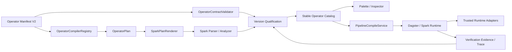
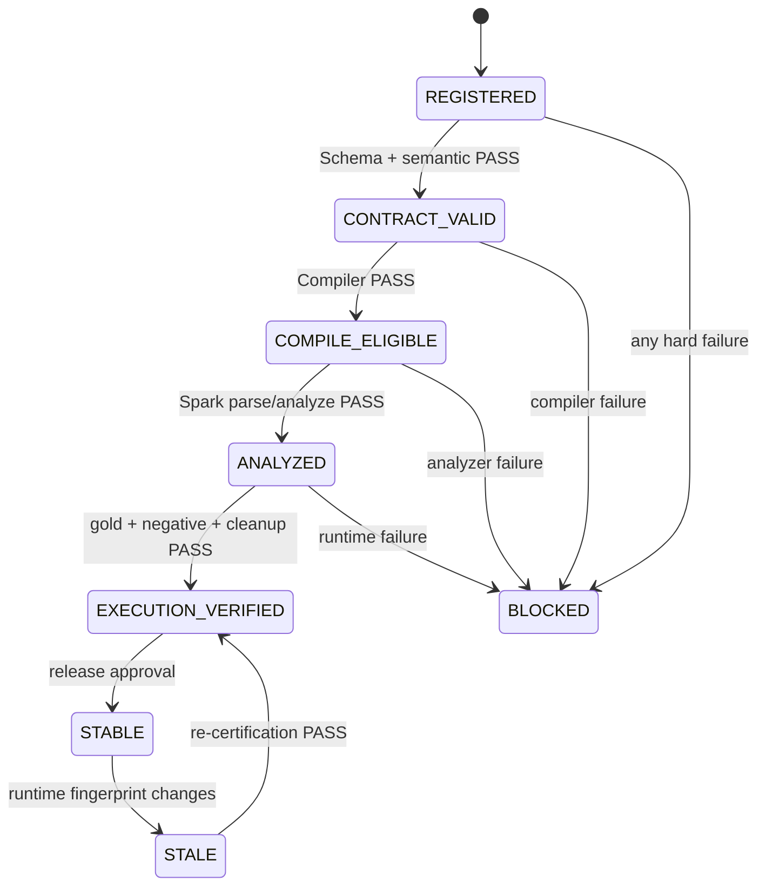

# OneLake 算子池可靠性优先升级设计

> 状态：设计已确认
>
> 日期：2026-07-15（Asia/Shanghai）
>
> 依据：`docs/operator-audit-20260715/` 下 69/69 设计评审、真实测试、竞品研究与最终报告
>
> 范围：本文件定义升级目标、架构、迁移、兼容、错误处理、验证和成功标准；逐任务 Agentic 开发提示词在本设计通过书面评审后单独形成实施计划。

## 1. 背景与事实基线

当前数据库、市场接口和审计时运行态 Palette 均显示 69 个 ACTIVE 实体：66 个全局 BUILTIN、3 个当前租户 CUSTOM。该数量不能作为生产可执行能力指标。

审计结论如下：

| 证据层 | 结果 | 含义 |
|---|---:|---|
| 市场/数据库可见 | 69 | 66 个正式内置 + 3 个验证型 CUSTOM |
| 当前源码 G1 eligible | 50 | 49 个内置 + `verify.version_lock_135715` 测试算子 |
| 真实 Spark 成功 | 33 | 32 个内置 + 1 个测试算子 |
| 真实 Spark 失败 | 17 | 均为内置算子 |
| G1 创建阻断 | 19 | 17 个内置 G2 算子 + 2 个无效 CUSTOM 夹具 |
| 设计风险 | P0 36 / P1 30 / P2 3 | 注册、可见、预览和真实执行被错误混用 |

因此，生产业务口径应从“69 个活动实体”校准为“66 个正式内置算子”；3 个 CUSTOM 验证夹具保留历史证据，但进入 `TEST_ONLY` 可见性，不再参与生产 Palette、业务能力计数或正式成功率。

## 2. 升级目标

### 2.1 总目标

建立一个证据驱动、版本可复现、失败可解释、安全可执行、可持续扩展的算子池，使“Palette 可选”“编译预览通过”“真实运行成功”成为同一条可验证发布链，而不是三个相互漂移的状态。

### 2.2 分阶段目标

| 阶段 | 目标状态 |
|---|---|
| U0 基线治理 | 66 个正式内置与 3 个 TEST_ONLY 夹具彻底分离；运行构建与源码可追踪 |
| U1 Contract V2 | 66 个内置均有显式、闭合、可机器校验的 Manifest V2 |
| U2 G1 修复 | 当前 49 个 G1 内置算子全部取得真实成功证据 |
| U3 G2 闭环 | 3 AGG + 5 JOIN + 9 QUALITY_GATE 完成 Compiler 与 E2E，达到 66/66 内置真实通过 |
| U4 运行增强 | CONTROL、checkpoint、retry、error branch、subpipeline、人工审批可用 |
| U5 扩展能力 | INTEGRATION、AGENT、RESEARCH 和高级 QUALITY/GOVERNANCE 按同一发布门槛上线 |

### 2.3 非目标

- 不把本次升级改造成独立算子微服务或全新调度平台。
- 不重写现有 `pipeline_task`、发布快照、JobRun/TaskRun 和 Dagster 主链路。
- 不原地修改不可变的历史 Manifest 或已发布流水线快照。
- 不把 retry、timeout、idempotency、approval、scope、secret、trace 设计成普通算子节点。
- 不以单元测试全绿、SQL 字符串生成成功或 Palette 可见代替真实运行认证。
- U0～U3 不扩充业务算子数量；先完成 66 个正式内置算子的可信闭环。

## 3. 设计原则

1. **版本不可变**：算子升级只追加新版本；旧版本和旧快照始终可读取。
2. **证据晋级**：只有依次通过契约、编译、分析和真实执行的版本才能进入 STABLE Palette。
3. **校验单一事实源**：注册、发布、Inspector、图校验和编译复用同一 Schema 与错误模型。
4. **编译结构化**：Manifest 声明意图和绑定，不直接承载任意可执行字符串。
5. **安全能力受信**：Secret、KMS、FPE、tokenization 由运行 Adapter 解析，禁止模板注入密钥。
6. **失败关闭**：无法证明兼容、权限、语义或运行能力时进入 BLOCKED/STALE，不自动降级执行。
7. **运行可复现**：Manifest hash、Compiler 版本、运行构建和数据面指纹进入认证与 TaskRun。
8. **小批迁移**：每一批新版本独立验证和晋级，失败不移动 stable 指针。

## 4. 目标架构



### 4.1 模块边界

| 组件 | 单一职责 | 主要依赖 |
|---|---|---|
| `OperatorManifestV2` | 表达算子身份、端口、参数、编译、运行、安全和观测契约 | 无运行依赖 |
| `OperatorContractValidator` | 完整 JSON Schema 和跨字段语义校验 | Manifest Schema Registry |
| `OperatorCompilerRegistry` | 根据 compilerId/version 分派具体 Compiler | 各 Compiler 实现 |
| `OperatorCompiler` | 将 Manifest + 参数 + 输入契约编译为结构化 `OperatorPlan` | 不直接执行 Spark |
| `SparkPlanRenderer` | 将 OperatorPlan 渲染为 Spark SQL/PySpark 执行单元 | Spark 方言能力注册表 |
| `SparkPlanAnalyzer` | parse/analyze、输入输出 Schema、函数和 catalog capability 校验 | 隔离 SparkSession |
| `OperatorQualificationService` | 汇总契约、编译、分析和运行证据，决定 release channel | 认证表和证据存储 |
| `TrustedRuntimeAdapterRegistry` | 解析 Secret/KMS/Token/外部副作用能力 | security/common/internal API |
| `OperatorVerificationRunner` | 执行金样例、负例、多节点 E2E 和清理 | Pipeline、Dagster、Spark、Trino |

## 5. Operator Manifest V2

### 5.1 版本策略

- 新增独立 `OperatorManifestV2`，不直接破坏当前 `OperatorManifestDTO`。
- V1 历史版本通过 `OperatorManifestV1Adapter` 只读转换为内部兼容模型。
- 新发布的 BUILTIN/CUSTOM 版本必须使用 `schemaVersion=2.0`。
- V1 版本允许旧快照继续执行，但不能重新晋级 STABLE；要成为新 stable 必须发布 V2 版本。

### 5.2 规范结构

```json
{
  "schemaVersion": "2.0",
  "identity": {
    "operatorRef": "govern.trim_whitespace",
    "version": "2.0.0",
    "category": "GOVERN",
    "displayName": "去除空白"
  },
  "ports": {
    "inputs": [{"name": "in", "kind": "TABLE", "cardinality": "ONE"}],
    "outputs": [{"name": "out", "kind": "TABLE", "schemaMode": "PASSTHROUGH_MODIFY"}]
  },
  "params": {
    "schema": {
      "type": "object",
      "additionalProperties": false,
      "required": ["column"],
      "properties": {
        "column": {"type": "string", "format": "column-ref", "minLength": 1, "maxLength": 256}
      }
    }
  },
  "compiler": {
    "id": "spark.row-transform",
    "version": "1",
    "operation": "TRIM",
    "bindings": {"column": {"role": "COLUMN_REF"}}
  },
  "runtime": {
    "engine": "SPARK",
    "sideEffect": "NONE",
    "idempotency": "DETERMINISTIC"
  },
  "security": {
    "requiredScopes": ["pipeline:execute"],
    "secretKinds": [],
    "classificationEffect": "INHERIT"
  },
  "resources": {
    "resourceGroup": "spark-default",
    "timeoutSeconds": 300,
    "maxInputBytes": 1073741824
  },
  "observability": {
    "metrics": ["inputRows", "outputRows", "changedRows", "durationMs"]
  },
  "examples": [{"name": "basic", "params": {"column": "customer_name"}}]
}
```

### 5.3 必须支持的 JSON Schema 子集

- `type`、`required`、`additionalProperties=false`
- `enum`、`const`、`default`
- `oneOf`、`allOf`、条件依赖
- `minimum`、`maximum`、`multipleOf`
- `minLength`、`maxLength`、`pattern`、受控 `format`
- `minItems`、`maxItems`、`uniqueItems`、嵌套对象/数组
- `readOnly`、`writeOnly` 和 secret/resource/column 等 UI format

禁止继续根据参数名猜测类型。66 个内置 Manifest 必须逐一显式定义参数类型、默认值、枚举、边界、描述和示例。

### 5.4 跨字段校验

Contract Validator 除标准 JSON Schema 外，还必须检查：

- identity 与数据库 operator/version 完全一致；
- compiler bindings 覆盖所有被消费参数，且不存在未声明模板占位符；
- required 参数要么由用户提供，要么有明确 default/compiler binding；
- 端口 cardinality、kind 和 output schemaMode 与 Compiler 家族兼容；
- sideEffect、idempotency、requiredScopes、secretKinds 与运行 Adapter 一致；
- examples 全部通过 Schema、Compiler 和 Spark analyzer；
- STABLE 版本不能引用 PREVIEW/BLOCKED Compiler 或 Adapter。

## 6. 版本认证与目录状态

### 6.1 目录生命周期与执行资格分离

现有 `OperatorStatus.ACTIVE/DEPRECATED` 继续只表达算子目录生命周期。新增版本级认证，不把执行质量塞进 `OperatorStatus`。

### 6.2 数据模型

在 orchestration migration V33 及后续版本中增量增加：

#### `operator` 新字段

| 字段 | 说明 |
|---|---|
| `visibility` | `BUSINESS/TEST_ONLY/HIDDEN`，默认 BUSINESS |
| `stable_version` | Palette 默认推荐版本；与 latest_version 分离 |

#### `operator_version_qualification`

| 字段 | 说明 |
|---|---|
| `operator_version_id` | 不可变 Manifest 版本 |
| `runtime_fingerprint` | build SHA、Compiler、Spark/Iceberg、Catalog hash 的确定性摘要 |
| `manifest_hash` | 规范化 Manifest SHA-256 |
| `suite_version` | 认证套件版本 |
| `contract_status` | `PENDING/PASS/FAIL` |
| `compile_status` | `PENDING/PASS/FAIL` |
| `analyze_status` | `PENDING/PASS/FAIL` |
| `execution_status` | `PENDING/PASS/FAIL/BLOCKED` |
| `release_channel` | `TEST_ONLY/PREVIEW/STABLE/BLOCKED/STALE` |
| `failure_codes` | 稳定错误码 JSON 数组 |
| `evidence_ref` | 不含敏感信息的证据清单引用 |
| `verified_at/expires_at` | 认证时间与失效时间 |

唯一键为 `(operator_version_id, runtime_fingerprint, suite_version)`。

#### `operator_verification_run`

保存每次认证尝试的不可变运行记录、阶段状态、环境摘要、开始/结束时间、清理状态和脱敏日志/产物引用。qualification 是当前投影，verification_run 是审计历史。

### 6.3 晋级状态机



### 6.4 目录 API 语义

- 市场接口返回所有当前租户可见版本及资格摘要。
- 保留 `GET /operators/installed` 兼容入口，但默认仅返回 BUSINESS + STABLE + 当前 runtime fingerprint 匹配的版本。
- 新增 `GET /operators/catalog-state` 返回 build SHA、catalog hash、stable/preview/blocked/stale 数量。
- 新增版本资格查询，返回阶段状态、reasonCodes、verifiedAt、suiteVersion 和脱敏 evidenceRef。
- 新增管理员/DE 认证触发接口；生产环境必须异步执行并有幂等 verification key。
- `compile-preview` 返回 `GENERATED/PARSED/ANALYZED` 三层状态；只有 ANALYZED 才使用“可执行”文案。

## 7. Compiler SPI

### 7.1 结构化计划

Compiler 不直接返回任意 SQL 字符串，而返回 `OperatorPlan`：

```text
OperatorPlan
  operatorRef/operatorVersion/manifestHash
  compilerId/compilerVersion
  inputBindings/outputBindings
  logicalOperation
  statements
  inferredOutputSchema
  requiredAdapters
  requiredPrivileges
  sideEffects
  idempotencyContract
  metricsContract
```

SparkPlanRenderer 负责方言和标识符/字面量编码；SparkPlanAnalyzer 在发布和预览阶段验证解析、函数、表/列、输出 Schema 和 catalog capability。

### 7.2 Compiler 家族

| 家族 | 覆盖 |
|---|---|
| `SourceOperatorCompiler` | INPUT、只读查询、表/模型引用 |
| `ProjectionOperatorCompiler` | select/rename/reorder/derive/window |
| `RowTransformOperatorCompiler` | filter、fill、trim、mask、standardize |
| `AggregateOperatorCompiler` | group aggregate、distinct、pivot/unpivot、running/window |
| `JoinOperatorCompiler` | inner/left/union/lookup/dedup merge |
| `QualityGateOperatorCompiler` | not-null、unique、range、regex、enum、freshness、row-count、referential、custom SQL |
| `SinkOperatorCompiler` | Iceberg write、merge、view、quarantine |

`OperatorCompilerRegistry` 按 compilerId/version 解析；不存在、版本不匹配或 runtime capability 不满足时返回稳定错误，不回退通用字符串模板。

### 7.3 参数角色

允许的绑定角色至少包括：

- `TABLE_REF`、`COLUMN_REF`、`COLUMN_LIST`
- `STRING_LITERAL`、`NUMBER_LITERAL`、`BOOLEAN_LITERAL`
- `ENUM_VALUE`、`DURATION`、`DATA_TYPE`
- `PREDICATE_AST`、`EXPRESSION_AST`、`AGGREGATION_AST`、`JOIN_AST`
- `SECRET_REF`、`POLICY_REF`、`RESOURCE_REF`

RAW SQL 只允许特定算子使用，只读/写入权限、单语句、AST、目标表和代价预算分别校验。

## 8. U2：17 个 G1 失败项修复设计

### 8.1 输入绑定与类型

| 算子 | 设计修复 |
|---|---|
| `input.sql_query` | 使用受控只读 QueryPlan；不再依赖不存在的隐式 `input` |
| `transform.spark_sql` | 显式声明输入别名和可用 relation；Analyzer 校验引用 |
| `transform.cast_type` | DATA_TYPE 使用 Spark 类型注册表，禁止裸 `VARCHAR` |
| `transform.constant_column` | 常量类型由 Schema/值推导或显式 Spark DataType |

### 8.2 结构化 SQL Composer

| 算子 | 设计修复 |
|---|---|
| `govern.dedup` | 子查询内计算 row_number，外层按序号过滤 |
| `govern.standardize_enum` | 使用结构化 mapping 或受管 codebook relation |
| `standard.address_normalize` | 使用受管区域码表 JoinPlan，不生成 CASE 占位符 |
| `standard.codebook_mapping` | 统一复用 CodebookMappingPlan |
| `mask.generalize` | buckets 为闭合对象数组，Compiler 生成完整 CASE AST |

### 8.3 Spark 方言

| 算子 | 设计修复 |
|---|---|
| `standard.date_format` | 依据参数生成 `to_date/to_timestamp/date_format` 组合 |
| `encrypt.sha256` | 使用 Spark `sha2(concat(...), 256)` 或受信 Adapter，不使用 Trino VARBINARY |
| `agg.unpivot` | 使用 Spark `stack`/受控表达式，输出 key/value Schema |

### 8.4 可信安全 Adapter

| 算子 | 设计修复 |
|---|---|
| `encrypt.aes` | `secretRef` 经 task-bound token 在 Spark runtime 内存解析；SQL/日志/TaskRun 不含密钥 |
| `encrypt.fpe` | 使用版本化 FPE Adapter/UDF；无 Adapter 时 BLOCKED |
| `encrypt.tokenize` | 调用 tenant-isolated Tokenization Adapter；输出 token policy/version |

安全 Adapter 使用短期 execution token 调用内部 security API；只在执行进程内存中获取材料，不经 argv、环境变量、SQL、Dagster config 或日志传递明文。

### 8.5 Sink 与原子提交

| 算子/路径 | 设计修复 |
|---|---|
| `output.incremental_merge` | 生成 Spark/Iceberg 支持的 MERGE，使用稳定 alias、key AST 和幂等 requestId |
| `output.view` | 先探测 catalog capability；不支持 replace 时生成受控 drop/create 计划或标记不支持 |
| 所有 COLUMN_EXPR | 基于输入 Schema 枚举列，在单个 Iceberg replace/CTAS 提交中替换目标列；禁止 CTAS 成功后再独立 UPDATE |

如果当前 Catalog 不支持原子 replace，则写临时表、验证快照后由受信 Catalog Adapter 原子切换；无法保证原子性时不能晋级 STABLE。

## 9. U3：G2 编译闭环

### 9.1 AGG

- `group_aggregate`、`distinct_count` 共享 AggregatePlan，显式 groupBy、metrics 和输出类型。
- `pivot` 的 columns/value types、聚合函数和最大展开列数必须受限。
- 已有 `running_total/window_function/unpivot` 迁移到同一 Projection/Aggregate SPI。

### 9.2 JOIN

- JOIN 端口使用稳定 `left/right/inputs` ID 和明确 cardinality。
- Join condition 使用 Join AST；禁止自由字符串引用任意 relation。
- `union_all` 支持 strict/by-name、缺列策略和类型兼容报告。
- `lookup_enrich` 的维表引用必须经过资产权限、唯一键和规模预算校验。
- `dedup_merge` 明确 source priority、key、order、冲突和 determinism。

### 9.3 QUALITY_GATE

QualityGatePlan 包含：

```text
checkType
actualQuery
expectedContract
severity
action: FAIL | WARN | QUARANTINE
samplePolicy
metricsContract
```

运行时统一产出 actual、expected、failureRate、sampleRef、severity、action、qualityResultId。失败样本必须脱敏，门禁失败按 action 传播，不能只返回 SQL 异常。

## 10. 运行、安全与可观测

### 10.1 横切执行策略

节点实例而非普通算子承载：

- timeout、maxAttempts、backoff、retryableErrors；
- onError、error port、fallback；
- idempotencyKey、checkpointPolicy；
- requiredScopes、approvalPolicy；
- resourceGroup、costBudget；
- trace/log/metric policy。

### 10.2 统一运行标识

JobRun/TaskRun 和日志统一携带：

- pipelineRunId、taskRunId、attemptId、traceId、checkpointId；
- operatorRef、operatorVersion、manifestHash；
- compilerId/version、runtimeFingerprint；
- inputRows、outputRows、changedRows、rejectedRows；
- duration、shuffleBytes、spillBytes；
- errorCode、retryable、evidenceRef。

### 10.3 日志与秘密信息

- 日志永不输出 secretRef 解析值、原始 PII 样本或完整 token。
- 配置快照只保存引用和 policy/version。
- 错误详情分用户可见摘要和受权限保护的诊断信息。
- 所有 verification/evidence 产物执行 tenant scope 和过期清理。

## 11. 前端与 API 体验

### 11.1 Palette

- 默认仅展示 BUSINESS + STABLE + 当前 fingerprint 有效的算子。
- 管理员可切换“预览/阻断/过期”，普通 DE 不看到 TEST_ONLY。
- 算子卡片显示版本、认证状态、最近验证时间和执行引擎。
- BLOCKED/STALE 不可拖入，并显示稳定 reasonCode 与恢复建议。

### 11.2 Inspector

- 使用 Manifest V2 Schema 渲染 enum、oneOf、数组对象、secret/resource/column picker。
- 未知字段、类型、长度、范围和条件依赖在前端即时提示，后端再次权威校验。
- secret 只选择引用，永不接收明文。
- 预览对 GENERATED、PARSED、ANALYZED 分层展示；只有 ANALYZED 显示“可执行”。

### 11.3 市场与详情

- 区分 latest/stable/pinned version。
- 展示 qualification 阶段、runtime fingerprint、证据时间和变更日志。
- 版本晋级和回退需要 DE/Admin 权限与审计原因。
- loading、empty、error、no-permission、blocked、stale 状态复用现有 `StateView` 和 token。

## 12. 稳定错误模型

| 错误码 | 阶段 | 语义 |
|---|---|---|
| `OP_CONTRACT_INVALID` | 注册/发布/图校验 | Manifest 或参数不满足 V2 Schema/语义 |
| `OP_COMPILER_UNAVAILABLE` | 编译 | compilerId/version 不可用 |
| `OP_PARAM_BINDING_MISSING` | 编译 | 参数声明与 Compiler 消费不闭合 |
| `OP_ANALYZE_FAILED` | 预览/发布 | Spark parse/analyze 失败 |
| `OP_RUNTIME_ADAPTER_MISSING` | 发布/运行 | 必需受信 Adapter 不可用 |
| `OP_CAPABILITY_UNSUPPORTED` | 编译/运行 | 当前 Catalog/Engine 不支持所需能力 |
| `OP_VERIFICATION_STALE` | Palette/发布 | 认证 fingerprint 与当前环境不一致 |
| `OP_SECRET_RESOLUTION_FAILED` | 运行 | SecretRef 无权、过期或解析失败 |
| `OP_ATOMIC_COMMIT_FAILED` | 运行 | 原子写提交失败或结果不确定 |
| `OP_RUNTIME_INCOMPATIBLE` | 历史回放 | 锁定版本所需 runtime 已不可用 |

错误均包含 stage、operatorRef/version、retryable、userMessage、diagnosticRef；不得返回秘密或原始敏感数据。

## 13. 迁移与发布方案

### 13.1 U0：基线治理

1. 从当前工作树重新构建并启动后端，校验 build SHA 与源提交一致。
2. 生成规范化 catalog hash，API/日志/页面可见。
3. 将 3 个验证型 CUSTOM 标记 TEST_ONLY，保留版本和历史运行。
4. 固化正式 66 基线：32 PASS、17 FAIL、17 G2 BLOCKED。
5. 建立 qualification/verification 数据结构和只读 API。
6. Palette 先按现有 G1 规则 fail closed，同时显示明确状态数量。

### 13.2 U1：Contract V2

1. 引入 V2 DTO、Schema Registry、Validator 和 V1 Adapter。
2. 为 66 个内置算子逐一编写显式 V2 Manifest，按家族分批提交。
3. 注册、版本发布、图校验、Pipeline Compile 和 Inspector 接入统一 Validator。
4. 运行 69×负例矩阵，确认 unknown/type/null/oversize 全部按 Schema 拒绝。
5. V2 版本先进入 PREVIEW，不移动 stable_version。

### 13.3 U2：G1 修复

依次交付输入/类型、结构化 Composer、Spark 方言、安全 Adapter、Sink/原子写五批。每批：

1. 新增 Compiler/Adapter 红灯测试；
2. 发布对应 2.x Manifest；
3. 通过 Schema、Compiler、Analyzer、隔离 Spark 和多节点 E2E；
4. 写入 qualification evidence；
5. 管理员审批后移动 stable_version；
6. 回归旧版本快照；
7. 精确清理验证资产。

U2 结束时 49/66 G1 内置必须为 STABLE + EXECUTION_VERIFIED。

### 13.4 U3：G2 闭环

按 AGG → JOIN → QUALITY_GATE 顺序交付。原因是 JOIN 端口/Schema 能力是 referential gate 等高级门禁的上游依赖。U3 完成后 66/66 内置均需通过真实执行。

### 13.5 U4～U5

只有 U3 通过后才启用新家族：

- U4：CONTROL 与 durable execution；
- U5a：HTTP/MCP/trigger；
- U5b：structured LLM/tool router/memory/retrieval/research/sandbox；
- U5c：schema contract/profile/drift/PII/quarantine/schema discovery。

所有新算子沿用同一 Manifest V2、Compiler、qualification 和 runtime policy，不建立第二套发布机制。

## 14. 向后兼容与回退

### 14.1 兼容规则

- 旧 PipelineSnapshot 继续保存 operatorRef/version，读取对应 V1 Manifest。
- V1 Adapter 只服务历史编译/运行，不允许用 V1 发布新 stable。
- `operator_install.pinned_version` 保持语义；若 pinned 版本 BLOCKED/STALE，Palette 显示阻断，不静默切 stable。
- API 增量添加 qualification 字段；现有消费者在迁移期可忽略。
- `stable_version` 与 `latest_version` 分离后，新版本发布不影响生产默认选择。

### 14.2 回退规则

- 新版本失败：标记 BLOCKED，stable_version 不移动。
- 新 stable 上线后出现缺陷：将 stable_version 指回上一已认证版本，记录审计原因。
- Runtime fingerprint 变化：所有受影响认证变 STALE，批量重认证；不自动沿用旧 PASS。
- 数据写入失败：依赖 Iceberg snapshot/requestId 回滚或重试；状态不确定时停止自动重试并人工介入。
- 数据库迁移只增表/增列，旧字段至少保留一个完整发布周期；回退应用时新字段可被忽略。

## 15. 验证方案

### 15.1 测试金字塔

1. **Manifest**：Schema 正例、缺参、错类型、null、未知字段、边界、条件依赖。
2. **Compiler**：每算子金 Plan/金 SQL、参数角色、注入、方言、输出 Schema。
3. **Analyzer**：Spark parse/analyze、函数、表列、Catalog capability。
4. **隔离运行**：Iceberg fixture 结果、行数、Schema、快照和幂等。
5. **Pipeline E2E**：多节点、双输入、门禁失败、Sink、副作用和错误传播。
6. **版本**：V1/V2、latest/stable/pinned、旧快照回放和回退。
7. **安全**：最小角色、跨租户、Secret/KMS、日志脱敏、注入、超长输入。
8. **可靠性**：重试、超时、kill/restart、重复回调、并发写、故障注入。
9. **规模**：小/中/大基线、shuffle/spill、预算拒绝和性能回归。
10. **清理**：DAG、任务、运行、表、快照、证据和临时凭据归零。

### 15.2 每算子认证矩阵

每个正式版本至少包含：

- 1 个合法最小配置；
- 1 个完整业务金样例；
- 缺失 required、wrong type、null、unknown、oversize；
- 字符串特殊字符/注入；
- 输入 Schema 不兼容；
- Spark analyzer；
- 真实结果与输出 Schema；
- 幂等/重跑；
- 权限与可观测字段；
- 精确清理。

JOIN 增加左右端口、缺边、错端口、类型冲突和数据膨胀；QUALITY_GATE 增加 PASS/WARN/FAIL/QUARANTINE 与样本脱敏；安全算子增加无权/失效 secret、日志扫描和 key rotation；Sink 增加并发、重放和提交失败。

### 15.3 推荐验证命令

```bash
cd onelake-app
mvn -q -pl module-orchestration -am test

cd web-console
pnpm exec tsc --noEmit
pnpm build
```

运行态认证由 `OperatorVerificationRunner` 统一驱动，不允许各 Agent 自造不同的统计口径。认证完成后仍需浏览器验证 Palette 状态、Manifest 表单、预览层级、连线、运行和错误恢复。

## 16. 成功标准

### 16.1 U0

- 运行 build SHA 与源码提交一致，catalog hash 可查询。
- 3 个测试夹具不进入生产 Palette 和 66 个业务指标。
- 当前 66 个内置准确显示 32 PASS、17 FAIL、17 BLOCKED，不再显示虚假 69 可用。

### 16.2 U1

- 66/66 内置具有唯一 V2 Manifest 和闭合 Schema。
- required/type/null/unknown/oversize 五类负例 66/66 正确拒绝。
- 注册、Inspector、图校验和编译给出一致错误码。
- 27 个“required 但无显式消费”问题归零。

### 16.3 U2

- 49/49 G1 内置通过 Analyzer 和真实 Spark 金样例。
- 预览 ANALYZED 与真实运行无假绿。
- AES/FPE/tokenize 无明文密钥路径；COLUMN_EXPR 无两阶段半提交。
- 17 个原失败项均有新版本 evidence，旧版本保持不可变。

### 16.4 U3

- 66/66 正式内置为 BUSINESS + STABLE + EXECUTION_VERIFIED。
- 5 JOIN 有真实双输入多节点 E2E。
- 6 AGG 均验证输出 Schema、空输入、null 和数据量边界。
- 9 QUALITY_GATE 均验证结果指标、失败传播和样本脱敏。
- 旧发布快照在允许的历史 runtime 上结果可复现。
- 所有审计临时资产清理为 0，后端和数据面健康。

### 16.5 U4～U5

- 控制流重放不重复成功副作用；暂停/恢复保持同一 checkpoint。
- 外部连接按 scope/credential 执行，MCP Schema 漂移可阻断。
- Agent 成本、模型、工具调用、引用和审批可追踪。
- 高级质量产物可版本化、比较并回溯到数据快照。

## 17. 交付与质量门

每一开发切片必须交付：

1. 红灯测试和失败证据；
2. 最小范围实现；
3. 聚焦测试、模块全量测试和必要前端构建；
4. 真实运行 evidence；
5. 兼容/回退验证；
6. 精确清理结果；
7. 文档和资格状态同步；
8. 改动文件、命令、测试数、剩余 blocker 报告。

任何切片只要缺少 Analyzer、真实结果、权限、安全或清理证据，就只能进入 PREVIEW/BLOCKED，不能写成 STABLE 或“升级完成”。

## 18. 已确认决策

| 决策 | 结论 |
|---|---|
| 升级方式 | 分阶段、可靠性优先，不做 69 项一次性大爆炸 |
| 正式业务池口径 | 66 个内置算子；3 个 CUSTOM 验证夹具转 TEST_ONLY |
| 架构 | Manifest V2 + 统一 Validator + Compiler SPI + 版本认证 |
| 兼容 | 历史 Manifest/快照不可变，V1 Adapter 只读兼容 |
| 发布 | latest 与 stable 分离，只有当前 fingerprint 的认证版本进入 Palette |
| 安全 | Secret/KMS/Token 由受信 Adapter 解析，不进入 SQL/日志 |
| 编排策略 | retry/timeout/idempotency/auth/trace 是横切策略，不是普通算子 |
| 扩展顺序 | U0/U1 → U2 → U3 → U4 → U5 |

## 19. 实施计划输入约束

后续 Agentic 实施计划必须：

- 按 U0～U5 和依赖关系拆成可独立验证的小切片；
- 每步列出目标、前置条件、精确代码/迁移/测试文件、TDD 顺序、验证命令、成功标准、回退和清理；
- 为编码 Agent、代码审查 Agent、安全审查 Agent、测试 Agent 和数据工程师 E2E 分别提供可复制提示词；
- 禁止并行修改同一 Compiler/Manifest/迁移文件；
- 不允许在一个步骤同时迁移多个高风险家族；
- 所有“完成”均以 qualification evidence 和运行结果为准。
