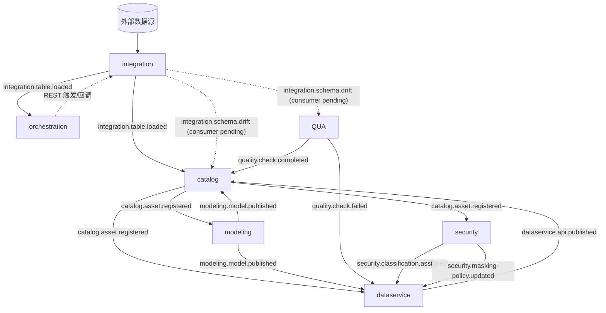

<aside>
📡

本文是 **OneLake 全局事件契约**,沉淀模块间事件驱动协作的统一标准:总线机制、事件清单、发布/订阅关系、载荷 Schema 与落地实现。**当前代码基线**:已落地 `Outbox -> Redis Stream -> consumer group -> consumed_event 幂等` 的可靠域事件通道;事件名集中定义在 `com.onelake.common.outbox.DomainEvents`。

</aside>

## 一、事件驱动总览与设计原则

OneLake 为模块化单体(`onelake-app`),模块间 **不直接调用彼此 Service**,统一通过 **Outbox → Redis Stream** 事件总线解耦,保证「业务写库」与「发事件」原子一致。

**命名规范**:`<模块>.<实体>.<动作>`,全小写点分。**统一信封**字段:`eventId / eventType / tenantId / aggregateId / occurredAt / version / payload`。

三层传输通道:

| 通道 | 用途 | 机制 | 典型事件 |
| --- | --- | --- | --- |
| 可靠域事件（跨模块） | 业务状态流转,需保证投递 | Outbox 表 → Dispatcher → Redis Stream 消费者组 | integration.table.loaded、catalog.asset.registered |
| 进程内事件（同模块/同事务） | 事务后置副作用 | Spring @TransactionalEventListener | 模块内缓存刷新 |
| 高频遥测（不进 Outbox） | 海量、可采样可丢 | metrics / 日志管道 | dataservice.api.invoked、同步日志 |

## 二、事件总线机制

### 2.1 Outbox 表与幂等表（common schema）

```sql
CREATE TABLE common.outbox_event (
    id             uuid         PRIMARY KEY DEFAULT gen_random_uuid(),
    tenant_id      uuid         NOT NULL,
    aggregate_type varchar(64)  NOT NULL,
    aggregate_id   varchar(64)  NOT NULL,
    event_type     varchar(128) NOT NULL,
    payload        jsonb        NOT NULL,
    status         varchar(16)  NOT NULL DEFAULT 'PENDING',  -- PENDING / PUBLISHED / DEAD
    retry_count    int          NOT NULL DEFAULT 0,
    occurred_at    timestamptz  NOT NULL DEFAULT now(),
    published_at   timestamptz
);
CREATE INDEX idx_outbox_pending ON common.outbox_event (status, occurred_at)
    WHERE status = 'PENDING';

-- 消费端幂等去重表
CREATE TABLE common.consumed_event (
    event_id    uuid        NOT NULL,
    consumer    varchar(64) NOT NULL,
    consumed_at timestamptz NOT NULL DEFAULT now(),
    PRIMARY KEY (event_id, consumer)
);
```

### 2.2 OutboxPublisher（生产端,事务内写入）

```java
@Component
@RequiredArgsConstructor
public class OutboxPublisher {

  private final OutboxEventRepository repo;
  private final ObjectMapper om;

  /** 必须在业务事务内调用,与业务写库同生共死 */
  public void publish(String eventType, String aggregateId, Object payload) {
    OutboxEvent e = new OutboxEvent();
    e.setTenantId(TenantContext.getTenantId());
    e.setAggregateType(OutboxPublisher.aggregateTypeOf(eventType));
    e.setAggregateId(aggregateId);
    e.setEventType(eventType);
    e.setPayload(om.valueToTree(payload));
    e.setStatus(OutboxEvent.Status.PENDING);
    repo.save(e);   // 与业务实体处于同一 @Transactional
  }
}
```

### 2.3 OutboxDispatcher（中继,轮询投递）

```java
@Component
@RequiredArgsConstructor
public class OutboxDispatcher {

  private final OutboxEventRepository repo;
  private final StringRedisTemplate redis;
  private final ObjectMapper om;
  private static final int BATCH = 100;
  private static final int MAX_RETRY = 8;

  @Scheduled(fixedDelay = 1000)
  @Transactional
  public void dispatch() {
    for (OutboxEvent e : repo.lockPendingBatch(BATCH)) {
      try {
        String body = JsonUtil.toJson(EventEnvelope.of(e));
        redis.opsForStream().add(
            StreamRecords.string(Map.of("data", body))
                .withStreamKey("stream:" + e.getEventType()));
        e.setStatus(OutboxEvent.Status.PUBLISHED);
        e.setPublishedAt(Instant.now());
      } catch (Exception ex) {
        e.setRetryCount(e.getRetryCount() + 1);
        if (e.getRetryCount() >= MAX_RETRY) e.setStatus(OutboxEvent.Status.DEAD);
      }
    }
  }
}
```

抢占 PENDING 采用 `FOR UPDATE SKIP LOCKED`,保证多实例并发不重复投递:

```sql
SELECT * FROM common.outbox_event
WHERE status = 'PENDING'
ORDER BY occurred_at
LIMIT :batch
FOR UPDATE SKIP LOCKED;
```

### 2.4 消费者骨架（Redis Stream 消费者组 + 幂等）

```java
@Component
@RequiredArgsConstructor
public class SyncRunEventHandler implements DomainEventHandler {

  @Override
  public Set<String> eventTypes() {
    return Set.of(DomainEvents.INTEGRATION_TABLE_LOADED, DomainEvents.INTEGRATION_SYNC_FAILED);
  }

  @Override
  public void handle(OutboxEvent event) {
    // RedisStreamDomainEventConsumer 负责 consumer group、幂等和 XACK。
    // Handler 只处理业务逻辑。
  }
}
```

### 2.5 可靠性保证

- **重试/死信**:投递失败 `retry_count++`,超过 `MAX_RETRY=8` 置 `DEAD`,进死信监控等待人工处理。
- **幂等**:`consumed_event(event_id, consumer)` 唯一约束 →「至少一次投递 + 幂等消费 = 有效一次」。
- **顺序**:同一 `aggregate_id` 的事件按 `occurred_at` 顺序投递。

## 三、完整事件清单

### ① integration（数据集成）

| 事件 | 触发时机 | 载荷要点 | 订阅方（动作） | 状态 |
| --- | --- | --- | --- | --- |
| integration.table.loaded | reconcile 成功、同步运行进入 SUCCEEDED | namespace、table、targetTable、sourceId、runId、taskId、rowsSynced | catalog（刷新资产新鲜度）、orchestration（触发依赖 DAG） | ✅ 已实现 |
| integration.schema.drift | 源端结构快照发生 checksum 变化 | sourceId、object、previousChecksum、currentChecksum、changes | quality（漂移校验/告警）、catalog（更新结构） | ✅ 生产端已实现;消费端待接入 |
| integration.datasource.health_changed | 连通性状态翻转 | previous、current、ok | ops（告警） | ✅ 生产端已实现;消费端待接入 |
| integration.sync.failed | sync_run 终态 = FAILED | runId、taskId、targetTable、status | catalog（记录失败）、common alert（创建告警） | ✅ 已实现 |
| integration.sync_task.created | 创建采集任务 | taskId、sourceId、targetTable、tenantId | security（PII 扫描）、dataservice（预生成 DRAFT API） | ✅ 已实现 |
| integration.sync_run.started | 手动/调度触发运行 | runId、taskId、externalJobId、targetTable | 暂无 | ✅ 生产端已实现 |

### ② orchestration（调度编排）

| 事件 | 触发时机 | 载荷要点 | 订阅方（动作） | 状态 |
| --- | --- | --- | --- | --- |
| orchestration.schedule.fired | Dagster schedule/sensor 命中 | dagId、cron、firedAt | integration（触发 sync,经 REST 命令） | 规划 |
| orchestration.pipeline.finished | 一条编排管道整体完成 | dagId、runId、status、durationMs | quality、ops | 规划（v2 起，由 `pipeline.run.succeeded/failed` 替代） |
| **pipeline.published** | 流水线状态 DRAFT→VALIDATED→PUBLISHED 完成 | pipelineId、version、publishedBy、publishedAt | catalog（资产登记）、security（密级绑定）、dataservice（API 资源准备）、quality（关联规则） | 🆕 P1 |
| **pipeline.run.succeeded** | `onelake_pipeline_run` Dagster job 整体成功 | pipelineId、runId、durationMs、taskCount、artifactPath | catalog（血缘/新鲜度）、quality（质量分回写）、ops（成功通知） | 🆕 P1 |
| **pipeline.run.failed** | `onelake_pipeline_run` 整体失败（任一 task 失败） | pipelineId、runId、failedTaskKey、errorMsg、partialSucceeded[]、artifactPath | catalog（部分血缘）、quality（失败告警）、ops（失败通知） | 🆕 P1 |
| **pipeline.task.loaded** | 单个 task_run 进入 SUCCEEDED（数据已写入 Iceberg） | pipelineId、runId、taskKey、targetFqn、rowsWritten、scanBytes、artifactPath | modeling（更新 data_model 状态/血缘）、catalog（资产登记）、security（PII 扫描触发）、quality（关联规则触发） | 🆕 P1 |

<aside>
🔁

orchestration 与数据面 Dagster 主要走 **REST 回调**(`/sync-runs/{id}/reconcile`),不是事件;它把「调度命中」转化为对 integration 的命令调用。

</aside>

<aside>
🆕

**流水线 v2 事件（pipeline.* 系列）**：替代历史跨 schema 直写路径。原 `OrchestrationService` 直接 `INSERT/UPDATE modeling.model_run` 的代码路径在 P5 删除，改为 orchestration 发出 `pipeline.task.loaded`，modeling 自身消费后更新 data_model 状态。这是流水线重设计方案 §6.3 / §6.5 / C4 的关键约束。

</aside>

### ③ catalog（数据目录/血缘）

| 事件 | 触发时机 | 订阅方（动作） | 状态 |
| --- | --- | --- | --- |
| catalog.asset.registered | 消费 table.loaded 后完成编目 | modeling（可建模）、security（打密级）、dataservice（可发布）、quality（关联规则） | 规划 |
| catalog.lineage.updated | 血缘解析/更新 | OpenMetadata 同步、UI | 规划 |

### ④ modeling（数据建模）

| 事件 | 触发时机 | 订阅方（动作） | 状态 |
| --- | --- | --- | --- |
| modeling.model.published | 模型发布到 dws/ads | dataservice（可对外开放）、catalog（登记派生资产）、quality（对模型跑规则） | 规划 |
| modeling.transform.completed | 一次转换作业完成 | quality | 规划 |

### ⑤ quality（数据质量）

| 事件 | 触发时机 | 订阅方（动作） | 状态 |
| --- | --- | --- | --- |
| quality.check.completed | 稽核任务结束 | catalog（质量分写回资产）、dataservice（决定是否放行） | 规划 |
| quality.check.failed | 规则不通过 | dataservice（下线/拦截 API）、orchestration（阻断下游）、ops（告警） | 规划 |

### ⑥ security（安全/分级/脱敏）

| 事件 | 触发时机 | 订阅方（动作） | 状态 |
| --- | --- | --- | --- |
| security.classification.assigned | 对资产打密级 L1–L4 | dataservice（动态脱敏策略）、catalog（展示密级标签） | 规划 |
| security.masking-policy.updated | 脱敏/掩码策略变更 | dataservice（刷新返回脱敏规则） | 规划 |
| security.access.changed | 授权/吊销 | dataservice（刷新鉴权缓存） | 规划 |

### ⑦ dataservice（数据服务 DaaS）

| 事件 | 触发时机 | 订阅方（动作） | 状态 |
| --- | --- | --- | --- |
| dataservice.api.published | 低代码发布数据 API | catalog（登记为「数据服务」资产）、ops | 规划 |
| dataservice.api.invoked | 每次接口调用（计量） | ops/计量（走 metrics,非 Outbox） | 规划 |

### ⑧ common（公共）

仅提供 Outbox 中继与审计基础设施(`OutboxDispatcher`、`common.audit.logged`),不产生业务事件。

## 四、发布 / 订阅矩阵

行 = 生产者,列 = 消费者,✅ 表示该消费模块订阅了该生产者的事件:

| 生产  消费 | integration | catalog | modeling | quality | security | dataservice | ops |
| --- | --- | --- | --- | --- | --- | --- | --- |
| integration | — | ✅ |  | 待接入 | ✅ | ✅ | ✅ |
| orchestration | ✅ | 🆕 ✅ | 🆕 ✅ | 🆕 ✅ | 🆕 ✅ | 🆕 ✅ | 🆕 ✅ |
| catalog |  | — | ✅ | ✅ | ✅ | ✅ |  |
| modeling |  | ✅ | — | ✅ |  | ✅ |  |
| quality |  | ✅ |  | — |  | ✅ | ✅ |
| security |  | ✅ |  |  | — | ✅ |  |
| dataservice |  | ✅ |  |  |  | — | ✅ |

<aside>
🆕

**orchestration 成为全模块生产者**（v2 起）：通过 `pipeline.published` / `pipeline.run.*` / `pipeline.task.loaded` 向所有下游模块广播流水线生命周期。这是消灭跨 schema 直写的关键替代路径——下游模块不再被 orchestration 直接 JDBC 写入，而是消费事件自主更新。

</aside>

<aside>
🧭

**catalog 是事件枢纽**:被 integration/modeling/dataservice 喂数据,又向 modeling/security/dataservice 广播资产,呼应「元数据驱动」的架构原则。

</aside>

## 五、跨模块端到端事件链路



## 六、主链路分解（入湖 → 开放）

1. **采集落库**:Airbyte 写入 ods,Dagster sensor 回调 reconcile → integration 同事务回写 `sync_run` 并写 Outbox,发 **integration.table.loaded**。
2. **编目/编排**:catalog 消费该事件刷新资产新鲜度;orchestration 消费该事件触发依赖目标表的 DAG。
3. **安全/服务预置**:security 与 dataservice 消费 **integration.sync_task.created**,分别触发 PII 扫描和预生成 DRAFT API。
4. **漂移**:source schema 快照变化时发 **integration.schema.drift**;catalog/quality 消费逻辑待接入。
5. **后续目标**:catalog.asset.registered、quality.check.completed、security.classification.assigned、modeling.model.published、dataservice.api.published 仍是目标链路。

## 七、事件载荷 Schema

### 7.1 统一信封

```json
{
  "eventId": "a7f3-...",
  "eventType": "integration.table.loaded",
  "tenantId": "t-001",
  "aggregateId": "task-9981",
  "occurredAt": "2026-06-15T14:00:00Z",
  "version": 1,
  "payload": { }
}
```

### 7.2 各事件 payload 示例

```json
// integration.table.loaded
{ "runId": "r-7788", "taskId": "task-9981", "namespace": "ods.crm", "table": "orders", "targetTable": "ods.crm.orders", "sourceId": "a1b2", "rowsRead": 10523, "rowsSynced": 10523, "status": "SUCCEEDED" }

// integration.schema.drift
{ "sourceId": "a1b2", "object": "orders", "previousChecksum": "abc", "currentChecksum": "def", "changes": [{ "columnName": "amount", "changeType": "TYPE_CHANGE", "previousType": "DECIMAL", "currentType": "BIGINT" }] }

// catalog.asset.registered
{ "assetId": "tbl-9001", "fqn": "iceberg.ods.crm.orders", "type": "TABLE", "upstream": ["crm.orders"] }

// modeling.model.published
{ "modelId": "fct_orders", "layer": "dws", "fqn": "iceberg.dws.fct_orders", "materialization": "incremental" }

// quality.check.completed
{ "assetId": "tbl-9001", "ruleSet": "crm-orders-v1", "score": 98.5, "passed": true, "failedRules": [] }

// security.classification.assigned
{ "assetId": "tbl-9001", "level": "L3", "fields": { "phone": "L3", "id_card": "L4" }, "maskingPolicy": "mask-mid" }

// dataservice.api.published
{ "apiId": "api-330", "path": "/v1/orders", "boundAsset": "iceberg.dws.fct_orders", "auth": "oauth2" }

// ===== orchestration.pipeline.* （流水线 v2 新增，见流水线模块重设计方案 §7 P0） =====

// pipeline.published
{
  "pipelineId": "d3f0c1e2-...",
  "tenantId": "t-001",
  "version": 3,                        // 发布版本号，从 dag.version 取
  "publishedBy": "user-42",            // UserId（from JWT sub）
  "publishedAt": "2026-06-24T10:00:00Z",
  "pipelineKind": "ODS_DWD",           // BLANK | ODS_DWD | MULTI_LAYER
  "taskCount": 5,
  "targetFqns": ["iceberg.dwd.trade_orders"]  // 流水线产出的所有表级 FQN
}

// pipeline.run.succeeded
{
  "pipelineId": "d3f0c1e2-...",
  "tenantId": "t-001",
  "runId": "r-9012",                   // orchestration.job_run.id
  "dagsterRunId": "dag-run-abc",
  "durationMs": 124500,
  "taskCount": 5,
  "succeededTaskCount": 5,
  "triggerType": "MANUAL",             // MANUAL | CRON | EVENT
  "artifactPath": "s3://onelake-artifacts/pipelines/t-001/r-9012/",  // 见流水线方案 §12
  "startedAt": "2026-06-24T10:00:00Z",
  "finishedAt": "2026-06-24T10:02:04.500Z"
}

// pipeline.run.failed
{
  "pipelineId": "d3f0c1e2-...",
  "tenantId": "t-001",
  "runId": "r-9012",
  "dagsterRunId": "dag-run-abc",
  "failedTaskKey": "dwd_trade_orders",    // 首个失败任务的 task_key
  "failedTaskType": "SPARK_SQL",          // SYNC_REF|SPARK_SQL|PYSPARK|QUALITY_GATE
  "errorMsg": "Spark SQL failed: Reference 'ods_orders' not found",
  "errorCode": "SPARK_SQL_FAILED",
  "partialSucceeded": [                   // 在失败前已成功的任务
    { "taskKey": "sync_ref_ods", "targetFqn": "iceberg.ods.crm.orders", "rowsWritten": 10523 }
  ],
  "triggerType": "MANUAL",
  "artifactPath": "s3://onelake-artifacts/pipelines/t-001/r-9012/",
  "startedAt": "2026-06-24T10:00:00Z",
  "finishedAt": "2026-06-24T10:01:32Z"
}

// pipeline.task.loaded（最细粒度，每个 task 成功都发；用于下游模块增量更新血缘/状态）
{
  "pipelineId": "d3f0c1e2-...",
  "tenantId": "t-001",
  "runId": "r-9012",
  "taskKey": "dwd_trade_orders",          // pipeline_task.task_key
  "taskType": "SPARK_SQL",                // SYNC_REF|SPARK_SQL|PYSPARK|QUALITY_GATE
  "engine": "SPARK_SQL",                  // SPARK_SQL|PYSPARK
  "targetFqn": "iceberg.dwd.trade_orders",
  "pipelineTaskId": "task-uuid",
  "rowsWritten": 10523,
  "scanBytes": 83886080,
  "artifactPath": "s3://onelake-artifacts/pipelines/t-001/r-9012/dbt/run_results.json",
  "finishedAt": "2026-06-24T10:01:15Z"
}
```

## 八、落地清单（DoD）

- [x]  common.outbox_event + consumed_event Flyway 脚本
- [x]  OutboxPublisher（事务内写入）
- [x]  OutboxDispatcher（SKIP LOCKED 轮询 → Redis Stream）+ 重试/死信
- [x]  消费者基类（消费者组 + XACK + 幂等 consumed_event）
- [ ]  各模块按事件清单补齐剩余生产端发布与订阅
- [ ]  事件信封与各 payload 的 JSON Schema 校验
- [ ]  死信监控与告警面板
- [ ]  端到端冒烟:table.loaded → asset.registered → model.published → api.published
