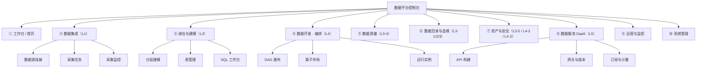
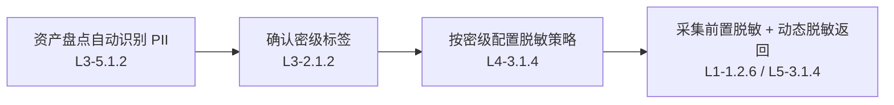
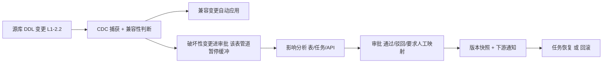
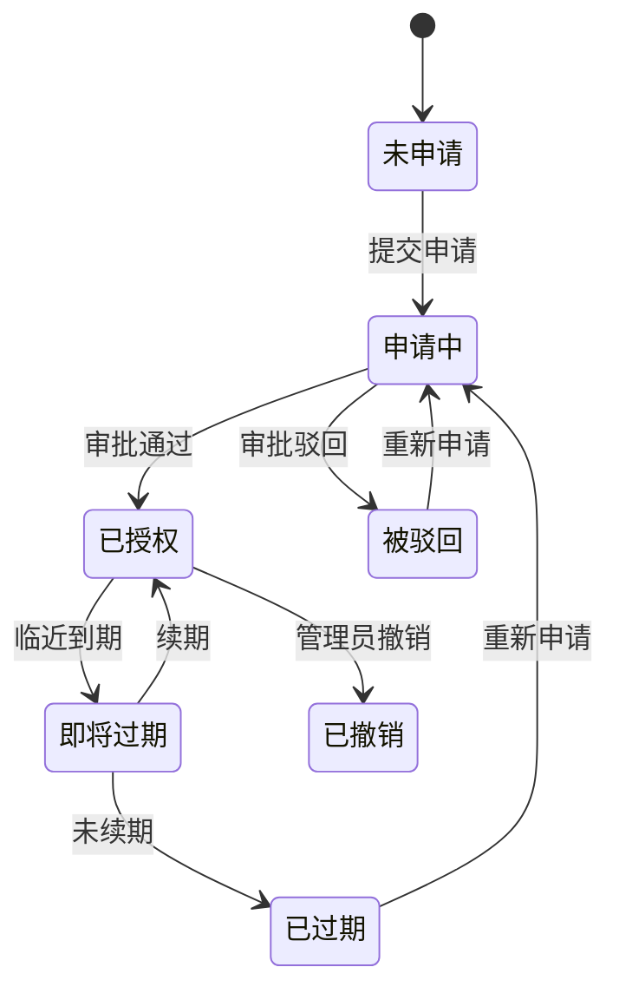
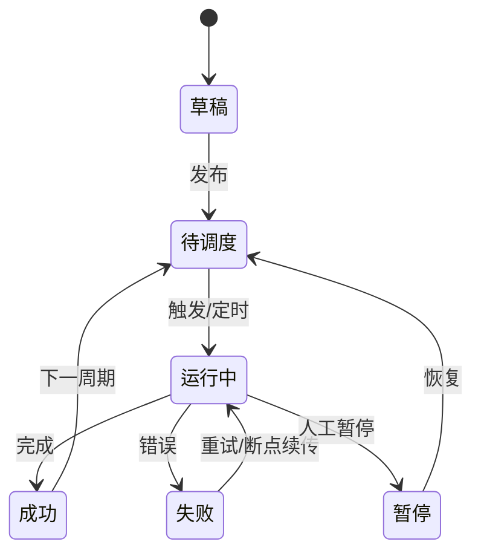
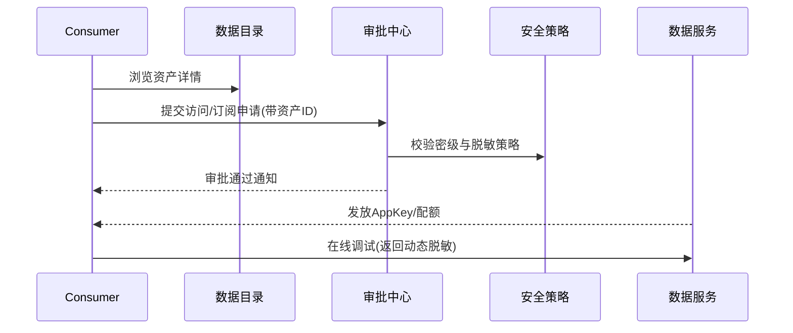

<aside>
🎨

**文档目标**：指导 UI/UX 设计师完成数据平台控制台（Web 端）的详细线框、高保真与交互原型设计。本文档**逐个功能**给出页面结构、界面元素、核心交互流程、状态反馈与异常表现，并特别标注**功能连续性**（跨模块跳转与数据流转）。功能编号沿用 数据平台 · 详细功能清单产品详细设计（可落地）（如 L1-1.2.2），技术形态遵循 数据平台 · 技术架构设计（精简起步版 · 组装优先 / 单体优先） 的「模块化单体控制台 + 开源数据面」。

</aside>

## 〇、如何使用本文档

| 项 | 说明 |
| --- | --- |
| **阅读对象** | UI/UX 设计师（主）、前端工程师、产品经理（协同评审） |
| **设计交付物** | ① 信息架构与导航图 ② 各模块线框图（Lo-Fi） ③ 高保真视觉稿（Hi-Fi） ④ 可点击交互原型 ⑤ 组件与交互规范（Design System） |
| **编号对应** | 本文每个界面/交互均回链到功能清单的 L{层}-{模块}.{功能} 编号，便于设计-需求双向追溯 |
| **优先级** | P0 必须先出稿 / P1 重要 / P2 增强；建议按 P0 先完成可点击原型闭环 |
| **连续性标记** | 🔗 标记表示「跨模块跳转 / 上下文带参」，设计时必须保证页面间状态可携带、可返回 |

<aside>
🧭

**设计总原则**：① 任务导向——以「用户要完成的事」组织界面，而非以后端模块堆砌；② 渐进披露——复杂配置用向导/抽屉分步暴露；③ 所见即所得——配置即预览，长任务有实时反馈；④ 一致性——同类操作（增删改查/运行/发布）交互范式全站统一；⑤ 可恢复——危险操作有二次确认与撤销，配置可版本回滚。

</aside>

---

## 一、产品信息架构与全局导航

### 1.1 信息架构（IA）



### 1.2 全局布局

| 区域 | 内容 | 交互要点 |
| --- | --- | --- |
| **顶栏 TopBar** | Logo、全局搜索、租户/项目切换器、消息通知铃铛、帮助、用户头像菜单 | 全局搜索（⌘K）跨资产/任务/API 检索；租户切换后全站上下文随之刷新 🔗 |
| **左侧主导航 SideNav** | ①~⑩ 一级菜单 + 二级子菜单，可折叠为图标态 | 记忆展开状态；当前位置高亮；无权限菜单置灰或隐藏 |
| **主内容区 Content** | 面包屑 + 页面标题 + 操作区 + 主体（列表/详情/画布） | 面包屑可回溯；主操作按钮固定右上；列表-详情优先用「右侧抽屉」而非整页跳转 |
| **右侧抽屉 / 详情面板** | 详情查看、快速编辑、运行日志 | 抽屉不打断列表上下文；支持「上一条/下一条」翻页 |
| **全局任务条** | 底部/右下角常驻长任务进度（运行中的采集、稽核、Compaction） | 可最小化；点击展开实时进度；完成后 Toast + 红点 |

### 1.3 角色与可见性

| 角色 | 核心诉求 | 默认落地页 | 可见模块 |
| --- | --- | --- | --- |
| **数据工程师 DE** | 接入、建模、开发、发布 | 工作台（我的任务） | ②③④⑤⑥⑧ 全功能 |
| **数据管理员 Admin** | 资产治理、分级、审批 | 资产地图 | ⑥⑦⑨⑩ + 审批 |
| **数据消费方 Consumer** | 找数、申请、调 API | 数据目录 | ⑥（只读）⑧（订阅） |
| **安全合规 Sec** | 密级、脱敏、审计 | 安全策略 | ⑦（脱敏/加密）⑩（审计） |
| **运维 Ops** | 监控、告警、排障 | 运营与监控 | ③⑨（监控）⑩（告警） |

<aside>
🔗

**连续性约定**：所有跨模块跳转必须**携带上下文并可返回**。例如从「资产详情」点「申请访问」跳到「订阅审批」，需带上资产 ID 预填表单，提交后可一键返回原资产页。设计稿需为每个 🔗 跳转标注「来源参数 / 目标预填 / 返回路径」。

</aside>

### 1.4 全局搜索（⌘K）与搜索结果页

<aside>
🔍

**补充（审查补全）**：全局搜索是跨模块找数与跳转的核心入口，需独立搜索浮层 + 结果页，保证「搜得到、看得懂状态、带上下文跳转」。

</aside>

| 搜索域 | 可检索内容 | 结果要素 | 跳转 🔗 |
| --- | --- | --- | --- |
| 资产 | 表名/字段/描述/术语 | 密级徽章、质量分、被订阅数、负责人 | 资产详情 |
| 任务 | 采集/加工任务名、runId | 状态、最近运行、租户 | 任务详情 / run 日志 |
| API | API 名/路径/版本 | 状态、版本、QPS、密级 | API 详情 |
| 审批/待办 | 审批单、待办项 | 类型、申请人、状态 | 审批详情 |
| 告警 | 告警标题、来源 | 级别、状态、时间 | 告警详情 |
- 交互：⌘K 唤起浮层 → 展示「最近访问 / 搜索建议」→ 输入联想 → 分类 Tab 结果 → 回车进结果页；结果点击带来源参数进详情并可返回；无结果给引导与「扩大检索范围」。

### 1.5 通知中心

- 分类：全部 / 任务 / 审批 / 告警 / 安全 / 系统；状态：未读 / 已读。
- 每条通知：来源、对象、级别、时间、操作按钮（处理 / 查看 / 静默）。
- 支持批量已读、按类型静默、点击直达来源页并回写已读状态 🔗。

### 1.6 跨模块跳转标注模板（连续性矩阵）

<aside>
🔗

**补充（审查补全）**：每个 🔗 跳转在设计稿中必须按下表统一标注，确保「来源参数 / 目标预填 / 返回路径 / 状态回写」四要素完整。

</aside>

| 来源 | 触发动作 | 携带参数 | 目标页 | 目标预填 | 返回 / 回写 |
| --- | --- | --- | --- | --- | --- |
| 资产详情 | 发布为 API | assetId、表名、字段 | API 构建向导 | 数据源、返回字段 | 返回资产；API 状态回写资产 |
| 连接详情 | 基于此连接建采集 | connectionId | 采集任务向导 | 源连接 | 完成回连接「使用中任务」 |
| 采集监控 | 查看下游影响 | runId、表 | 血缘图 | 预选当前节点 | 返回大盘 |

---

## 二、全局 UX 框架与设计令牌

### 2.1 栅格与响应式

- **栅格**：12 列栅格，内容最大宽度 1440px，左右留白自适应；最小支持 1280px（数据平台以桌面为主，不强求移动端）。
- **间距系统**：基础单位 4px，常用 8 / 12 / 16 / 24 / 32。
- **断点**：≥1600 宽屏（图表三列）/ 1280~1599 标准（两列）/ <1280 紧凑（单列 + 抽屉转全屏）。

### 2.2 设计令牌（Design Tokens）

| 类别 | 令牌 | 用途 |
| --- | --- | --- |
| **主色** | Primary（品牌蓝）+ Hover/Active/Disabled 四态 | 主按钮、选中、链接 |
| **状态色** | 成功(绿) / 警告(橙) / 错误(红) / 信息(蓝) / 中性(灰) | 任务状态、告警、校验 |
| **密级色** | L1 公开(灰)→L2 内部(蓝)→L3 敏感(橙)→L4 机密(红) | 资产/字段密级徽章，全站统一 🔗 |
| **字体** | 正文 14、次要 12、标题 16/20/24；等宽字体用于 SQL/日志/编号 | 表格、代码、监控数值 |
| **圆角/阴影** | 圆角 4/8；卡片浅阴影、抽屉/弹窗中阴影 | 层级区分 |

<aside>
🎨

**密级色板是跨模块强约定**：采集层字段标记、目录资产徽章、血缘节点描边、脱敏策略、API 返回字段，凡涉及敏感分级处，必须使用同一套 L1~L4 密级色，让用户一眼识别敏感度。

</aside>

### 2.3 通用组件库（全站复用）

| 组件 | 规范要点 |
| --- | --- |
| **数据表格 Table** | 列设置（显隐/排序/冻结）、行选（批量操作条浮出）、行内快捷操作、分页/游标、密度切换、空/载/错三态、行点击进抽屉 |
| **筛选栏 FilterBar** | 关键字 + 多维下拉（租户/域/状态/负责人/标签）+ 时间范围；筛选条件可存为「我的视图」 |
| **配置抽屉 Drawer** | 右侧滑出，宽度分 S/M/L；底部固定「取消/保存」；未保存离开二次确认 |
| **向导 Stepper** | 顶部步骤条，支持「上一步/下一步/保存草稿」，每步即时校验，最后一步预览汇总 |
| **状态徽章 StatusBadge** | 运行中(蓝/动效)、成功(绿)、失败(红)、等待(灰)、告警(橙)、已下线(暗)，全站语义一致 |
| **详情页骨架** | 头部（标题+状态+主操作）+ Tab 区（概览/配置/运行历史/血缘/权限）+ 右侧元信息卡 |
| **空/载/错/无权限** | 空状态给引导 CTA；加载用骨架屏；错误给原因+重试；无权限给「申请权限」入口 🔗 |
| **通知与反馈** | 轻量 Toast（操作成功）、全局通知中心（异步任务/审批）、Confirm 弹窗（危险操作）、长任务进度条 |

### 2.4 通用交互模式与状态规范

- **列表→详情**：默认右侧抽屉预览，复杂对象（画布、血缘）整页打开；详情内可直接编辑或跳编辑态。
- **运行/异步反馈**：触发运行 → 即时 Toast「已提交，runId=…」→ 全局任务条出现进度 → 完成 Toast + 通知中心红点；详情页运行历史实时刷新（轮询/推送）。
- **危险操作**：删除/下线/破坏性 Schema 变更需输入名称确认或二次弹窗，并展示**影响分析**（下游受影响数量）🔗。
- **校验反馈**：表单即时行内校验（失焦校验 + 提交整体校验），错误定位到字段并滚动可见。
- **权限缺失**：无权查看→脱敏/打码占位 + 「申请访问」；无权操作→按钮置灰 + Tooltip 说明所需角色。

### 2.5 组件状态矩阵（审查补全）

<aside>
🧩

**补充**：每个核心组件交付时必须给齐下列状态，避免线框只画默认态。

</aside>

| 组件 | 默认 | Hover | Active/选中 | Disabled | Loading | Error/异常 |
| --- | --- | --- | --- | --- | --- | --- |
| 主按钮 | 品牌蓝 | 加深 | 按下态 | 置灰+Tooltip | 转圈+禁点 | — |
| 表格行 | 常态 | 底色高亮 | 选中+批量条 | 不可选灰 | 骨架屏 | 错误占位+重试 |
| 状态徽章 | 语义色 | — | — | 已下线暗色 | 运行中动效 | 失败红 |
| 表单字段 | 常态 | 聚焦边框 | — | 只读灰 | 校验中 | 行内红错 |
- 每个 P0 线框必须交付：空 / 载 / 错 / 无权限 四态。

### 2.6 批量操作统一规范（审查补全）

平台多处需批量（批量确认 PII、批量优化、批量审批、批量下线、模板批量生成任务）。统一范式：

- 行选择 → 顶部浮出批量操作条（显示已选 N 项）→ 选操作 → 二次确认 + 影响分析 → 执行进度（全局任务条）→ 结果报告（成功/失败明细，失败项可重试）。

---

## 三、核心角色与端到端旅程（功能连续性）

<aside>
🔗

本章定义跨模块**主线旅程**，是「功能连续性」的核心。设计师须保证每条旅程在原型中可一镜到底点通，每次跨页都带上下文。下面每条旅程给出流程图 + 关键跳转说明。

</aside>

### 旅程一：DE 从数据接入到对外发布一条数据 API（主线闭环）


| 步骤 | 所在页面 | 跨页跳转与上下文携带 🔗 |
| --- | --- | --- |
| ① 建连接 | 数据集成 · 连接管理 | 创建成功后弹「下一步：基于此连接建采集任务」CTA，带 connectionId 预填 |
| ② 建采集 | 数据集成 · 采集任务向导 | 完成后「查看入湖结果」直达湖仓表管理对应 ODS 表 |
| ③ 建模 | 湖仓与建模 | 从 ODS 表「派生下游模型」进入建模，自动带源表血缘 |
| ④ 编排 | 数据开发 · DAG 画布 | 模型可「加入流水线」直接落到画布算子节点 |
| ⑤ 质量门禁 | 数据质量 · 规则 | 在画布节点上「挂质量规则」内嵌为门控，失败阻断发布 |
| ⑥ 目录可见 | 数据目录 · 资产详情 | 加工产出自动登记，详情页展示血缘/质量分；可一键「发布为 API」 |
| ⑦⑧ 建并发布 API | 数据服务 · API 构建/网关 | 从资产「发布为 API」带表/字段预填向导；发布后回写目录「已开放 API」标记 |

### 旅程二：Consumer 发现数据并订阅 API


- 关键连续性：搜索结果→资产详情→「申请访问」抽屉（带资产/字段范围）→提交进入审批中心→审批通过后通知 Consumer→详情页状态变「已授权」并出现「我的凭据/调试」入口 🔗。

### 旅程三：Admin/Sec 敏感分级与脱敏策略生效



- 关键连续性：密级一处设定，全站随动——目录徽章、血缘节点、采集脱敏、API 返回脱敏自动套用同策略；策略变更给出「影响 N 个资产 / M 个 API」预览再生效 🔗。

### 旅程四：Ops 监控告警与故障排查


- 关键连续性：大盘红点→点击直达具体 run 的日志页（带时间窗）→「查看影响」跳血缘图高亮下游→可在此发起重跑或暂停管道 🔗。

### 旅程五：Schema 变更从捕获到下游生效（闭环 · 审查补全）



- 关键连续性 🔗：审批结果回写 CDC 任务状态；影响分析复用血缘图；版本快照进入元数据变更历史。

### 旅程六：API 全生命周期（构建→灰度→下线 · 审查补全）


- 关键连续性 🔗：弃用通知发到订阅方通知中心；下线前强制活跃订阅处理；全程进审计日志。

### 旅程七：数据访问申请与授权状态机（审查补全）



- 关键连续性 🔗：状态变化在资产详情「访问/订阅」Tab 实时反映；过期/撤销触发通知；凭据在「我的凭据」可查。

---

---

# 四、逐模块原型设计

<aside>
🧩

每个模块统一按「模块目标与角色 → 页面清单 → 关键界面与逐功能交互 → 状态与异常 → 跨模块衔接」结构展开。交互描述采用「触发 → 系统响应 → 反馈/状态」三段式，便于设计师直接转为交互原型。

</aside>

## 4.1 工作台 / 首页（Dashboard）

**模块目标**：登录后的职能入口，按角色定制「我的待办 + 平台概览 + 快捷入口」。主角色：全体。

| 区块 | 内容 | 交互 |
| --- | --- | --- |
| 顶部指标卡 | 资产总数、今日任务成功率、运行中任务、待处理告警/审批 | 点卡片下钻到对应列表（带筛选条件）🔗 |
| 我的待办 | 待审批、失败需重跑、质量门禁拦截、Schema 变更待确认 | 每条可直接「处理」跳到上下文页面 |
| 快捷入口 | 新建连接/采集/模型/API 等常用动作 | 一键进入对应向导 |
| 近期动态 | 我参与的资产/任务变更、订阅变更通知 | 时间线式，点击跳详情 |

<aside>
🧩

**补充（审查补全）· 待办闭环**：「我的待办」需可点击展开详情抽屉才能闭环。

</aside>

- **待办详情抽屉**：展示待办类型（审批/失败任务/质量门禁/Schema 变更）、关联对象、产生原因、影响范围、推荐处理动作；操作：处理 / 忽略 / 转交 / 查看上下文 🔗。
- **指标卡下钻参数**：每个指标卡点击携带明确筛选（如「运行12」→采集任务列表 filter=运行中）。
- **近期动态**：增加动态类型筛选、已读标记、订阅设置。

## 4.2 数据集成（L1）

**模块目标**：可视化、低代码地把多源异构数据按离线/实时/文件三种范式采集入湖。主角色：DE / Ops。

### 4.2.1 页面清单

| 页面 | 功能点 | 优先级 |
| --- | --- | --- |
| 连接列表页 | L1-1.1.1~5 | P0 |
| 连接创建/编辑抽屉 | L1-1.1.1 / .2 / .3 / .5 | P0 |
| 采集任务列表页 | L1-1.2 / L1-2 / L1-3 | P0 |
| 采集任务向导（源→目标→映射→调度） | L1-1.2 / L1-4.1.1 | P0 |
| 任务详情与运行实例页 | L1-1.3.4 / L1-2.1.3 | P0 |
| 采集监控大盘 | L1-4.1.3 / .4 | P0 |

### 4.2.2 连接管理（L1-1.1）

- **连接列表**：表格列含名称、类型图标（MySQL/PG/Hive…）、host、状态徽章（连通/异常）、所属租户/项目、负责人；右侧行内操作「测连/编辑/轮换密钥/删除」。
- **L1-1.1.1 连接创建**：点「新建连接」→右侧抽屉；首行选类型（卡片选择器）→表单动态渲染（host/port/库名/账号/密码/连接参数）；密码输入框带「加密存储」安全提示，不回显。交互：填写中可随时「测连」；保存前强制探活。
- **L1-1.1.2 连接测试**：点「测连」→按钮转 loading→成功给绿色「连通，RTT 23ms」；失败给红色错误卡，按 网络/鉴权/驱动 分类给出原因与修复建议。
- **L1-1.1.3 连接池配置**：抽屉内「高级」折叠区，含最大连接数/空闲超时/获取超时/校验 SQL；默认值给推荐 + 「不超过源库连接数 20%」提示。
- **L1-1.1.4 密钥轮换**：连接详情「密钥」Tab 展示上次轮换时间、下次计划；支持「立即轮换」，交互提示「热更新、不中断运行中任务」。
- **L1-1.1.5 权限隔离**：连接必填「绑定租户/项目」；检测到非只读账号时给警告条「该账号含写权限，建议使用只读账号」。

<aside>
⚠️

**状态与异常**：测连超时 5s 给「超时可重试」；重复创建（同 host+库）提示已存在并引导复用；密码错误不暴露明文。

</aside>

### 4.2.3 采集任务向导（L1-1.2 / L1-2 / L1-3 / L1-4.1.1）

采用**四步向导**，步骤条贯穿：

1. **选源与模式**：选连接→选采集模式页签「全量 / 增量 / 实时CDC / 文件」（L1-1.2.1 / .2 / L1-2 / L1-3）。选表（多选树 + 搜索）。
2. **映射与转换**（L1-1.2.3）：双栏字段映射表，左源字段右目标字段，类型不兼容行标橙警告并给转换建议；敏感字段自动带密级色 + 「采集前脱敏」开关（L1-1.2.6）🔗。
3. **增量/CDC 参数**：增量选水位列 + 回溯 N 分钟（L1-1.2.2）；CDC 展示「初始快照+增量衔接」示意与位点说明（L1-2.1.2/.3）。
4. **调度与限流**：Cron 可视化编辑 + 依赖上游触发（L1-1.3.1）；限流/错峰窗口（L1-1.2.5）；失败重试策略（L1-1.3.3）。最后一步预览汇总 + 「试跑」。

<aside>
🔗

**连续性**：向导可从连接详情「基于此连接新建采集」带 connectionId 进入；完成后「查看入湖表」直达湖仓 ODS 表详情。文件采集（L1-3）向导额外展示目录监听、分片上传进度、MD5 校验结果。

</aside>

### 4.2.4 运行实例与监控（L1-1.3 / L1-4）

- **任务详情页**：Tab（概览/配置/运行历史/血缘）；运行历史列表每行状态徽章+行数+耗时+吞吐；点进 run 看实时日志与分片进度（断点续传 L1-1.2.4）。
- **L1-4.1.3 监控大盘**：聚合所有任务状态/时延/吞吐/失败率，按租户/项目下钻；吞吐曲线 + 失败 Top 列表。
- **L1-4.1.4 告警规则**：规则配置面板（失败/时延超阈/行数同环比突变）+ 分级路由（P0 电话/P1 钉钉/P2 邮件）+ 静默窗口。
- **连续性 🔗**：大盘异常点击→直达 run 日志（带时间窗）→「查看下游影响」跳血缘图（L3-3.1.3）。

<aside>
🧩

**补充（审查补全）· 接入排障与生命周期闭环**：补齐连接详情、失败诊断、Schema 变更审批详情。

</aside>

- **连接详情页**：基本信息 / 连通性历史 / 使用中采集任务 / 权限·租户绑定 / 密钥轮换记录 / 连接池配置 / 变更历史；危险操作（禁用/删除）需二次确认 + 影响分析。
- **采集失败诊断**：错误分类（网络/鉴权/Schema/质量/目标写入）+ 错误码 + 失败分片 + 最近成功 checkpoint；可恢复动作：重试 / 从 checkpoint 恢复 / 跳过坏记录 / 暂停；展示下游影响 🔗。
- **Schema 变更审批详情**：变更前/后 diff、兼容性判断、影响表/任务/API、推荐处理；审批通过/驳回/要求人工映射，结果回写 CDC 任务状态 🔗。

## 4.3 湖仓与建模（L2）

**模块目标**：分层建模、表格式管理、存储优化与统一 SQL 查询。主角色：DE。

### 4.3.1 页面清单

| 页面 | 功能点 | 优先级 |
| --- | --- | --- |
| 分层表浏览（ODS/DWD/DWS/ADS） | L2-1.1.1~4 | P0 |
| 表详情（Schema/快照/分区/优化） | L2-2 / L2-3 | P0 |
| 建表/建模向导 | L2-1.1.1 / .2 | P0 |
| SQL 查询工作台 | L2-4.1.1~4 | P0 |
| 存储优化中心（Compaction/冷热） | L2-3.1.2 / .4 | P1 |

### 4.3.2 分层建模（L2-1）

- **分层浏览**：左侧四层（ODS/DWD/DWS/ADS）树 + 业务域筛选；表列表列含名称、行数、大小、负责人、质量分、密级。
- **L2-1.1.2 命名规范校验**：建表时实时校验 {层}*{域}*{业务}_{粒度} 格式，违规行内红提示 + 改名建议；域/粒度下拉取自元数据字典。
- **L2-1.1.3 生命周期**：表详情可配 TTL，到期分区自动归档/清理；删除前检查血缘下游引用并警示。
- **L2-1.1.4 分层依赖校验**：建模时检测逆向依赖（如 ODS 读 ADS），违规阻断并提示重构。

### 4.3.3 表详情与表格式管理（L2-2）

- **Schema Tab**（L2-2.1.2）：字段表展示名/类型/描述/密级/血缘；支持加列、改名、类型提升，破坏性变更需审批。
- **快照/时间旅行 Tab**（L2-2.1.3）：快照时间线，可选某快照「预览数据 / 回滚到此」（回滚需二次确认 + 影响提示）。
- **快照管理**（L2-2.1.5）：展示快照数/孤儿文件，提供「清理过期快照」动作（长任务进度）。
- **Upsert/Merge** 与 CDC 入湖去重（L2-2.1.4）在表详情「写入策略」区可见。

### 4.3.4 存储优化（L2-3）

- 表详情「优化」Tab：分区策略（L2-3.1.1 隐藏分区）、小文件数与 Compaction 状态（L2-3.1.2）、冷热分层（L2-3.1.4）、压缩格式（L2-3.1.5）。
- 提供「立即优化」按钮触发 Compaction，进入全局任务条；小文件超阈给「建议优化」黄色提示。

### 4.3.5 SQL 查询工作台（L2-4）

- **布局**：左表树 + 中 SQL 编辑器（关键字高亮/补全/格式化）+ 下结果区（表格/图表切换）。
- **L2-4.1.1 统一网关**：运行时自动路由 Trino/Spark，顶部显示引擎与资源组；可手动选引擎。
- **L2-4.1.2/.4 资源与审计**：运行前预估扫描量，超阈「熝断提示」；运行后显示耗时/扫描量/行数；查询历史可检索。
- **连续性 🔗**：查询结果可「另存为模型」跳建模、「发布为 API」跳 DaaS、「加入流水线」跳 DAG 画布。

<aside>
🧩

**补充（审查补全）· 变更与查询闭环**：补齐表/字段变更影响分析、SQL 查询历史与快照回滚确认。

</aside>

- **表/字段变更影响分析弹窗**：删字段/改类型/删表前展示受影响任务/模型/API/订阅方、是否阻断、处理建议、二次确认 🔗。
- **SQL 查询历史 / 保存查询**：最近运行 / 我保存的 SQL / 团队共享 / 参数化查询 / 运行人·扫描量·耗时；可重跑 / 发布为 API / 加入流水线 🔗。
- **快照回滚确认页**：当前快照 / 目标快照 / 数据差异概览 / 下游影响 / 是否生成新快照 / 回滚后恢复方式。

## 4.4 数据开发 · 编排（L4）

**模块目标**：以低代码 DAG 画布为载体，把治理/加密/脱敏算子编排成加工链路，并内嵌质量与安全。主角色：DE。

### 4.4.1 页面清单

| 页面 | 功能点 | 优先级 |
| --- | --- | --- |
| 流水线列表页 | L4-4.1.4 | P0 |
| DAG 画布编辑器（整页） | L4-4.1.1 | P0 |
| 算子市场/算子面板 | L4-4.1.2 / L4-1 / L4-2 / L4-3 | P1 |
| 调试/试运行面板 | L4-4.1.5 | P1 |
| 版本管理与发布 | L4-4.1.4 | P1 |

### 4.4.2 DAG 画布编辑器（L4-4.1.1）

- **三区布局**：左算子面板（可拖拽，按类别分组：输入/治理/脱敏/加密/输出）+ 中画布（节点连线）+ 右属性面板（选中节点的参数）。
- **交互**：拖算子到画布 → 节点连点拉线 → 实时校验环路与上下游 schema 类型匹配（L4-4.1.1），不匹配的连线标红。
- **节点状态**：未配置(虚线)/已配置/校验失败(红)/运行中/成功/失败；节点右上角可挂「质量门禁」徽章🔗。
- **参数化**（L4-4.1.3）：右面板可引用全局/环境变量（如 ${run_date}），顶部切环境 dev/test/prod。

### 4.4.3 算子与治理/加密/脱敏（L4-1 / L4-2 / L4-3）

- **L4-1 治理算子**：标准化、清洗去重、缺失值、MDM，每个算子右面板配规则（码表/去重键/填充策略）。
- **L4-3 脱敏算子**：选字段 + 选算法（掩码/替换/泛化/哈希/加密），按密级联动默认策略（L4-3.1.4）带密级色徽章🔗。
- **L4-2 加密算子**：字段级加密配置，密钥选 KMS 引用；密钥不可用时节点挂起不降级输出明文（异常提示）。
- **L4-4.1.2 算子市场**：内置+自定义算子卡片库，声明输入/输出 schema，支持租户私有算子。

### 4.4.4 调试、版本与发布（L4-4.1.4 / .5）

- **L4-4.1.5 试运行**：采样预览每节点输出（所见即所得），试跑不落正式表只写临时区；节点间可逐步点「预览数据」。
- **L4-4.1.4 版本管理**：版本列表 + diff 对比 + 一键回滚 + 灰度发布（按比例/环境）。发布前强制过质量门禁。

<aside>
⚠️

**状态与异常**：算子失败策略（中断/跳过/重试）可配；脱敏与加密同字段冲突取最高安全策略；保存前拦截 DAG 环路；试跑与正式运行状态严格区分色。

</aside>

<aside>
🔗

**连续性**：从建模/SQL 工作台「加入流水线」进画布自动生节点；节点「挂质量规则」跳质量模块配规后回填为门控；运行产出自动上报血缘到目录与血缘图。

</aside>

<aside>
🧩

**补充（审查补全）· 发布与校验闭环**：补齐 DAG 校验结果面板、发布确认/结果页、算子市场。

</aside>

- **DAG 校验结果面板**：环路 / Schema 匹配 / 参数缺失 / 权限 / 质量门禁 / 安全策略 校验项，点击一键定位到节点。
- **发布确认 / 发布结果**：版本号 / 环境 / 变更摘要 / 影响任务 / 质量门禁状态 / 审批状态 / 发布策略（全量·灰度·回滚点）；发布失败给原因 + 一键回滚。
- **算子市场**：分类 / 搜索 / 内置·自定义·租户私有 / 输入输出 Schema / 版本 / 安装·更新·禁用 / 使用示例。

## 4.5 数据质量（L3-4）

**模块目标**：配规则、跑稽核、出评分、做门禁与告警。主角色：DE / Admin。

### 4.5.1 页面清单与交互

| 页面 | 功能点 | 关键交互 |
| --- | --- | --- |
| 规则配置页 | L3-4.1.1 | 内置规则库卡片（非空/唯一/范围/枚举/正则/引用完整/波动率）+ 自定义 SQL 规则；规则绑定资产与调度 |
| 稽核任务页 | L3-4.1.2 | 定时/事件触发，辐出通过率与明细异常行（抽样可查） |
| 质量评分看板 | L3-4.1.3 | 多维度（完整/准确/一致/及时）加权评分，趋势图，按资产/域汇总 |
| 门禁与告警配置 | L3-4.1.4 | 强规则失败阻断发布（门控），弱规则仅告警 |

### 4.5.2 逐功能交互

- **L3-4.1.1 规则配置**：选资产表/字段 → 选规则类型卡片 → 填阈值/表达式 → 绑调度；支持自定义 SQL 规则并实时试跑看命中行数。
- **L3-4.1.2 稽核任务**：运行后展示通过率仪表盘 + 异常行明细表（可下载/下钻）；可从采集/加工分区就绪事件触发。
- **L3-4.1.3 质量评分**：资产详情页嵌入质量分环图 + 趋势；低于阈值标红。
- **L3-4.1.4 门禁**：在 DAG 节点作为门控节点，失败阻断下游；门禁状态回传工作台待办🔗。

<aside>
🔗

**连续性**：规则可从 DAG 节点「挂质量规则」带表/字段预填进入；稽核失败产生的「需处理」待办回到工作台；质量分同步到目录资产详情与资产地图。

</aside>

<aside>
🧩

**补充（审查补全）· 质量门禁闭环**：补齐门禁失败处理、规则详情、异常数据处理闭环。

</aside>

- **质量门禁失败处理页**：失败规则 / 失败阈值 / 异常行样例 / 影响下游；可选动作：修复后重跑 / 临时豁免（需审批）/ 降级为告警 / 阻断发布；豁免记录进审计 🔗。
- **质量规则详情页**：绑定资产/字段 / 规则表达式 / 调度方式 / 最近运行结果 / 失败趋势 / 版本历史 / 负责人。
- **异常数据处理闭环**：异常发现 → 分派负责人 → 修复/忽略/加白 → 重跑 → 关闭问题 → 审计记录。

## 4.6 数据目录与血缘（L3-1 / L3-2 / L3-3）

**模块目标**：让所有人「找得到、看得懂、信得过」数据资产，是 Consumer 的主入口。主角色：Consumer / Admin / DE。

### 4.6.1 页面清单

| 页面 | 功能点 | 优先级 |
| --- | --- | --- |
| 资产搜索/浏览页 | L3-2.1.1 / .3 | P0 |
| 资产详情页（多 Tab） | L3-2.1.2 / .4 / L3-1 | P0 |
| 血缘图（整页/交互画布） | L3-3.1.1~3 | P0 |
| 业务术语表/数据字典 | L3-2.1.5 | P1 |

### 4.6.2 搜索与浏览（L3-2）

- **搜索页**：顶部全文搜索框 + 左侧分面筛选（类型/域/密级/标签/负责人/质量分）；结果卡片含名称、描述、密级徽章、质量分、热度/被订阅数。
- **L3-2.1.1 检索**：支持名称/字段/描述/术语语义检索；输入联想 + 热门搜索词。
- **L3-2.1.3 推荐**：「猜你需要」与「热门资产」模块（基于被订阅/血缘热度）。

### 4.6.3 资产详情页（L3-1 / L3-2）

采用「详情页骨架」，Tab 包含：

- **概览**：名称/负责人/更新频率/密级/标签 + 样例数据（按权限脱敏 L3-2.1.4）。
- **Schema/字段**（L3-1 元数据）：字段名/类型/描述/密级/枚举值分布。
- **血缘**：嵌入上下游血缘缩略图，点「展开」进整页血缘🔗。
- **质量**：质量分与近期稽核结果（来自 4.5）。
- **访问/订阅**：「申请访问」与「发布/调用 API」入口（跳 DaaS）🔗。
- **L3-2.1.2 标签/密级**：Admin 可在此设密级，一处设定全站随动。

### 4.6.4 血缘图（L3-3）

- **交互画布**：节点=表/任务/API，边=流向；支持上下游逐层展开、字段级血缘切换（L3-3.1.2）、路径高亮。
- **L3-3.1.3 影响分析**：选中节点「分析下游影响」高亮受影响资产并给受影响数量；变更/删除/故障时复用。
- **连续性 🔗**：从采集监控、表删除、字段变更均可跳入血缘图并预选当前节点。

<aside>
🧩

**补充（审查补全）· 找数与授权闭环**：补齐资产访问申请抽屉、授权状态、血缘影响分析详情。

</aside>

- **资产访问申请抽屉**：申请资产 / 字段范围 / 用途 / 使用周期 / 权限（查样例·查询·下载·API） / 敏感字段提示 / 审批链预览；提交后进入申请状态机 🔗。
- **授权状态展示**：资产详情明确展示 未授权/申请中/已授权/部分字段授权/即将过期/已过期/已撤销。
- **血缘影响分析详情面板**：直接下游 / 间接下游 / 受影响任务 / API / 订阅方 / 严重程度 / 导出影响报告。

## 4.7 资产与安全（L3-5 / L4-2 / L4-3）

**模块目标**：资产盘点、敏感分级、加密与脱敏策略集中管理。主角色：Admin / Sec。

### 4.7.1 页面清单

| 页面 | 功能点 | 优先级 |
| --- | --- | --- |
| 资产地图/盘点页 | L3-5.1.1 / .3 | P0 |
| PII 识别与分级页 | L3-5.1.2 | P0 |
| 脱敏策略页 | L4-3.1.1~4 | P0 |
| 加密与密钥管理页 | L4-2.1.1~3 | P1 |

### 4.7.2 资产盘点与分级（L3-5）

- **L3-5.1.1 资产地图**：按域/层/租户聚合的资产全景（热力图/树图），含密级分布统计。
- **L3-5.1.2 PII 识别**：自动扫描识别手机/身份证/银行卡等，给「疑似敏感字段」待确认列表；Admin 批量确认密级，一键打敏级色标🔗。
- **L3-5.1.3 盘点报告**：生成资产/敏感分布报告，可导出。

### 4.7.3 脱敏策略（L4-3）

- **策略列表**：按密级/字段类型维护默认脱敏规则（L4-3.1.4）。
- **L4-3.1.1~3 算法配置**：选字段 + 选算法（掩码/泛化/替换/加噪）+ 预览脱敏后样例（所见即所得）。
- **静态 vs 动态**：区分采集前静态脱敏（L1-1.2.6）与 API 返回动态脱敏（L5-3.1.4），策略复用同一套。

### 4.7.4 加密与密钥（L4-2）

- 字段级/存储级加密配置，密钥统一 KMS 管理（轮换/版本/授权）；密钥不明文展示。

<aside>
🔗

**连续性（安全主线）**：密级在此一处确认 → 目录徽章、采集脱敏开关、DAG 脱敏算子默认值、API 返回脱敏全部随动；策略变更给「影响 N 资产 / M 个 API」预览再生效。

</aside>

<aside>
🧩

**补充（审查补全）· 安全主线闭环**：补齐密级变更影响确认、策略冲突处理、密钥轮换闭环。

</aside>

- **密级变更影响确认页**（L2→L3）：受影响字段 / 样例数据变化 / 受影响 API 返回字段 / 受影响订阅方 / 默认脱敏策略变化 / 是否需通知·审批 🔗。
- **策略冲突处理**：多策略命中同字段时展示命中顺序，默认取最高安全等级，允许申请豁免。
- **密钥轮换闭环**：轮换前影响资产 / 轮换任务进度 / 失败回滚 / 旧密钥保留期 / 审计记录。

## 4.8 数据服务 DaaS（L5）

**模块目标**：把表/SQL/模型低代码发布为受控 API，含网关、鉴权、订阅与计量。主角色：DE（发布）/ Consumer（订阅）/ Sec。

### 4.8.1 页面清单

| 页面 | 功能点 | 优先级 |
| --- | --- | --- |
| API 列表/市场页 | L5-1 / L5-4 | P0 |
| API 构建向导 | L5-1.1.1~5 | P0 |
| API 详情（版本/文档/调试） | L5-1.1.5 / L5-2 | P0 |
| 订阅与配额页 | L5-4.1.1~4 | P0 |
| 安全管控页 | L5-3.1.1~4 | P1 |

### 4.8.2 API 构建向导（L5-1）

采用**五步向导**：

1. **选数据源**：选表/模型或粘贴 SQL（L5-1.1.1）；可从资产详情/SQL 工作台带参进入🔗。
2. **参数与响应**（L5-1.1.2）：配请求参数（类型/必填/默认/校验）与返回字段；敏感字段自动带脱敏徽章。
3. **缓存与性能**（L5-1.1.3）：配缓存 TTL/分页策略/超时。
4. **鉴权与限流**（L5-3）：AppKey/OAuth、IP 白名单、QPS/配额。
5. **预览与发布**（L5-1.1.5）：在线调试器造请求看真实响应 → 生成 OpenAPI 文档 → 发布到网关。

### 4.8.3 版本、网关与安全（L5-2 / L5-3）

- **L5-2 版本管理**：多版本并存（v1/v2）、灰度发布、弃用标记与下线倒计时；路由与雷达状态可视。
- **L5-3.1.4 动态脱敏**：API 返回按调用方角色动态脱敏，复用安全主线策略🔗。

### 4.8.4 订阅与计量（L5-4）

- **L5-4.1.4 订阅/申请**：Consumer 从 API 市场「申请订阅」→填用途/配额→进审批中心→通过后发 AppKey🔗。
- **L5-4.1.1~3 计量**：调用量/成功率/时延看板，按订阅方计费，配额超限告警。

<aside>
⚠️

**状态与异常**：未发布/已发布/已弃用/已下线四态清晰；调用超配额返 429 并提示升额；下线前检查活跃订阅并通知。

</aside>

<aside>
🧩

**补充（审查补全）· API 生命周期闭环**：补齐发布审批、AppKey/凭据管理、下线迁移、升额申请。

</aside>

- **API 发布审批 / 结果**：OpenAPI 文档完整性 / 鉴权 / 限流 / 动态脱敏 / 质量分 / 订阅影响 / 审批状态。
- **AppKey / 凭据管理页**：AppKey / Secret 展示·重置 / 绑定 API / 配额 / 调用统计 / IP 白名单 / 过期时间。
- **API 下线迁移闭环**：活跃订阅方列表 / 最近调用量 / 替代版本 / 通知计划 / 宽限期 / 强制下线确认 / 到期 410 🔗。
- **升额申请闭环**：配额超限 → 申请升额（填理由）→ 审批 → 新配额生效 → 计量看板更新。

## 4.9 运营与监控

**模块目标**：平台级统一运维视图与告警。主角色：Ops。

- **总览大盘**：跨采集/加工/查询/API 的统一健康看板（任务成功率、资源水位、SLA）。
- **告警中心**：汇总各模块告警，分级/认领/静默/路由；与采集告警（L1-4.1.4）、质量告警（L3-4.1.4）统一范式。
- **连续性 🔗**：告警点击直达对应 run/资产/API 详情，并可跳血缘做影响分析。

<aside>
🧩

**补充（审查补全）· 告警到恢复闭环**：补齐告警处理详情、故障复盘时间线、SLA/SLO 看板。

</aside>

- **告警处理详情页**：告警来源 / 触发规则 / 当前状态 / 关联对象 / 影响范围 / 时间线 / 处理人；操作：认领 / 静默 / 关闭 / 转工单 / 查看血缘 🔗。
- **故障复盘 / 事件时间线**：告警触发 → 任务失败 → 重试 → 人工介入 → 恢复 → 影响时长 → RCA 记录。
- **SLA / SLO 看板**：任务准点率 / API 可用性 / 查询成功率 / 数据新鲜度 / 违约记录。

## 4.10 系统管理

**模块目标**：租户/用户/权限/审批/审计等平台治理能力。主角色：Admin / Sec。

| 页面 | 要点 |
| --- | --- |
| 租户/项目管理 | 租户隔离、资源配额、成员归属 |
| RBAC 角色权限 | 角色-菜单-数据权限矩阵，最小权限原则 |
| 审批中心 | 统一汇集访问/订阅/变更审批，可批量处理🔗 |
| 审计日志 | 全操作记录可检索导出，敏感操作高亮 |
| 告警通知渠道 | 邮件/钉钉/Webhook 配置与测试 |

<aside>
🔗

**连续性**：各模块的「申请访问/订阅/破坏性变更」统一汇入审批中心；审批结果回写来源页状态并通知申请人。

</aside>

<aside>
🧩

**补充（审查补全）· 审批与通知闭环**：审批中心需补审批详情页、通知渠道配置、高危权限申请闭环。

</aside>

- **审批详情页**：审批类型 / 申请人 / 申请对象 / 申请理由 / 风险提示 / 影响范围 / 审批链 / 历史意见；操作：通过 / 驳回 / 转交 / 加签；结果回写来源页并通知申请人 🔗。
- **通知渠道配置**：邮件 / 钉钉 / Webhook / 电话 / 路由规则 / 测试发送 / 失败重试。
- **高危权限申请闭环**：申请 → 风险评估 → 二次审批 → 限时授权 → 到期回收 → 审计记录。

---

# 五、关键交互流程详解（状态机视角）

<aside>
🎴

本章把跨模块的关键动作拆解为可设计的状态机/时序，补充第三章主线旅程中的关键鱼骨节点，供设计师明确每个状态的界面表现。

</aside>

## 5.1 采集任务生命周期状态机



- 每个状态对应唯一状态色与可用操作：草稿（可编辑/删除）、运行中（可暂停/看日志）、失败（可重跑/看错误码）。

## 5.2 资产访问申请时序（跨模块）



- 设计要点：每个节点都要有「进行中/已完成/被驳回」状态，被驳回给理由与「重新申请」入口；全程可在「我的申请」跟踪。

## 5.3 密级变更的连锁生效

- 一处变更（资产盘点/资产详情）→ 弹「影响预览」（受影响资产/API/任务清单）→ 确认后全站随动更新徽章与策略 → 通知受影响负责人。该模式是「安全主线连续性」的核心，设计需统一预览弹框样式。

---

# 六、通用交互与组件规范附录

## 6.1 状态与反馈通用规范

| 场景 | 交互规范 |
| --- | --- |
| 加载中 | 骨架屏（列表/详情），避免全屏 loading 转圈 |
| 空状态 | 插画 + 一句说明 + 主 CTA（如「新建连接」） |
| 错误状态 | 错误码 + 原因分类 + 重试 + 联系支持 |
| 无权限 | 打码占位 + 「申请访问」入口🔗 |
| 危险操作 | 二次确认 + 输入名称 + 影响分析展示 |
| 长任务 | 全局任务条进度 + 完成 Toast + 通知中心红点 |

## 6.2 表单与向导规范

- 向导每步即时校验 + 可「保存草稿」；未保存离开二次确认；最后一步预览汇总。
- 表单错误定位到字段并滚动可见；敏感字段输入不回显。

## 6.3 表格与筛选规范

- 列设置、密度切换、批量操作条、游标分页；筛选条件可存为「我的视图」并分享。

## 6.4 可访问性与国际化

- 符合 WCAG AA 对比度；全键盘可操作；密级色不仅靠颜色还附文字/图标；文案外部化便于中英文切换。

---

# 七、交付与协作约定

| 阶段 | 交付物 | 负责 |
| --- | --- | --- |
| 第一轮（P0 闭环） | IA 定稿 + 主线旅程一可点原型（接入→发布 API） | UX |
| 第二轮 | 各模块 Lo-Fi 线框 + 组件库骨架 | UX |
| 第三轮 | Hi-Fi 视觉稿 + Design Tokens + 交互规范 | UI |
| 交付 | 标注稿 + 切图/图标 + 交互说明文档 | UI → 前端 |

<aside>
✅

**验收清单**：① 每个 P0 页面含空/载/错/无权限四态；② 每个 🔗 跳转标注了来源参数/目标预填/返回路径；③ 密级色与状态色全站一致；④ 危险操作均有二次确认与影响分析；⑤ 长任务有全局进度与通知。

</aside>

---

# 八、逐功能线框图（Lo-Fi Wireframe）

<aside>
📐

本章为每个核心功能给出低保真线框（ASCII 示意），描述页面分区、关键控件位置与布局骨架，供 UI/UX 直接转 Figma 线框。线框统一遵循第二章布局：顶栏 TopBar / 左侧 SideNav / 主内容区 / 右侧抽屉 / 底部全局任务条。图例：●=当前选中菜单，[按钮]，▾=下拉，🔗=跨模块跳转，🟧L3=密级徽章。

</aside>

## 8.1 工作台 / 首页（L0）

```
┌─ TopBar ──────────────────────────────────────────┐
│ [Logo] 数据平台   [🔍 全局搜索 ⌘K]      租户▾  🔔³  ?  (头像)▾ │
├──────────┬──────────────────────────────────────┐
│ ① 工作台   ●│  工作台 / 我的工作台                              │
│ ② 数据集成   │  ┌────┐┌────┐┌────┐┌────┐                  │
│ ③ 湖仓建模   │  │资产1280│成功98%│运行12│待办 5│  ← 指标卡(可下钻🔗) │
│ ④ 数据开发   │  └────┘└────┘└────┘└────┘                  │
│ ⑤ 数据质量   │  ┌── 我的待办 ──────┐ ┌── 快捷入口 ──┐  │
│ ⑥ 数据目录   │  │ ⚠ 任务X失败    [重跑]│ │ + 新建连接    │  │
│ ⑦ 资产安全   │  │ 📋 订阅申请待批 [处理]│ │ + 新建采集    │  │
│ ⑧ 数据服务   │  │ 🚦 质量门禁拦截 [查看]│ │ + 新建模型    │  │
│ ⑨ 运营监控   │  └───────────────────┘ └───────────┘  │
│ ⑩ 系统管理   │  ┌── 近期动态(时间线) ─────────────┐    │
│ «折叠       │  │ • 10:21 资产A Schema变更              │    │
│             │  └───────────────────────────┘    │
└──────────┴────────────────────────────────────────┘
[全局任务条 ▸ 采集任务运行中 3 ………………… 62%]
```

- **指标卡**（顶部四卡）：点击下钻到带筛选条件的列表（如「运行12」→采集任务过滤=运行中）🔗。
- **我的待办**：按角色聚合待处理项，每条右侧「处理」直达上下文页。
- **快捷入口 / 近期动态**：右栏上下排列；空态时快捷入口仍保留，动态区给引导文案。

### 8.1.1 全局搜索浮层（⌘K）与搜索结果页（审查补全）

```jsx
┌─ 全局搜索 (⌘K) ─────────────────────────┐
│ [🔍 输入资产/任务/API/告警…           ]  [Esc] │
│ ── 最近访问 ──                                  │
│  • dwd_order_df   • orders_sync   • /api/order  │
│ ── 联想结果 (分类) ──                           │
│  资产(12) | 任务(3) | API(5) | 告警(2) | 审批(1) │
│  🗃 dwd_order_df      🟦L2 质量91 订阅32         │
│  ⚙ orders_sync       ●运行中 租户:交易          │
│  ▶ /api/order/detail v2 ●已发布 QPS50           │
│  回车 → 进搜索结果页(全量+分面筛选)             │
└────────────────────────────────────────┘
```

- 结果点击带来源上下文进详情并可返回；无结果给「扩大范围/换关键词」引导🔗。

### 8.1.2 通知中心（审查补全）

```jsx
┌─ 通知中心 ──[全部|任务|审批|告警|安全|系统]─[全部已读]┐
│ ● 未读 🔴P0 采集 orders_sync 失败       10:21 [处理]🔗 │
│ ○ 已读 📋 订阅申请待审批 王五           09:30 [查看]🔗 │
│ ● 未读 🟧 dwd_order 密级变更 L2→L3       09:10 [查看]🔗 │
│ ● 未读 ✅ Compaction 完成 dws_user      08:50 [查看]   │
│ ── 设置 ──  按类型静默 ▾   免打扰时段 ▾              │
└──────────────────────────────────────────────┘
```

- 点击直达来源页并回写已读；支持批量已读、按类型静默。

### 8.1.3 我的待办详情抽屉（审查补全）

```jsx
(工作台变暗)        ┌─ 抽屉(右滑 M) ─ 待办详情 ─ ✕ ┐
                    │ 类型: 🚦质量门禁拦截            │
                    │ 关联: dwd_order_df / 范围规则  │
                    │ 原因: amount 越界 32 行         │
                    │ 影响: 阻断下游 2 模型 / 1 API  │
                    │ 推荐: 修复数据后重跑 或 申请豁免│
                    ├─────────────────────────┤
                    │ [处理][忽略][转交][查看上下文🔗]│
                    └─────────────────────────┘
```

## 8.2 数据集成（L1）

### 8.2.1 连接列表页（L1-1.1）

```
┌─ TopBar: [Logo] 数据平台  [🔍 ⌘K]  租户▾ 🔔 ? (头像)▾ ────┐
├─SideNav──┬─ 数据集成 / 连接管理 ───────────[+ 新建连接]──┤
│②数据集成●│ ┌FilterBar: [🔍名称] 类型▾ 状态▾ 负责人▾ [我的视图▾]┐│
│ ·连接管理●│ ├────┬──────┬──────────┬──────┬──────┬─────────┤│
│ ·采集任务 │ │类型│名称  │ host     │状态  │负责人│ 操作       ││
│ ·采集监控 │ ├────┼──────┼──────────┼──────┼──────┼─────────┤│
│          │ │🐬MySQL│订单库│ 10.0.0.1 │●连通 │张三  │测连 编辑 ⋯ ││
│          │ │🐘PG   │用户库│ 10.0.0.2 │○异常 │李四  │测连 编辑 ⋯ ││
│          │ └────┴──────┴──────────┴──────┴──────┴─────────┘│
│          │         ‹ 1 2 3 … ›   每页 20 ▾                   │
└──────────┴────────────────────────────────────┘
```

- 行内「测连」点击后转 loading，成功变绿勾并显 RTT；“⋯”菜单含轮换密钥/删除（危险操作二次确认）。

### 8.2.2 连接创建/编辑抽屉（L1-1.1.1~.5）

```
(列表页变暗遮罩)          ┌─ 抽屉(右滑 M) ─ 新建连接 ─ ✕ ┐
                         │ 1・选择类型                  │
                         │ [🐬MySQL][🐘PG][🐝Hive][📁S3]…│
                         │ ── 连接信息 ──                │
                         │ Host  [______________]         │
                         │ Port  [____]  库名 [_________]  │
                         │ 账号  [____________]           │
                         │ 密码  [••••••] 🔒加密存储,不回显 │
                         │ ▸ 高级(连接池:最大连接/超时)  │
                         │ 绑定租户/项目 [下拉▾] (必填) │
                         │ ⚠ 检测到写权限账号,建议只读  │
                         ├─────────────────────────┤
                         │        [测连]   [取消]  [保存] │
                         └─────────────────────────┘
```

- 类型选定后下方表单动态渲染；保存前强制探活；重复（同host+库）提示已存在并引导复用。

### 8.2.3 采集任务向导（四步 L1-1.2 / L1-2 / L1-3）

```
┌─ 采集任务向导 ──────────────── connectionId=订单库 🔗 ┐
│ ①选源与模式 ─●─ ②映射转换 ─ ③增量/CDC ─ ④调度限流 (步骤条)│
├──────────────────────────────────────────┐
│ 采集模式: ( )全量  (•)增量  ( )实时CDC  ( )文件        │
│ 选择来源表:  [🔍搜索]                                   │
│  ☑ ods.orders        ☐ ods.users                       │
│  ☑ ods.order_items   ☐ ods.payments    (多选树)        │
├──────────────────────────────────────────┐
│                    [保存草稿]    [取消]   [下一步 →]   │
└──────────────────────────────────────────┘
  ②映射与转换(L1-1.2.3):
  ┌─ 源字段 ────┼ 类型 ┼→┼ 目标字段 ┼ 脱敏 ─────┐
  │ order_id        │ BIGINT│→│ order_id  │            │
  │ phone 🟧L3敏感  │ VARCHAR│→│ phone    │[采集前脱敏▾]│
  │ amount          │ DECIMAL│→│ amount   │⚠类型转换建议│
  └────────────────┴───────┴─┴──────────┴───────────┘
  ③增量/CDC: 水位列[updated_at▾] 回溯[5]分 | CDC位点:bin.000012:45
  ④调度限流: [Cron 每天02:00▾] ☑依赖上游[任务A▾] | 重试[3]次
               ── 预览汇总 ──   [试跑] [上一步] [发布]
```

- 映射表类型不兼容行标橙警告 + 转换建议；敏感字段自动带密级色与「采集前脱敏」开关🔗；最后一步「试跑」采样预览。

### 8.2.4 任务详情与运行实例（L1-1.3）

```
┌─ 采集任务 / orders_sync ───── ●运行中 ── [暂停][编辑] ─┐
│ Tab: 概览 | 配置 | 运行历史● | 血缘                          │
│ ┌ 运行历史 ────────────────────────────────┐│
│ │ runId  开始时间  状态  行数   耗时  吞吐             ││
│ │ #1042  02:00:01 ●成功 12.3万 48s  2.5k/s [日志]      ││
│ │ #1041  昨02:00   ○失败 -      12s  -      [日志][重跑]││
│ └────────────────────────────────────────┘│
│ ┌ 实时日志(选中run) ─ 分片 ▰▰▰▰▱ 80% ─ 断点续传 ─┐ │
│ │ 10:00:01 INFO start partition 1/5 …             │ │
│ └─────────────────────────────────────┘ │
└──────────────────────────────────────────┘
```

### 8.2.5 采集监控大盘（L1-4.1.3/.4）

```
┌─ 数据集成 / 采集监控大盘 ──── 租户▾ 时间[近24h▾] ───┐
│ ┌成功率┐┌运行中┐┌失败┐┌平均时延┐                    │
│ │ 98% ││  12 ││ 3  ││  42s  │  ← 指标                  │
│ └────┘└────┘└───┘└─────┘                    │
│ ┌ 吞吐/失败率曲线 ─────┐ ┌ 失败 Top ────────┐ │
│ │      ╱╲    ╱╲          │ │ orders_sync 3次[下钻]🔗│ │
│ │ ───╱──╲──╱──╲───     │ │ user_cdc    1次[下钻] │ │
│ └──────────────────┘ └──────────────────┘ │
└────────────────────────────────────────┘
```

- 失败 Top 「下钻」直达对应 run 日志（带时间窗）→「查看下游影响」跳血缘图🔗。

### 8.2.6 文件采集配置（L1-3 · 目录监听/分片/校验/去重）

```jsx
┌─ 采集任务向导 · 文件模式 ──────────────────────┐
│ ①选源与模式 ─ ②目录与文件 ─● ③解析与映射 ─ ④调度 │
├──────────────────────────────────────────┐
│ 来源类型: (•)SFTP ( )FTP ( )NAS ( )对象桶S3            │
│ 监听目录: [/data/inbound/orders/        ] [测试连通]  │
│ 监听方式: (•)事件通知(S3→SQS)  ( )定时轮询[5分▾]      │
│ 文件匹配: [orders_*.csv]  稳定判定:大小连续2次不变    │
│ ── 文件处理策略 ──                                    │
│ ☑ 大文件分片上传(64MB/片) + 断点续传                  │
│ ☑ MD5/SHA-256 校验, 不一致自动重传                     │
│ ☑ 按内容哈希去重, 命中已采则跳过                       │
├──────────────────────────────────────────┐
│ ── 已监听文件列表 ──                                  │
│ 文件名            大小    校验    分片进度   状态      │
│ orders_0614.csv   1.2GB   ✓一致  ▰▰▰▰▰100% 已入湖   │
│ orders_0613.csv   0.9GB   ✗不符  ▰▰▱▱  重传中 ⚠     │
│ orders_dup.csv    1.2GB   -       -        ⊘去重跳过  │
└──────────────────────────────────────────┘
```

- 监听优先事件通知（低延迟），轮询兜底；文件需「写完稳定」才采集，避免半文件入湖（L1-3.1.1）。
- 校验失败行标橙并自动重传（L1-3.1.3）；去重命中记一条引用关系，不重复占存（L1-3.1.5）🔗。

### 8.2.7 CDC 实时采集 · Schema 演进与位点监控（L1-2）

```jsx
┌─ CDC 任务 / mysql_orders_cdc ─●运行中─[暂停][重建快照]┐
│ Tab: 概览 | 位点与延迟● | Schema演进 | 运行日志            │
│ ── 位点与延迟(L1-2.1.3) ──                                 │
│ 当前位点: binlog.000128 : 4456   快照阶段: ✓已完成        │
│ 同步延迟: ▮ 1.2s   背压: 正常    Exactly-Once: ✓两阶段提交 │
│ 延迟曲线:    ╱╲___╱╲____                                   │
│ ── Schema 演进待审批(L1-2.2) ──                            │
│ 时间    表       变更             类型     操作            │
│ 10:21  orders   ADD COLUMN memo   兼容→自动 已应用         │
│ 09:50  users    DROP COLUMN age   破坏性⚠  [审批][拒绝]    │
│   未审批期间该表数据按旧 schema 缓冲写入                   │
└──────────────────────────────────────────────┘
```

- 破坏性 DDL（删列/改窄类型）进审批队列，仅暂停该表管道、不影响其他表（L1-2.2.2）；演进结果经血缘通知下游（L1-2.2.3）🔗。
- 位点随 checkpoint 原子持久化，故障重启从最近位点恢复；延迟/背压超阈触发告警。

### 8.2.8 采集任务模板库（L1-4.1.2）

```jsx
┌─ 数据集成 / 任务模板 ─────────────[+ 自定义模板]─┐
│ ┌整库迁移┐ ┌单表增量┐ ┌CDC实时┐ ┌文件批量┐        │
│ │🗃 一键   │ │⏱ 水位线 │ │🔄 Binlog│ │📁 SFTP  │        │
│ │配库即可 │ │配增量列 │ │配位点  │ │配目录  │        │
│ │ [使用]  │ │ [使用]  │ │ [使用] │ │ [使用] │        │
│ └────────┘ └────────┘ └───────┘ └───────┘        │
│ ── 使用模板「整库迁移」──                              │
│ 源连接[订单库▾] 目标层[ODS▾] 表范围[全部☑/排除…]      │
│ → 参数化一键生成 N 个采集任务(可批量编辑调度)          │
└──────────────────────────────────────────┘
```

- 模板参数化（库名/表名/增量列）一键批量实例化任务，生成后可统一改调度与限流。

### 8.2.9 连接详情页（L1-1.1 · 审查补全）

```jsx
┌─ 数据集成 / 连接 / 订单库 ──●连通── [测连][编辑][⋯]┐
│ Tab: 概览● | 连通历史 | 使用中任务 | 密钥 | 变更历史  │
│ 类型:🐬MySQL host:10.0.0.1 库:order 账号:ro_user(只读)│
│ 租户/项目: 交易事业部 / 订单域                        │
│ ── 使用中采集任务 ──                                  │
│  orders_sync ●运行中   order_items_sync ○失败        │
│ ── 连通历史 ── 近24h ✓✓✓✗✓  RTT 23ms                 │
│ ── 危险操作 ── [禁用] [删除] (二次确认+影响分析)      │
└──────────────────────────────────────────────┘
```

- 删除/禁用前展示「使用中任务」影响，阻断有活跃任务的删除🔗。

### 8.2.10 采集失败诊断页（L1-1.3 · 审查补全）

```jsx
┌─ run #1041 / orders_sync ── ○失败 ──────────────┐
│ 错误分类: ●鉴权 ○网络 ○Schema ○质量 ○目标写入       │
│ 错误码: AUTH_401  消息: 账号密码过期                  │
│ 最近成功 checkpoint: binlog.000128:4456 (02:00)      │
│ 失败分片: 3/5                                         │
│ ── 可恢复操作 ──                                      │
│ [重试] [从checkpoint恢复] [跳过坏记录] [暂停管道]     │
│ ── 下游影响 ── 2 模型 / 1 API 延迟 [查看血缘🔗]       │
└──────────────────────────────────────────────┘
```

### 8.2.11 Schema 变更审批详情（L1-2.2 · 审查补全）

```jsx
┌─ Schema 变更审批 / users ── 破坏性⚠ ──────────────┐
│ 变更: DROP COLUMN age                                 │
│ ── Diff ──   - age INT (移除)                         │
│ 兼容性: ✗破坏性  当前该表管道: 暂停缓冲中             │
│ ── 影响分析 ──  下游表 2 / 任务 1 / API 1             │
│  dwd_user_df.age ← 引用 | /api/user 返回字段含 age    │
│ ── 处理 ── [通过] [驳回] [要求人工字段映射]           │
│ 通过后:应用→通知下游→任务恢复; 驳回:保持旧schema      │
└──────────────────────────────────────────────┘
```

- 审批结果回写 CDC 任务状态与元数据版本历史🔗。

## 8.3 湖仓与建模（L2）

### 8.3.1 分层表浏览（L2-1）

```
┌─ 湖仓与建模 / 分层浏览 ───────────────[+ 建表]─┐
├─层级树──┬─ 表列表 ─────────────────────────┤
│ ▸ ODS    │ [🔍表名] 业务域▾ 密级▾                  │
│ ▾ DWD    │ ┌─名称───────┬行数─┬大小┬质量┬密级┐  │
│   ·dwd_order│ │dwd_order_df  │ 12万│ 2GB │ 92 │🟦L2│  │
│ ▸ DWS    │ │dwd_user_df   │ 8万 │ 1GB │ 88 │🟧L3│  │
│ ▸ ADS    │ └─────────────┴────┴────┴────┴────┘  │
│ [业务域▾]│  行点击→右侧抽屉预览 / 双击→表详情页        │
└─────────┴─────────────────────────────────┘
```

- 建表时实时校验命名规范（L2-1.1.2），违规行内红提示；逆向依赖（ODS读ADS）阻断。

### 8.3.2 表详情页（L2-2 / L2-3）

```
┌─ dwd_order_df ────── 🟦L2内部 ── [立即优化][发布为API🔗]┐
│ Tab: 概览 | Schema● | 快照 | 优化 | 血缘 | 权限          │
│ ┌ Schema(L2-2.1.2) ──────────────────────┐ │
│ │ 字段     类型    描述   密级   血缘           │ │
│ │ order_id BIGINT  订单号  -     ↑上游         │ │
│ │ phone    STRING  手机    🟧L3   ↑上游         │ │
│ │ [+ 加列]  (破坏性变更需审批)                  │ │
│ └─────────────────────────────────┘ │
│ 快照Tab: 时间线 ●─●─●  选点→[预览数据][回滚到此⚠]   │
│ 优化Tab: 小文件 1.2k ⚠建议优化 | 冷热分层 | 压缩格式  │
└────────────────────────────────────────┘
```

- 回滚/清理快照为危险操作，二次确认 + 影响提示；「立即优化」进全局任务条。

### 8.3.3 SQL 查询工作台（L2-4）

```
┌─ SQL 工作台 ──────────引擎[自动路由▾ Trino] 资源组▾ ─┐
├─表树──┬─────────────────────────────────┤
│ 🔍搜表 │ 1 SELECT * FROM dwd_order_df    [格式化][▶运行]│
│ ▸ ods   │ 2 WHERE dt = '2026-06-14'                    │
│ ▸ dwd   │ ── ⚠ 预估扫描 1.2TB,超阈需确认 ─────── │
│         ├─────────────────────────────────┤
│         │ 结果 [表格●|图表]  耗时48s 扫挏12GB 行1.2万│
│         │ order_id | amount | dt                       │
│         │ [另存为模型🔗][发布为API🔗][加入流水线🔗]   │
└────────┴────────────────────────────────┘
```

- 结果区底部三个「另存/发布/加入流水线」是跨模块连续性入口，带查询上下文🔗。

### 8.3.6 建表 / 建模向导（L2-1.1.1 / .2）

```jsx
┌─ 建表向导 ─────────────────────────────────┐
│ ①选层与域 ─● ②表结构 ─ ③分区与格式 ─ ④生命周期     │
│ 分层: ( )ODS (•)DWD ( )DWS ( )ADS   业务域[交易▾]     │
│ 表名: dwd_trade_order_df                              │
│   ✓ 命名规范 层_域_业务_粒度 校验通过                 │
│   ✗ 若违规 → 行内红字 + 改名建议                      │
│ ── 字段定义 ──                                        │
│ 字段名     类型     主键  密级    描述                 │
│ order_id   BIGINT   ☑    -       订单号               │
│ phone      STRING   ☐    🟧L3    手机(自动识别PII)    │
│ [+ 加字段]                                            │
│ ③分区: 隐藏分区 days(created_at)▾   ④TTL: [365]天    │
│ ⚠ 逆向依赖检测: 禁止读取上层 ADS                      │
└──────────────────────────────────────────┘
```

- 实时校验命名规范，违规阻断（L2-1.1.2）；逆向依赖（ODS 读 ADS）阻断并提示重构（L2-1.1.4）。
- 识别到 PII 字段自动带密级色，并联动脱敏策略默认值🔗。

### 8.3.7 存储优化中心（L2-3 · Compaction/冷热/排序）

```jsx
┌─ 湖仓 / 存储优化中心 ──── 范围[全部表▾] ──[批量优化]┐
│ ┌待优化表┐┌孤儿文件┐┌冷数据可下沉┐                   │
│ │  18    ││ 2.3万  ││  1.2 TB     │  ← 概览            │
│ └───────┘└───────┘└────────────┘                   │
│ ── 优化建议列表 ──                                     │
│ 表             小文件数 状态        建议      操作      │
│ dwd_order_df   1.2k ⚠   待Compaction 合并128M [优化]   │
│ dws_user_df    320     正常         Z-Order  [优化]   │
│ ods_log_2025   -       冷分区90天+  下沉Glacier[下沉]  │
│ ── 优化任务进度 ──  Compaction ▰▰▰▰▱ 80% (全局任务条) │
└──────────────────────────────────────────┘
```

- 小文件超阈给「建议优化」（L2-3.1.2）；冷热分层按访问热度下沉低频/归档桶降本（L2-3.1.4）。
- 「立即优化/下沉」进全局任务条；优化并行度受控，不阻塞写入。

### 8.3.8 表/字段变更影响分析弹窗（L2-2 · 审查补全）

```jsx
┌─ 影响分析 ─ 删除字段 dwd_order_df.phone ──────────┐
│ ⚠ 该操作为破坏性变更，请确认下游影响              │
│ ── 受影响 ──                                       │
│  任务:  ods_to_dwd_order (读 phone)                │
│  模型:  dws_user_order (引用 phone)                │
│  API:   /api/order/detail (返回 phone)             │
│  订阅方: 18 个                                      │
│ 是否阻断: ●是(存在API引用)                          │
│ 处理建议: 先下线API字段 → 再删列                    │
│ 输入表名确认: [____________]  [取消] [确认删除]     │
└──────────────────────────────────────────────┘
```

### 8.3.9 SQL 查询历史 / 保存查询（L2-4 · 审查补全）

```jsx
┌─ SQL 工作台 / 查询历史 ──[最近|我保存的|团队共享]─┐
│ 时间    运行人 扫描量 耗时 状态  SQL 摘要           │
│ 10:21  张三   12GB   48s ✓   SELECT * dwd_order…   │
│ 09:50  张三   1.2TB  -   ✗超阈 SELECT * ods_log…   │
│ ── 我保存的 ──  日订单统计 ★  用户留存 ★           │
│ 选中 → [重新运行][发布为API🔗][加入流水线🔗][分享] │
└──────────────────────────────────────────────┘
```

### 8.3.10 快照回滚确认页（L2-2.1.3 · 审查补全）

```jsx
┌─ 回滚确认 ─ dwd_order_df ─────────────────────┐
│ 当前快照: snap-0614-1000 (12.3万行)               │
│ 目标快照: snap-0613-1000 (11.8万行)               │
│ 数据差异: -5000 行 / 2 字段变更                    │
│ 下游影响: 3 模型需重算 [查看血缘🔗]               │
│ ☑ 回滚同时生成新快照(可再次恢复)                   │
│ 输入表名确认: [____________]  [取消] [确认回滚]    │
└──────────────────────────────────────────────┘
```

## 8.4 数据开发 · 编排（L4）

### 8.4.1 DAG 画布编辑器（L4-4.1.1）

```
┌─ 流水线 / order_pipeline ─ 环境[dev▾] ─[试跑][保存][发布]┐
├─算子面板─┬───── 画布 ────────┬─ 属性面板(选中) ─┤
│ 输入      │  ┌输入┐    ┌清洗┐         │ 节点: 脱敏       │
│  ·表/查询  │  │ods ├───→│去重├─┐      │ 字段: phone🟧L3 │
│ 治理      │  └───┘    └───┘  │      │ 算法: [掩码▾]    │
│  ·清洗去重 │           ┌脱敏┐◀─┘      │ 默认按密级联动🔗 │
│ 脱敏🟧    │           │mask├─→┌输出┐  │ 参数: \$\{run_date\} │
│ 加密🔑    │           └───┘  │dws │  │                  │
│ 输出      │    [节点右上角: 🚦质量门禁]  └───┘  │                  │
└─────────┴───────────────────────┴────────────────┘
```

- 拖算子到画布→连点拉线→实时校验环路与 schema 类型，不匹配连线标红；脱敏/加密节点带密级色徽章🔗。
- 节点状态色：虚线(未配)/实线(已配)/红框(校验失败)/动效(运行中)。

### 8.4.2 试运行面板（L4-4.1.5）

```
┌─ 试跑 ─ order_pipeline @dev ──────────────────┐
│ 节点进度: ods✅ → 去重✅ → 脱敏⏳ → 输出○            │
│ 选中「脱敏」节点 ─ 输出采样预览(只读,不落正式表) │
│ ┌ order_id │ phone        │ amount ┐                  │
│ │ 1001     │ 138****8888  │ 99.0  │ ← 脱敏后          │
│ └────────┴────────────┴─────┘                  │
└─────────────────────────────────────┘
```

### 8.4.3 版本管理与发布（L4-4.1.4）

```
┌─ 版本管理 ─ order_pipeline ──────────────────┐
│ v3 (当前)  06-14 张三  [diff对比][回滚]            │
│ v2          06-10 张三  [diff对比][回滚]            │
│ ── 发布 ──  灰度: [按环境 prod▾] [比例10%▾]      │
│ ⚠ 发布前必须通过质量门禁 (当前: ✅通过)         │
└─────────────────────────────────────┘
```

### 8.4.4 DAG 校验结果面板（L4-4.1.1 · 审查补全）

```jsx
┌─ 校验结果 ─ order_pipeline ───────────────────┐
│ ✗ 2 错误  ⚠ 1 警告  ✓ 5 通过                      │
│ ✗ 环路检查: 节点B→C→B 存在环 [定位]               │
│ ✗ Schema: 脱敏节点输入缺 phone 字段 [定位]        │
│ ⚠ 参数: run_date 变量未在 prod 定义 [定位]        │
│ ✓ 权限 / 质量门禁 / 安全策略                       │
│ [一键定位首个错误]  发布前必须全部通过             │
└──────────────────────────────────────────────┘
```

### 8.4.5 发布确认 / 发布结果页（L4-4.1.4 · 审查补全）

```jsx
┌─ 发布确认 ─ order_pipeline v4 ────────────────┐
│ 环境: prod   变更摘要: +脱敏节点, 改调度         │
│ 影响任务: 下游 2 流水线                           │
│ 质量门禁: ✅通过    审批: ●待审批                  │
│ 发布策略: (•)灰度10% ( )全量   回滚点: v3         │
│ [上一步]            [提交审批] [发布]            │
│ ── 发布结果 ── ✗失败 原因:资源不足 [一键回滚v3]  │
└──────────────────────────────────────────────┘
```

### 8.4.6 算子市场（L4-4.1.2 · 审查补全）

```jsx
┌─ 数据开发 / 算子市场 ──[内置|自定义|租户私有]─[🔍]┐
│ 分类: 输入 | 治理 | 脱敏 | 加密 | 输出            │
│ ┌清洗去重┐ ┌掩码脱敏┐ ┌字段加密┐ ┌MDM主数据┐    │
│ │in:表   │ │in:字段 │ │in:字段 │ │in:多源  │    │
│ │out:表  │ │out:表  │ │out:表  │ │out:金表 │    │
│ │v2 [用] │ │v1 [用] │ │v3 [用] │ │自定义   │    │
│ └───────┘ └───────┘ └───────┘ └────────┘    │
│ 选中 → 声明输入/输出Schema + 示例 + [安装/更新]   │
└──────────────────────────────────────────────┘
```

## 8.5 数据质量（L3-4）

### 8.5.1 规则配置页（L3-4.1.1）

```
┌─ 数据质量 / 规则配置 ────────────[+ 新建规则]─┐
│ 绑定资产: [dwd_order_df ▾]  字段: [phone ▾]       │
│ ── 规则库(卡片) ──                                  │
│ [非空][唯一][范围][枚举][正则][引用完整][波动率] │
│ [+ 自定义 SQL 规则]                                  │
│ ── 选中「范围」 ──  阈值: [0] ≤ amount ≤ [99999]      │
│ 绑调度: [随加工就绪▾]   [试跑看命中行数]            │
└─────────────────────────────────────┘
```

- 选资产/字段→选规则卡片→填阈值→绑调度；自定义 SQL 可实时试跑看命中行数。

### 8.5.2 稽核任务与评分看板（L3-4.1.2/.3）

```
┌─ 稽核结果 ─ dwd_order_df @06-14 ────────────┐
│ ┌通过率仪表┐   质量分: 完整90 准确88 一致95 及时92   │
│ │   96%   │   → 综合 ●91 (趋势图 ↗)               │
│ └───────┘                                          │
│ ── 异常行明细 (抽样) ──           [下载][下钻]    │
│ order_id  规则      値                              │
│ 2087      范围      amount=-3 ✗                     │
└────────────────────────────────────┘
```

- 质量分低于阈值标红；异常行可下钻原数据；稽核失败产生「需处理」待办回工作台🔗。

### 8.5.3 质量门禁失败处理页（L3-4.1.4 · 审查补全）

```jsx
┌─ 质量门禁失败 ─ dwd_order_df @06-14 ──────────┐
│ 失败规则: 范围(amount 0~99999)  命中 32 行        │
│ 异常行样例: order_id=2087 amount=-3 …             │
│ 影响下游: 阻断 2 模型 / 1 API 发布                │
│ ── 处理动作 ──                                    │
│ ( )修复数据后重跑  ( )临时豁免(需审批)            │
│ ( )降级为告警      (•)阻断发布                     │
│ 审批记录: 王五 09:30 申请豁免 → 待审批🔗          │
└──────────────────────────────────────────────┘
```

### 8.5.4 质量规则详情页（L3-4.1.1 · 审查补全）

```jsx
┌─ 质量规则 / 订单金额范围 ─────────[编辑][停用]┐
│ 绑定: dwd_order_df.amount  类型: 范围            │
│ 表达式: 0 ≤ amount ≤ 99999                       │
│ 调度: 随加工就绪触发   负责人: 张三              │
│ ── 最近运行 ── ✓96% ✓97% ✗89% (趋势↘)            │
│ 版本历史: v3(当前) v2 v1  [diff]                 │
└──────────────────────────────────────────────┘
```

## 8.6 数据目录与血缘（L3-1/2/3）

### 8.6.1 资产搜索/浏览页（L3-2）

```
┌─ 数据目录 ──────────────────────────────┐
│        [🔍 搜表/字段/术语… 输入联想]   [搜索]      │
├─分面筛选─┬─ 结果列表(卡片) ───────────────┤
│ 类型      │ ┌────────────────────────────┐  │
│ 业务域    │ │ dwd_order_df         🟦L2  质量91   │  │
│ 密级      │ │ 订单明细宝 · 被订阅 32   负责:张三  │  │
│ 负责人    │ ├────────────────────────────┤  │
│ 质量分    │ │ dim_user            🟧L3  质量88   │  │
│ [猜你需要]│ └────────────────────────────┘  │
└─────────┴────────────────────────────┘
```

### 8.6.2 资产详情页（L3-1 / L3-2）

```
┌─ dwd_order_df ─── 🟦L2 ── [申请访问🔗][发布为API🔗]┐
│ Tab: 概览● | Schema | 血缘 | 质量 | 访问/订阅       │
│ 负责人:张三  更新:每日  密级:🟦L2  标签:交易       │
│ ── 样例数据(按权限脱敏 L3-2.1.4) ──                  │
│ order_id | phone        | amount                     │
│ 1001     | 138****8888  | 99.0   (无权→打码+申请) │
│ ── 血缘缩略图 ──  [展开整页血缘🔗]                │
│ ods.orders → [本表] → ads_sales → API:order        │
└────────────────────────────────────┘
```

- 无权查看字段打码占位 + 「申请访问」入口🔗；Admin 可在此设密级，一处设定全站随动。

### 8.6.3 血缘图（整页 L3-3）

```
┌─ 血缘图 ─ dwd_order_df ─字段级[开关]─[分析下游影响]┐
│                                                       │
│  ods.orders ┐                                         │
│             → [dwd_order_df] → ads_sales → ▶API:order│
│  ods.items ─┘            │                              │
│                          └→ dws_user_order             │
│  (选中节点高亮下游, 右键:展开/折叠/查影响)        │
│  影响分析: 下游受影响 3表 / 1个API                  │
└────────────────────────────────────┘
```

- 支持上下游逐层展开、字段级血缘切换、路径高亮；「分析下游影响」变更/删除/故障时复用🔗。

### 8.6.4 业务术语表 / 数据字典（L3-2.1.3）

```jsx
┌─ 数据目录 / 业务术语表 ───────────[+ 新建术语]─┐
├─术语分类─┬─ 术语详情 ──────────────────────┤
│ ▾ 交易域  │ 术语: 「GMV」                          │
│  ·GMV ●  │ 定义: 一定周期内成交总额(含取消)       │
│  ·客单价  │ 口径: SUM(order.amount) WHERE paid     │
│ ▸ 用户域  │ 同义词: 成交额 / Gross Merchandise     │
│ ▸ 风控域  │ ── 关联物理字段 ──                     │
│          │ ads_sales_df.gmv          🔗           │
│          │ ads_trade_df.total_amount 🔗           │
│          │ 负责人:张三   状态:●已审定             │
└─────────┴─────────────────────────────────┘
```

- 术语关联到物理字段（glossary → column），治理同名异义；点字段🔗跳资产详情。

### 8.6.5 元数据变更历史与版本 diff（L3-1.1.4）

```jsx
┌─ dwd_order_df / 变更历史 ───────────────────┐
│ 版本时间线: ●v5 ─ v4 ─ v3 ─ v2 ─ v1                │
│ 选 v4 ↔ v5 对比:                                   │
│ ── Schema Diff ──                                  │
│ + 新增字段  memo     STRING        (v5)            │
│ ~ 类型变更  amount   INT → DECIMAL                 │
│ - 删除字段  ext_col  (v4 移除, 经审批)             │
│ 变更人:张三  时间:06-14 10:21  来源:CDC DDL同步    │
│ [回放结构演变时间线]  [导出 diff]                  │
└──────────────────────────────────────────┘
```

- 每次元数据变更生成版本快照并计算 diff（加/删/改字段），可回放结构演变时间线。

### 8.6.6 资产访问申请抽屉（L3-2 · 审查补全）

```jsx
(资产详情变暗)      ┌─ 抽屉 ─ 申请访问 ─ ✕ ┐
                    │ 资产: dwd_order_df 🟦L2 │
                    │ 字段范围: ☑全部 / 自定义 │
                    │  ⚠ phone 🟧L3 敏感       │
                    │ 用途: [报表分析______]   │
                    │ 使用周期: [90天▾]        │
                    │ 权限:☑查样例☑查询☐下载☐API│
                    │ 审批链: 负责人→安全合规  │
                    ├────────────────────┤
                    │      [取消] [提交申请]   │
                    └────────────────────┘
```

- 提交后进入「申请中」状态机，可在「我的申请」跟踪🔗。

### 8.6.7 授权状态展示（资产详情·访问/订阅 Tab · 审查补全）

```jsx
┌─ dwd_order_df / 访问·订阅 ────────────────────┐
│ 我的授权状态: ●已授权 (剩余 12 天) [续期]         │
│  字段: order_id ✓  amount ✓  phone ✗(未授权)     │
│ 状态机: 未申请→申请中→已授权→即将过期→已过期      │
│         └驳回→重新申请  └已撤销                   │
│ 凭据: [查看我的凭据🔗]   申请记录: [我的申请🔗]    │
└──────────────────────────────────────────────┘
```

### 8.6.8 血缘影响分析详情面板（L3-3.1.3 · 审查补全）

```jsx
┌─ 影响分析 ─ 选中 dwd_order_df ────────────────┐
│ 直接下游: dws_user_order, ads_sales              │
│ 间接下游: ads_sales_api_view                     │
│ 受影响任务: 3   受影响API: 1   订阅方: 18         │
│ 严重程度: 🔴高(含对外API)                         │
│ [导出影响报告] [通知受影响负责人] [高亮全链路]    │
└──────────────────────────────────────────────┘
```

## 8.7 资产与安全（L3-5 / L4-2 / L4-3）

### 8.7.1 资产地图/盘点页（L3-5.1.1/.3）

```
┌─ 资产与安全 / 资产地图 ──── 维度[按业务域▾] ──[导出报告]┐
│ ┌密级分布┐  公开L1 ▓▓▓ 40%  内部L2 ▓▓ 30%             │
│ │ 饼图   │  敏感L3 ▓ 20%   机密L4 ▌ 10%               │
│ └───────┘                                              │
│ ── 资产热力(域×层) ──                                  │
│         ODS   DWD   DWS   ADS                            │
│ 交易域  ▓▓▓   ▓▓    ▓     ▓     (颜色深=资产多)         │
│ 用户域  ▓▓    ▓▓▓   ▓▓    ▓                              │
│  单元格点击→下钻该域该层资产列表🔗                    │
└────────────────────────────────────────┘
```

### 8.7.2 PII 识别与分级页（L3-5.1.2）

```
┌─ PII 识别 ──── 扫描[全部数据源▾] ──[重新扫描][批量确认]┐
│ ☑ 疑似敏感字段待确认                                   │
│ ┌资产.字段────────┬识别类型─┬置信度┬建议密级┬操作┐│
│ │ods.users.phone   │手机号    │ 98%  │🟧L3    │确认││
│ │ods.users.id_card │身份证    │ 95%  │🟥L4    │确认││
│ │ods.orders.email  │邮箱      │ 80%  │🟧L3    │忽略││
│ └─────────────────┴────────┴─────┴───────┴───┘│
│ 批量确认后一键打密级色标,全站随动🔗                  │
└────────────────────────────────────────┘
```

### 8.7.3 脱敏策略页（L4-3.1.1~.4）

```
┌─ 脱敏策略 ──────────────────[+ 新建策略]─┐
│ 适用范围: 密级[🟧L3▾] 字段类型[手机号▾]          │
│ 算法: ( )掩码 (•)泛化 ( )替换 ( )加噪              │
│ ── 预览(所见即所得) ──                              │
│ 原值: 13812348888  →  脱敏后: 138****8888          │
│ 静态(采集前 L1-1.2.6) ☑   动态(API返回 L5-3.1.4) ☑│
│ ⚠ 保存将影响: 12 资产 / 5 个API  [影响预览][保存] │
└────────────────────────────────────┘
```

- 策略变更先给「影响 N 资产 / M 个 API」预览再生效；静态/动态复用同一套策略🔗。

### 8.7.4 加密与密钥管理页（L4-2.1.1~.3）

```
┌─ 加密与密钥(KMS) ───────────────────────┐
│ 密钥列表: key_order_v3  状态●启用  轮换:90天      │
│           key_user_v2   状态○待轮换 [立即轮换]    │
│ ── 字段加密配置 ──                                  │
│ ods.users.id_card  → [字段级加密▾] 密钥[key_user▾]│
│ ⚠ 密钥不可用时节点挂起,不降级输出明文            │
└────────────────────────────────────┘
```

### 8.7.5 资产价值评估与闲置识别（L3-5.1.3 / .4）

```jsx
┌─ 资产与安全 / 价值与闲置 ──── 周期[近90天▾] ─[导出]┐
│ ── 高价值资产 Top(访问热度+API调用+下游数) ──       │
│ 资产           价值分  访问  API调用  下游  趋势     │
│ ads_sales_df   ●95     高    12k/日   8     ↗       │
│ dws_user_df    ●88     中    3k/日    5     →       │
│ ── 闲置资产(长期无访问/无下游) ──   [批量建议下线]  │
│ 资产           末次访问  下游  建议                  │
│ ods_tmp_2024   180天前   0     ⊘建议下线 [下线申请]  │
│ dwd_legacy_df  120天前   0     ⊘建议下线 [下线申请]  │
│ ⚠ 下线前血缘校验: 确认无下游引用方可下线             │
└───────────────────────────────────────────┘
```

- 按访问热度/API 调用/下游数加权算价值分（L3-5.1.3）；闲置资产生成下线建议，须血缘确认无依赖（L3-5.1.4）🔗。

### 8.7.6 密级变更影响确认页（L3-2.1.2 · 审查补全）

```jsx
┌─ 密级变更确认 ─ dwd_order_df.phone  L2→🟧L3 ──┐
│ ── 随动影响 ──                                    │
│ 目录徽章: L2→L3   样例数据: 138****8888 (新脱敏)  │
│ 采集脱敏: 自动开启   API返回: 3 个动态脱敏        │
│ 受影响订阅方: 18    默认脱敏策略: 掩码            │
│ 是否需要审批: ●是   是否通知负责人: ☑            │
│ [影响预览]              [取消] [确认变更]         │
└──────────────────────────────────────────────┘
```

- 一处变更全站随动，先预览「影响 N 资产 / M 个 API」再生效🔗。

### 8.7.7 脱敏策略冲突处理页（L4-3 · 审查补全）

```jsx
┌─ 策略冲突 ─ 字段 phone ───────────────────────┐
│ 命中策略 A: 密级L3 → 掩码 138****8888            │
│ 命中策略 B: Consumer角色 → 全隐藏 ***            │
│ ── 最终生效 ── 取最高安全等级: 全隐藏 ***         │
│ 冲突说明: 角色策略优先级 > 密级默认策略           │
│ [申请豁免(需审批)] [调整优先级] [保存]            │
└──────────────────────────────────────────────┘
```

## 8.8 数据服务 DaaS（L5）

### 8.8.1 API 列表/市场页（L5-1 / L5-4）

```
┌─ 数据服务 / API 市场 ───[我发布的|我订阅的]─[+ 构建API]┐
│ ┌FilterBar: [🔍API名] 分类▾ 状态▾ 密级▾┐               │
│ ┌──────────────────────────────────────┐  │
│ │ /api/order/detail   v2  ●已发布  QPS50  🟦L2 │  │
│ │ 订单明细查询 · 订阅18 · 成功率99.2%  [订阅]   │  │
│ ├──────────────────────────────────────┤  │
│ │ /api/user/profile   v1  ⊘已弃用  🟧L3        │  │
│ └──────────────────────────────────────┘  │
└────────────────────────────────────────┘
```

### 8.8.2 API 构建向导（五步 L5-1.1.1~.5）

```
┌─ API 构建向导 ──── 来源: dwd_order_df 🔗 ──────┐
│ ①选数据源 ─●─ ②参数响应 ─ ③缓存性能 ─ ④鉴权限流 ─ ⑤预览发布│
├──────────────────────────────────────────┐
│ 数据源: (•)表/模型 [dwd_order_df▾]  ( )粘贴SQL    │
│ ── 请求参数 ──         ── 返回字段 ──             │
│ order_id 必填 BIGINT   order_id ☑                  │
│ dt       选填 DATE     phone 🟧L3 ☑[动态脱敏]      │
├──────────────────────────────────────────┐
│              [保存草稿]  [上一步]  [下一步 →]      │
└──────────────────────────────────────────┘
  ⑤预览发布: ┌在线调试器┐ 造请求→真实响应→[生成OpenAPI][发布]
```

- 敏感返回字段自动带脱敏徽章；可从资产详情/SQL 工作台带参进入🔗；末步在线调试看真实响应再发布。

### 8.8.3 API 详情（版本/文档/调试 L5-1.1.5 / L5-2）

```
┌─ /api/order/detail ── v2● ── [新建版本][下线倒计时]┐
│ Tab: 文档 | 版本 | 调试 | 订阅方 | 监控               │
│ 版本: v2(当前) v1(弃用,30天后下线) ─ 灰度10%        │
│ ── 在线调试 ──  order_id=[1001] dt=[]  [发送]       │
│ 响应 200: {"order_id":1001,"phone":"138****8888"}   │
│       (按调用方角色动态脱敏 L5-3.1.4🔗)             │
└────────────────────────────────────┘
```

### 8.8.4 订阅与配额页（L5-4.1.1~.4）

```
┌─ 订阅与配额 ────────────────────────────┐
│ ── 申请订阅 (Consumer) ──                          │
│ API: /api/order/detail  用途:[报表]  配额QPS:[20]  │
│ [提交申请] → 进审批中心 → 通过后发 AppKey🔗       │
│ ── 计量看板 ──  调用量 12k/日  成功99.2%  时延80ms │
│ ⚠ 配额超限返 429,提示升额                          │
└────────────────────────────────────┘
```

### 8.8.5 API 安全管控页（L5-3.1.1~.5）

```jsx
┌─ /api/order/detail · 安全管控 ─────────────────┐
│ ── 鉴权方式(L5-3.1.1) ──                            │
│ (•)AppKey+Secret  ( )OAuth2  ( )JWT  ☑时间戳防重放  │
│ ── 限流熔断(L5-3.1.2) ──                            │
│ QPS[50] 并发[20]  熔断: 错误率>[50%]→降级  半开探测 │
│ ── IP 白名单(L5-3.1.3) ──                           │
│ 10.0.0.0/24 ☑   203.0.113.5 ☑   [+ 添加网段]        │
│ ── 行/列级权限(L5-3.1.5 越权防护) ──                │
│ 行级: 注入 tenant_id = :ctx.tenant  (防水平越权)    │
│ 列级: phone 仅 Sec 角色可见明文, 其余动态脱敏🔗     │
│ ── 动态脱敏返回(L5-3.1.4) ──                        │
│ phone 🟧L3 → 调用方角色=Consumer → 138****8888      │
└──────────────────────────────────────────┘
```

- 行级注入租户/权限过滤防水平越权，列级控制字段可见性防垂直越权（L5-3.1.5）；动态脱敏复用安全主线策略🔗。

### 8.8.6 API 网关 · 路由与版本管理（L5-2.1.1~.4）

```jsx
┌─ API 网关 / 路由管理 ───────────────────────┐
│ 统一域名: api.dataplat.io                            │
│ ── 路由列表 ──                                     │
│ 路径              后端服务      版本   灰度  状态     │
│ /v2/order/detail  daas-order   v2     100%  ●在线   │
│ /v1/order/detail  daas-order   v1(弃)  -   ⚠410倒计时 │
│ ── 灰度发布(L5-2.1.3) ──                            │
│ 新版本 v3: 按比例[10%▾] 或 消费方白名单[AppKey…]    │
│ [发布灰度]  异常 → [一键回退 v2]                     │
│ ── 协议转换(L5-2.1.4) ── 对外REST ⇄ 对内gRPC ☑      │
└──────────────────────────────────────────┘
```

- 多版本并存，弃用版本标 Deprecation 头并倒计时下线（到期返 410）；灰度异常一键回退🔗。

### 8.8.7 AppKey / 凭据管理页（L5-4 · 审查补全）

```jsx
┌─ 数据服务 / 我的凭据 ─────────────[+ 新建凭据]┐
│ AppKey: ak_8f3c… [复制]  Secret: ****** [重置]    │
│ 绑定API: /api/order/detail v2                     │
│ 配额: 20 QPS / 10万次日   已用: 1.2万次           │
│ IP白名单: 10.0.0.0/24   过期: 2026-12-31          │
│ ── 最近调用 ── 200×11.8k  429×120  401×3          │
│ [查看调用统计] [申请升额🔗] [禁用]                │
└──────────────────────────────────────────────┘
```

### 8.8.8 API 下线迁移页（L5-2 · 审查补全）

```jsx
┌─ API 下线 ─ /api/order/detail v1 ─────────────┐
│ 状态: 已弃用  下线倒计时: 23 天                   │
│ ── 活跃订阅方 ── 5 个 (近7天有调用)               │
│  报表组 1.2k/日  风控 300/日  …                   │
│ 替代版本: v2 [生成迁移指引]                       │
│ 通知计划: 已发 2 次 / 计划再发 1 次               │
│ 宽限期: 30 天   到期行为: 返 410                  │
│ [强制下线(需确认活跃订阅已处理)] [延长宽限期]     │
└──────────────────────────────────────────────┘
```

### 8.8.9 配额升额申请（L5-4 · 审查补全）

```jsx
┌─ 升额申请 ─ /api/order/detail ────────────────┐
│ 当前配额: 20 QPS   申请配额: [50 QPS▾]           │
│ 理由: [大促期间流量上涨______________]            │
│ 有效期: ( )永久 (•)临时 [大促周期▾]              │
│ → 提交进审批中心 → 通过后新配额生效 → 看板更新🔗  │
└──────────────────────────────────────────────┘
```

## 8.9 运营与监控

```
┌─ 运营与监控 / 总览大盘 ───── 时间[近7天▾] ───┐
├─SideNav─┬ ┌采集┐┌加工┐┌查询┐┌API┐ ← 健康卡   │
│⑨运营监控●│ │99% ││97% ││ ok ││99%│                  │
│ ·总览    │ └───┘└───┘└───┘└──┘                  │
│ ·告警中心 │ ── 资源水位 ──  CPU▓▓▓60% 内存▓▓45%     │
│          │ ── 告警中心 ──  [全部|P0|P1|P2] [认领][静默]│
│          │ 🔴P0 orders_sync 失败 02:10 [直达run🔗]   │
│          │ 🟠P1 API超时率↑ [直达API🔗]               │
└─────────┴────────────────────────────┘
```

- 告警分级/认领/静默/路由统一范式；点击直达对应 run/资产/API 详情，可跳血缘做影响分析🔗。

### 8.9.1 告警中心（分级/认领/静默/路由）

```jsx
┌─ 运营与监控 / 告警中心 ──[全部|P0|P1|P2]─[静默规则]┐
│ 级别 来源        告警            时间    认领   操作   │
│ 🔴P0 采集 orders_sync 连续失败3次 02:10  -     [认领]  │
│ 🔴P0 DaaS order_api 错误率>50%熔断 02:30 张三   [处理]  │
│ 🟠P1 质量 dwd_order 门禁拦截      01:55  -     [认领]  │
│ 🟡P2 湖仓 小文件超阈              昨日   -     [忽略]  │
│ ── 选中告警 ──  路由: P0电话+钉钉 | 关联run #1041     │
│ [直达run🔗] [查看血缘影响🔗] [静默2h] [转工单]        │
│ ── 静默窗口 ──  发布期 02:00-04:00 静默「小文件」类   │
└───────────────────────────────────────────┘
```

- 汇总各模块告警，统一分级/认领/静默/路由；与采集告警(L1-4.1.4)、质量告警(L3-4.1.4)同范式🔗。

### 8.9.2 告警处理详情页（审查补全）

```jsx
┌─ 告警详情 ─ orders_sync 连续失败 ─🔴P0────────┐
│ 来源: 采集  触发规则: 连续失败≥3次               │
│ 状态: ●处理中  处理人: 张三  认领于 02:15        │
│ 关联: run #1041 / 连接 订单库                     │
│ 影响: 2 模型 / 1 API 数据延迟                     │
│ ── 时间线 ── 02:10 触发→02:15 认领→02:20 重试中   │
│ [直达run🔗][查看血缘🔗][静默2h][转工单][关闭]     │
└──────────────────────────────────────────────┘
```

### 8.9.3 故障复盘 / 事件时间线（审查补全）

```jsx
┌─ 事件复盘 ─ INC-0614-001 ─────────────────────┐
│ 02:10 告警触发(orders_sync 失败)                  │
│ 02:12 通知值班                                    │
│ 02:15 认领 02:20 重试失败 02:35 切换只读账号       │
│ 02:40 恢复  影响时长: 30min  影响下游: 2模型/1API │
│ RCA: 源库账号密码过期未轮换                       │
│ 改进项: [接入密钥到期预警] 负责人:张三 [建任务]   │
└──────────────────────────────────────────────┘
```

### 8.9.4 SLA / SLO 看板（审查补全）

```jsx
┌─ 运营 / SLA 看板 ──── 周期[近30天▾] ──────────┐
│ 任务准点率  99.2% (SLO 99%) ✓                     │
│ API 可用性  99.95% (SLO 99.9%) ✓                  │
│ 查询成功率  99.7%                                 │
│ 数据新鲜度  ODS<5min DWD<1h                       │
│ ── 违约记录 ── 06-03 采集SLA违约 (延迟2h) [详情]  │
└──────────────────────────────────────────────┘
```

## 8.10 系统管理

```
┌─ 系统管理 ──────────────────────────────┐
├─子菜单──┬ 审批中心 ─────────────[批量通过][批量驳回]┤
│ 租户/项目 │ ┌类型──┬申请人┬对象──────┬时间┬操作┐ │
│ RBAC权限  │ │访问  │李四  │dwd_order_df│10:02│通过驳回││
│ 审批中心● │ │订阅  │王五  │/api/order  │09:30│通过驳回││
│ 审计日志  │ └─────┴────┴──────────┴───┴────┘ │
│ 通知渠道  │ ── RBAC: 角色×菜单×数据权限 矩阵勾选 ──  │
│          │ ── 审计日志: 全操作可检索导出,敏感高亮 ──│
└─────────┴────────────────────────────┘
```

- 各模块「申请访问/订阅/破坏性变更」统一汇入审批中心，结果回写来源页并通知申请人🔗。

### 8.10.1 RBAC 角色权限矩阵

```jsx
┌─ 系统管理 / RBAC ────────────────[+ 新建角色]─┐
│ 角色: [数据消费方 ▾]   成员: 28 人  [管理成员]      │
│ ── 菜单权限 ──         ── 数据权限 ──               │
│ ☑ 数据目录(只读)        行级: 仅本租户              │
│ ☑ 数据服务(订阅)        列级: 🟧L3+ 字段脱敏        │
│ ☐ 数据开发              库表范围: ads_* 只读        │
│ ☐ 系统管理              ── 操作权限 ──               │
│ 角色×菜单×数据权限矩阵勾选, 遵循最小权限原则        │
│ ⚠ 高危权限(删除/下线/密钥)需二次审批授予            │
└───────────────────────────────────────────┘
```

- 角色-菜单-数据(行/列/库表)三维矩阵勾选；高危权限授予需审批，全部进审计🔗。

### 8.10.2 审计日志

```jsx
┌─ 系统管理 / 审计日志 ──[时间▾][操作类型▾][🔍] [导出]┐
│ 时间      操作人 操作          对象          结果     │
│ 10:21:03 张三  修改密级       dwd_order_df  成功 🟧  │
│ 10:05:11 李四  下载样例数据   dim_user      成功 ⚠敏感│
│ 09:50:22 系统  DDL演进审批拒绝 users.age     拒绝     │
│ 09:30:00 王五  调用API order  /v2/order     200      │
│ 敏感操作(密级变更/下载/密钥/越权尝试)行高亮          │
│ 不可篡改存储, 支持全文检索与合规导出                 │
└───────────────────────────────────────────┘
```

- 全操作可追溯，敏感操作高亮；不可篡改存储 + 检索导出供合规审计。

### 8.10.3 租户 / 项目管理

```jsx
┌─ 系统管理 / 租户管理 ─────────────[+ 新建租户]─┐
│ 租户          项目数 成员 资源配额(CU)  状态        │
│ 交易事业部    8      120  500/800 ▰▰▰▱ ●正常       │
│ 风控中心      3      45   200/200 ▰▰▰▰ ⚠满载       │
│ ── 选中「交易事业部」──                              │
│ 资源配额: CPU/内存/存储/查询并发  [调整配额]        │
│ 成员归属 + 数据隔离(tenant_id 强制下推)             │
└───────────────────────────────────────────┘
```

- 租户隔离 + 资源配额（CU/并发/存储），配额满载告警；成员归属与数据强隔离。

### 8.10.4 审批详情页（审查补全）

```jsx
┌─ 审批详情 ─ 访问申请 #A-2087 ─────────────────┐
│ 类型: 资产访问  申请人: 李四  时间: 10:02        │
│ 对象: dwd_order_df (字段: order_id, amount)      │
│ 理由: 月度报表分析   使用周期: 90天              │
│ 风险提示: 不含敏感字段 phone                      │
│ 影响范围: 仅本租户只读                            │
│ 审批链: 资产负责人(张三)→安全合规(待)             │
│ 历史意见: 张三 同意 10:10                         │
│ [通过] [驳回] [转交] [加签]                       │
│ 通过后: 回写资产授权状态 + 通知申请人🔗           │
└──────────────────────────────────────────────┘
```

### 8.10.5 通知渠道配置（审查补全）

```jsx
┌─ 系统管理 / 通知渠道 ─────────────[+ 新建渠道]┐
│ 渠道      配置             状态    操作          │
│ 邮件      smtp.corp.com    ●正常   [测试发送]    │
│ 钉钉      webhook ****      ●正常   [测试发送]    │
│ 电话      值班号码         ○未配   [配置]        │
│ Webhook   https://…/hook   ●正常   [测试][重试]  │
│ ── 路由规则 ── P0→电话+钉钉  P1→钉钉  P2→邮件    │
└──────────────────────────────────────────────┘
```

<aside>
🏁

**第八章完成（已补全）**：覆盖 10 大模块、45+ 核心界面线框，逐一对应功能清单全部叶子功能（含 L1-2 CDC Schema 演进、L1-3 文件采集、L1-4 任务模板、L2 建模与存储优化、L3 术语表/元数据版本、L3-5 价值与闲置、L5-2 网关、L5-3 API 安全、系统管理 RBAC/审计/租户）。每图含布局骨架、关键控件、状态与 🔗 跨模块跳转，可直接在 Figma 落 Lo-Fi，再依第二章设计令牌升级 Hi-Fi。

</aside>