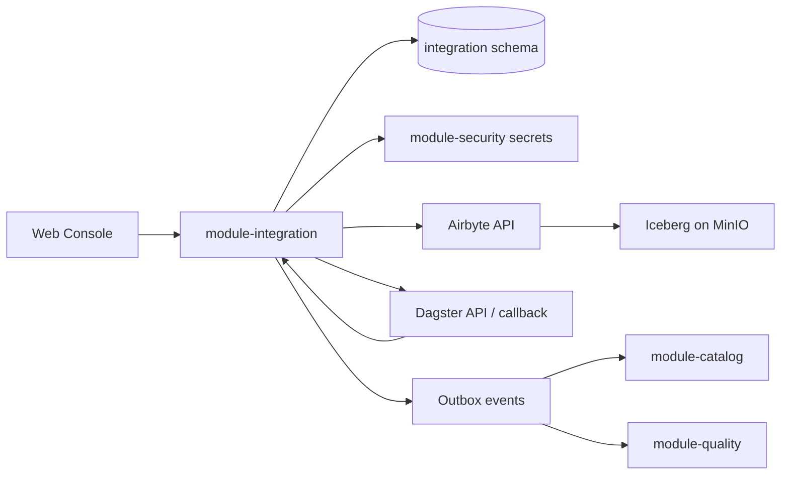

# 数据集成模块后端迭代开发计划

> 调研日期：2026-06-15
> 范围：`module-integration` 后端、数据集成技术方案、数据面开发指南、数据集成前端页面契约。

## 1. 结论摘要

数据集成模块当前已经具备控制面主干骨架：数据源 CRUD/测连、同步任务创建/详情/按源查询、触发 Airbyte 同步、运行记录分页与 reconcile 骨架均已存在，且 `mvn -q -pl module-integration -am test` 通过。

但它距离技术方案要求的“数据进入湖仓唯一入口”还有明显差距：当前只是“能保存数据源和触发已有 Airbyte connection”，还没有完成“源端 schema 发现 -> Airbyte Connection 动态创建 -> 任务启停/调度 -> 运行状态与日志 -> schema 漂移 -> 事件驱动 catalog/quality”的闭环。

推荐实施路线是先做控制面主链路，再做数据面深集成，最后补 CDC/file/schema drift 等高阶能力：

1. 接口契约与前端真实接入。
2. 任务生命周期与运行流水闭环。
3. Airbyte 动态连接创建与日志/取消代理。
4. 源端 schema 发现与漂移检测。
5. Dagster 调度回写与跨模块事件。
6. CDC、文件采集、模板库和监控大盘产品化。

## 2. 当前代码事实

### 2.1 已实现能力

`module-integration` 已有完整基础分层：

| 层 | 当前文件 | 已实现内容 |
| --- | --- | --- |
| API | `DataSourceController` | `/api/v1/integration/datasources` 创建、更新、详情、列表、删除、测连 |
| API | `SyncTaskController` | `/api/v1/integration/sync-tasks` 创建、详情、按源列表、触发运行、reconcile、任务运行分页 |
| Service | `DataSourceServiceImpl` | 租户下唯一名称校验、Outbox、Audit、TenantContext 过滤、测连状态回写 |
| Service | `SyncTaskServiceImpl` | 创建 DRAFT 任务、触发 Airbyte、落 `sync_run`、reconcile 运行状态 |
| Client | `ConnectivityTester` | TCP 探活 + 关系库 JDBC `SELECT 1` |
| Client | `AirbyteSyncDriver` | 调 Airbyte `/connections/sync` 与 `/jobs/get` |
| DB | `integration/V1__integration.sql` | `datasource`、`sync_task`、`sync_run`、`source_schema_snapshot` |
| Common | `module-common` | `TenantContext`、`AuditLogger`、`OutboxPublisher/Dispatcher` 可复用 |

### 2.2 主要缺口

| 领域 | 缺口 | 影响 |
| --- | --- | --- |
| 前端契约 | 页面仍大量读取 `src/mock/l1-integration.ts`；后端 DTO 缺前端展示字段 | 无法把数据集成页面切到真实接口 |
| 数据源 | DTO 不返回 config 派生的 host/port/dbName/username/rttMs；测连仍从 config.password 读取密码 | 列表/详情信息不足，且密钥治理与注释不一致 |
| 同步任务 | 无全量列表、分页、更新、删除、启用、停用；创建后永远 DRAFT | 前端任务列表/发布/暂停/编辑无法真实闭环 |
| Airbyte | 只触发已有 connection；不创建 source/destination/connection，不代理日志/取消 | 任务无法从 OneLake 配置自动生成 Airbyte 管道 |
| 运行流水 | DTO 缺 errorMsg/checkpoint/duration/throughput；reconcile 状态映射粗糙 | 任务详情和失败诊断页面难以接入 |
| Schema | `source_schema_snapshot` 未被使用；无 schema 发现、diff、审批/处理记录 | CDC schema 漂移页面无法落地 |
| 调度 | 任务 scheduleCron 未注册 Dagster，也没有 Dagster run tag 与回写闭环 | 只能手动触发，不能形成调度控制面 |
| 数据库 | 缺 sync_task 租户+名称唯一约束、运行租户字段、漂移事件/审批表、连接器模板表 | 查询、审计、权限隔离和高阶页面支撑不足 |

## 3. 目标架构

数据集成模块应保持“控制面不搬数据”的边界：



推荐新增后端边界：

| 边界 | 建议实现 |
| --- | --- |
| 采集驱动 | `SyncDriver` SPI + `SyncDriverRegistry`，首个实现 `AirbyteSyncDriver` |
| 连接器配置 | `ConnectorCatalogService` 提供连接器类型、表单 schema、能力声明 |
| 源端 schema | `SourceSchemaService` 负责 schema 发现、快照、diff、漂移事件 |
| 任务生命周期 | `SyncTaskLifecycleService` 负责 DRAFT/ENABLED/PAUSED 状态机 |
| 运行流水 | `SyncRunService` 负责详情、列表、日志、取消、reconcile、派生指标 |
| 数据面回调 | 内部接口或受限角色 `OPS`，用于 Dagster sensor 回写 |

## 4. 分阶段开发计划

### 阶段 0：契约冻结与最小真实接入

目标：先让前端“连接管理/采集任务列表/详情”可以接真实接口，降低后续迭代摩擦。

后端任务：

1. 扩展 `DataSourceDTO`：返回 `tenantId`、`host`、`port`、`dbName`、`username`、`rttMs` 等非敏感展示字段；字段从 `config` 派生，不返回 password。
2. 扩展 `SyncTaskDTO`：返回 `sourceName`、`fieldMapping`、`dirtyThreshold`、`airbyteConnectionId`。
3. 扩展 `SyncRunDTO`：返回 `errorMsg`、`checkpoint`、`durationMs`、`throughputRows`。
4. 新增列表接口：
   - `GET /api/v1/integration/sync-tasks?keyword=&mode=&status=&page=&size=`
   - `GET /api/v1/integration/sync-runs?taskId=&status=&page=&size=`
5. 增加 controller/service 层单元或 slice 测试，固定 ApiResponse 与 DTO 结构。

前端配合：

1. `DatasourceList`、`DatasourceDetail`、`SyncTaskList`、`SyncTaskDetail` 优先接 `IntegrationAPI`。
2. 保留 mock fallback，用于数据面未启动时的 prototype 展示。

验收：

1. `mvn -q -pl module-integration -am test`
2. `pnpm build`
3. 本地页面从真实接口读出数据源、任务、运行历史。

可行性：高。主要是 DTO/查询/前端接线，无重数据面依赖。

### 阶段 1：任务生命周期闭环

目标：把“新建 -> 保存草稿 -> 发布启用 -> 触发 -> 暂停/恢复 -> 删除”做成真实后端能力。

后端任务：

1. 新增/完善 VO：
   - `UpdateSyncTaskVO`
   - `EnableSyncTaskVO` 可带 `createConnection=true`、`registerSchedule=true`
   - `RunSyncTaskVO` 可带 `dryRun`、`resumeFromCheckpoint`、`reason`
2. 新增接口：
   - `PUT /api/v1/integration/sync-tasks/{id}`
   - `DELETE /api/v1/integration/sync-tasks/{id}`
   - `POST /api/v1/integration/sync-tasks/{id}/enable`
   - `POST /api/v1/integration/sync-tasks/{id}/disable`
   - `POST /api/v1/integration/sync-tasks/{id}/trigger`
3. 兼容现有 `POST /{id}/run`，短期保留别名，前端稳定后统一到 `/trigger`。
4. 状态机约束：
   - `DRAFT -> ENABLED`
   - `ENABLED -> PAUSED`
   - `PAUSED -> ENABLED`
   - 只有 `ENABLED` 可触发普通运行。
5. 删除约束：有 RUNNING run 或已启用任务时拒绝删除，给出明确错误码。
6. DB 增加唯一约束：`UNIQUE(tenant_id, name)` 到 `integration.sync_task`。

验收：

1. 状态流转测试覆盖非法转移。
2. 前端发布、暂停、触发按钮接真实接口。
3. 删除被关联/运行中任务时有可读错误。

可行性：高。当前表和实体基本够用，只需少量迁移和服务层状态机。

### 阶段 2：Airbyte 动态 Connection 与运行控制

目标：从“触发已有 connection”升级为“OneLake 创建任务即可生成 Airbyte 管道”。

后端任务：

1. 引入 `SyncDriver` SPI：
   - `supports(SyncTask task, DataSource source)`
   - `ensureConnection(SyncTask task, DataSource source)`
   - `trigger(SyncTask task)`
   - `getStatus(String externalJobId)`
   - `getLogs(String externalJobId)`
   - `cancel(String externalJobId)`
2. 将 `SyncTaskServiceImpl` 依赖 `AirbyteSyncDriver` 改为依赖 `SyncDriverRegistry`。
3. 扩展 Airbyte driver：
   - `/sources/create`
   - `/destinations/create`
   - `/connections/create`
   - `/connections/sync`
   - `/jobs/get`
   - `/jobs/list` 或日志端点
   - `/jobs/cancel`
4. 目标端先固定为当前数据面 Iceberg/MinIO/Hive Metastore 路径，使用配置化 destination。
5. `enable` 时调用 `ensureConnection`，成功后回写 `airbyte_connection_id`。
6. `trigger` 时创建 `sync_run`，并在 Airbyte 返回后记录 `external_job_id`。
7. `reconcile` 做 Airbyte 状态到本地 `RunStatus` 的明确映射，记录 `errorCode/errorMsg/rowsRead/rowsWritten/checkpoint`。
8. 新增接口：
   - `GET /api/v1/integration/sync-runs/{id}`
   - `GET /api/v1/integration/sync-runs/{id}/logs`
   - `POST /api/v1/integration/sync-runs/{id}/cancel`

验收：

1. 未预置 Airbyte connection 时，启用任务可自动创建 connection。
2. 触发后 `sync_run` 从 RUNNING 变为 SUCCEEDED/FAILED。
3. 失败诊断页面可以看到 errorMsg/logs/checkpoint。

可行性：中。技术路径明确，但 Airbyte 镜像/API 版本要先固定；`airbyte/airbyte:latest` 存在版本漂移风险，建议 pin 到文档或实测版本。

### 阶段 3：源端 schema 发现与漂移检测

目标：支撑采集向导的表/字段选择、字段映射，以及 CDC schema 变更审批。

后端任务：

1. 新增 `SourceSchemaService`：
   - 对 RDBMS 用 JDBC DatabaseMetaData 发现 schema/table/column。
   - 对 S3/file 用 connector-specific parser 或先返回目录/文件 schema 占位。
   - 对 Kafka/Hive 后置，先声明不支持或只做手工 schema。
2. 新增接口：
   - `GET /api/v1/integration/datasources/{id}/schemas`
   - `POST /api/v1/integration/datasources/{id}/snapshots`
   - `GET /api/v1/integration/datasources/{id}/snapshots`
   - `GET /api/v1/integration/datasources/{id}/drift`
3. 差异模型：
   - ADD_COLUMN：兼容，默认自动应用。
   - DROP_COLUMN / TYPE_NARROWING / RENAME：破坏性，生成审批。
   - TYPE_WIDENING：可配置自动应用。
4. 数据库新增：
   - `integration.schema_drift_event`
   - `integration.schema_change_approval` 或复用 `security.approval_request` 并建立业务关联。
5. 产生 `integration.schema.drift` outbox 事件，供通知、监控和下游影响分析使用。

验收：

1. 采集向导从真实 `/schemas` 获取表和字段。
2. 改变源端表结构后能生成 snapshot diff。
3. `SchemaChangeApproval` 能接真实审批详情。

可行性：中。RDBMS 路径可控；CDC/file 的精确处理依赖后续采集引擎和文件 schema 解析策略。

### 阶段 4：Dagster 调度与跨模块事件闭环

目标：将 `scheduleCron` 从字段变成真实调度能力，并在入湖后驱动目录/质量。

后端任务：

1. 与 `module-orchestration` 对齐调度边界：数据集成模块只声明任务调度，实际 Dagster job/schedule 注册由 orchestration 或数据面 client 执行。
2. 启用任务时根据 `scheduleCron` 注册或更新 Dagster schedule。
3. 触发运行时给 Dagster run 打 `onelake/sync_run_id` tag。
4. Dagster sensor 回写时调用内部 reconcile 接口。
5. `reconcile` 成功后发出：
   - `integration.table.loaded`
   - `integration.sync.failed`
   - `integration.schema.drift`
6. catalog/quality 模块通过 `DomainEventHandler` 消费事件，更新资产、质量或告警。

验收：

1. 定时任务可以由 Dagster 触发并回写本地 run。
2. 成功 run 触发 catalog asset 或 quality 检查事件。
3. Outbox 事件状态从 PENDING 到 SENT。

可行性：中。公共 Outbox 已有，但 Dagster assets/sensors 目前更多是文档骨架，数据面 Python 工程需要配合落地。

### 阶段 5：CDC、文件采集、模板和监控产品化

目标：补齐前端剩余高级页面，但应在主链路稳定后实施。

后端任务：

1. CDC 监控：
   - 位点、延迟、背压指标模型。
   - CDC run logs。
   - rebuild snapshot / pause / resume 操作。
2. 文件采集：
   - 文件监听配置表。
   - 文件 run/item 表，记录 checksum、progress、status、size、path。
   - S3/SFTP 连接器能力声明。
3. 模板库：
   - `integration.collect_template`
   - 模板参数 schema。
   - 一键生成多个 sync_task。
4. 监控大盘：
   - 聚合 run 成功率、吞吐、失败 Top、平均时延。
   - 可从 `sync_run` 先做 SQL 聚合，后续接 Prometheus/metrics。

验收：

1. CDC 页面可以显示真实 run/lag/schema change。
2. 文件采集页面可以显示真实文件处理进度。
3. 模板能生成任务草稿。
4. 监控大盘指标来自真实 `sync_run` 聚合。

可行性：中低。产品价值高，但依赖前面 Airbyte/Dagster/schema/run 基础能力；不建议第一轮就做。

## 5. 推荐首个迭代切片

首个迭代建议控制在 5-8 个工作日，目标是“前端连接/任务主页面接真实接口 + 后端任务生命周期闭环”。

### 后端交付范围

1. DTO 补齐前端所需展示字段。
2. 数据源列表支持 keyword/type/health/envLevel/page/size。
3. 同步任务列表支持 keyword/mode/status/sourceId/page/size。
4. 同步任务 update/delete/enable/disable/trigger。
5. 运行列表/详情 DTO 增强，返回派生指标。
6. 删除/触发/启停状态机测试。
7. 更新 OpenAPI 与相关文档。

### 明确不做

1. 不在第一轮做完整 Airbyte source/destination/connection 自动创建。
2. 不在第一轮做 CDC schema drift 审批。
3. 不在第一轮做文件监听和模板持久化。
4. 不在第一轮做 Dagster schedule 自动注册。

这个切片能让数据集成从“纯 mock 页面”迈到“真实控制面可用”，同时不被重数据面联调拖住。

## 6. 数据模型变更建议

### 近期迁移

```sql
ALTER TABLE integration.sync_task
  ADD CONSTRAINT uk_sync_task_tenant_name UNIQUE (tenant_id, name);

CREATE INDEX IF NOT EXISTS idx_synctask_tenant_status
  ON integration.sync_task (tenant_id, status);

CREATE INDEX IF NOT EXISTS idx_syncrun_status_time
  ON integration.sync_run (status, started_at DESC);
```

### 中期迁移

```sql
CREATE TABLE integration.schema_drift_event (
  id UUID PRIMARY KEY DEFAULT gen_random_uuid(),
  tenant_id UUID NOT NULL,
  source_id UUID NOT NULL REFERENCES integration.datasource(id),
  task_id UUID REFERENCES integration.sync_task(id),
  object_name VARCHAR(256) NOT NULL,
  change_type VARCHAR(64) NOT NULL,
  compatible BOOLEAN NOT NULL DEFAULT false,
  before_snapshot_id UUID REFERENCES integration.source_schema_snapshot(id),
  after_snapshot_id UUID REFERENCES integration.source_schema_snapshot(id),
  diff JSONB NOT NULL,
  status VARCHAR(32) NOT NULL DEFAULT 'PENDING',
  created_at TIMESTAMPTZ NOT NULL DEFAULT now(),
  decided_at TIMESTAMPTZ
);
```

`sync_run` 是否增加 `tenant_id`：建议增加。虽然可以经 task 关联租户，但监控大盘和运行列表会频繁按租户过滤，直接字段更利于查询和隔离。

## 7. API 契约优先级

### P0：第一轮必须

| 方法 | 路径 | 用途 |
| --- | --- | --- |
| GET | `/api/v1/system/context` | 当前登录上下文，返回 JWT 租户、可绑定项目、用户与角色 |
| GET | `/api/v1/system/projects` | 当前租户下的项目选项，用于数据源/任务绑定 |
| GET | `/api/v1/integration/datasources` | 数据源列表，支持筛选/分页 |
| POST | `/api/v1/integration/datasources` | 创建数据源，租户来自 JWT，`projectId` 必须属于当前租户，`config` 按类型校验 |
| POST | `/api/v1/integration/datasources/{id}/test` | 测连 |
| GET | `/api/v1/integration/sync-tasks` | 任务列表 |
| PUT | `/api/v1/integration/sync-tasks/{id}` | 更新任务 |
| POST | `/api/v1/integration/sync-tasks/{id}/enable` | 发布/启用 |
| POST | `/api/v1/integration/sync-tasks/{id}/disable` | 暂停 |
| POST | `/api/v1/integration/sync-tasks/{id}/trigger` | 触发运行 |
| GET | `/api/v1/integration/sync-tasks/{id}/runs` | 任务运行历史 |

### P0 数据源 Schema 校对

| 类型 | 必填连接字段 | 可选连接字段 | 网络字段 |
| --- | --- | --- | --- |
| MYSQL | `host`、`port`、`dbName/database`、`username` | `password`、后续 CDC/SSL 参数 | `networkMode=DIRECT` 不追加字段；`VPC` 必填 `networkAccessRef`；`SSH_TUNNEL` 必填 `sshHost`、`sshPort`、`sshUsername`、`sshPrivateKeyRef` 或 `sshPasswordRef` |
| POSTGRES | `host`、`port`、`dbName/database`、`username` | `password`、后续 schema/SSL/replication 参数 | 同 MYSQL |
| HIVE | `host`、`port`、`dbName/database` | `username`；`authMode=KERBEROS` 时必填 `principal` | 同 MYSQL |
| KAFKA | `bootstrapServers` | `topicPattern`；`securityProtocol=SASL_*` 时必填 `saslMechanism`、`saslUsername`、`saslPassword` | 同 MYSQL |
| S3 | `bucket` | `endpoint`、`region`、`prefix`、`pathStyleAccess`；`accessKey` 和 `secretKey` 需同时填写 | 同 MYSQL |

`projectId` 不从前端硬编码租户/项目字典读取，而由 `/api/v1/system/context` 或 `/api/v1/system/projects` 返回当前 JWT 租户下的项目；后端保存前再次校验项目必须属于当前租户。`networkMode` 是数据源顶层字段，网络接入参数随当前网络模式进入 `config`，不改变连接类型自身字段。

### P1：第二轮

| 方法 | 路径 | 用途 |
| --- | --- | --- |
| GET | `/api/v1/integration/sync-runs/{id}` | 运行详情 |
| GET | `/api/v1/integration/sync-runs/{id}/logs` | 运行日志 |
| POST | `/api/v1/integration/sync-runs/{id}/cancel` | 取消运行 |
| GET | `/api/v1/integration/connectors` | 连接器类型与表单 schema |
| GET | `/api/v1/integration/datasources/{id}/schemas` | 源端 schema |

### P2：第三轮及以后

| 方法 | 路径 | 用途 |
| --- | --- | --- |
| GET | `/api/v1/integration/datasources/{id}/drift` | 漂移检测 |
| GET | `/api/v1/integration/schema-changes` | Schema 变更队列 |
| POST | `/api/v1/integration/schema-changes/{id}/approve` | 审批通过 |
| POST | `/api/v1/integration/schema-changes/{id}/reject` | 驳回 |
| GET | `/api/v1/integration/files/watch-items` | 文件采集进度 |
| GET | `/api/v1/integration/templates` | 任务模板 |

## 8. 可行性与风险

| 方向 | 可行性 | 风险 | 建议 |
| --- | --- | --- | --- |
| DTO/列表/状态机 | 高 | 主要是字段兼容和分页返回结构 | 先做，收益最大 |
| 前端真实接入 | 高 | 页面仍有部分 mock 交互，需要渐进替换 | 先接主页面，保留 mock fallback |
| Airbyte 动态 connection | 中 | Airbyte 版本/API 和认证方式可能漂移 | pin 镜像版本，先做 MySQL/Postgres 到 Iceberg 一条链路 |
| Dagster 回写 | 中 | 数据面 Python 工程未完全落地 | 先保留 reconcile REST，后续由 Dagster sensor 调用 |
| Schema drift | 中 | RDBMS 可行，CDC/file 复杂 | 第一版只做 RDBMS snapshot diff |
| CDC 实时 | 中低 | 需要 Flink/Debezium 或 Airbyte CDC 能力明确 | 先做监控模型，不急着承诺 exactly-once |
| 文件采集 | 中低 | 文件监听、分片、校验、去重涉及独立采集器 | 先以任务模式和运行记录抽象承载 |
| 安全密钥 | 中 | 当前测连读取 config.password，与 secret_ref 设计不一致 | 第二轮前应接 `module-security` Secret 或至少定义 SecretResolver |

## 9. 验证策略

每个阶段都应保持“小闭环验证”：

1. 后端编译：`cd onelake-app && mvn -q -pl module-integration -am test`
2. OpenAPI：启动 backend 后访问 `/v3/api-docs`，确认新增接口出现。
3. 数据库：新增 migration 后执行 `make migrate`。
4. 前端：`cd onelake-app/web-console && pnpm build`。
5. 浏览器：打开 `http://localhost:5173/integration/datasources` 与 `/integration/sync-tasks`，确认真实数据、loading、empty、error 状态。
6. 数据面：Airbyte 阶段后做端到端冒烟：源库 -> Airbyte -> Iceberg/MinIO -> Trino 查询 -> `sync_run` 状态成功。

## 10. 下一步建议

立即进入第一轮实现时，建议按以下顺序开工：

1. 新增/调整 DTO 与 mapper，确保不暴露敏感字段。
2. 补 `SyncTaskService` 列表、更新、删除、启停、触发接口。
3. 为状态机和删除约束补测试。
4. 接入前端 `DatasourceList`、`DatasourceDetail`、`SyncTaskList`、`SyncTaskDetail`。
5. 跑后端测试、前端 build、浏览器验证。
6. 更新 `docs/IMPLEMENTATION_STATUS.md` 与 `docs/FRONTEND_VERIFICATION.md`。
