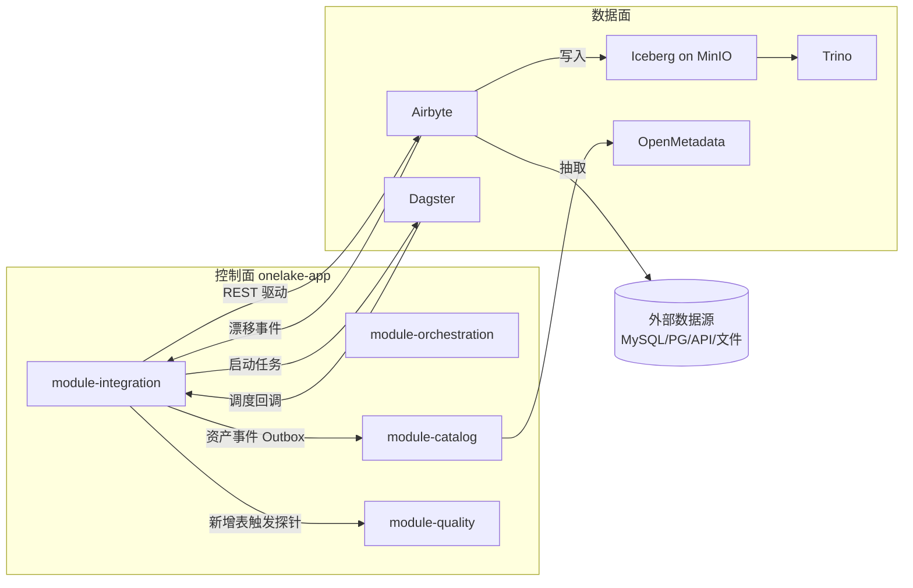
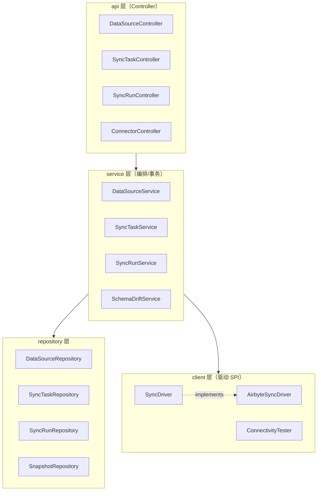
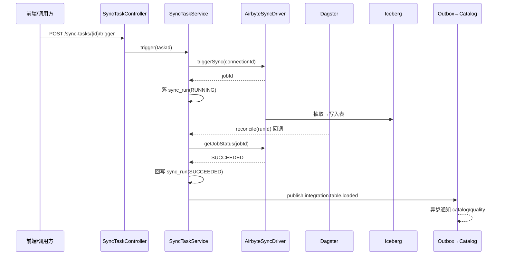
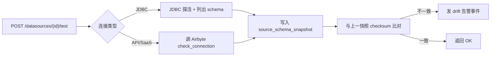
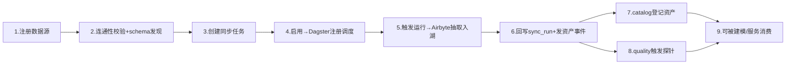

<aside>
🔌

本文是 **OneLake 数据集成模块（module-integration）** 的落地级技术方案。定位：统一纳管外部数据源的**接入、连通性校验、同步任务编排、运行监控与 schema 漂移检测**，作为数据进入湖仓（Iceberg on MinIO）的唯一入口。与总体架构对齐：控制面负责编排与元数据，数据面（Airbyte）负责真正搬运。

</aside>

## 一、模块定位与职责边界

数据集成模块是控制面的一个业务模块（`com.onelake.integration`），**只做编排与治理，不亲自搬数据**。真正的抽取-加载由数据面的 Airbyte 执行,本模块通过其 API 驱动。

| 能力 | 本模块负责 | 委托给（数据面） |
| --- | --- | --- |
| 数据源接入 | 源元数据、凭证引用、连通性校验 | — |
| 抽取加载（EL） | 创建/触发/取消同步作业，回写运行流水 | Airbyte Connection 实际执行 |
| 调度 | 定义调度策略、被 Dagster 触发 | Dagster Sensor/Schedule |
| schema 漂移 | 拉取源端表结构快照、比对告警 | — |
| 落库格式 | 指定目标 namespace/表 | Iceberg + Trino |

<aside>
🎯

**设计原则**：控制面不持有业务数据、不走大流量；所有“搬运”交给 Airbyte；模块与数据面之间用 **驱动接口（SyncDriver SPI）** 解耦，便于未来替换为 Flink CDC / 自研采集器。

</aside>

## 二、与整体架构的关系



## 三、第三方库与依赖

### 3.1 Maven 依赖（module-integration）

```xml
<dependencies>
  <!-- Web 与校验 -->
  <dependency>
    <groupId>org.springframework.boot</groupId>
    <artifactId>spring-boot-starter-web</artifactId>
  </dependency>
  <dependency>
    <groupId>org.springframework.boot</groupId>
    <artifactId>spring-boot-starter-validation</artifactId>
  </dependency>
  <!-- 持久化 -->
  <dependency>
    <groupId>org.springframework.boot</groupId>
    <artifactId>spring-boot-starter-data-jpa</artifactId>
  </dependency>
  <dependency>
    <groupId>org.postgresql</groupId>
    <artifactId>postgresql</artifactId>
  </dependency>
  <!-- 响应式 HTTP 客户端（调 Airbyte/OpenMetadata） -->
  <dependency>
    <groupId>org.springframework.boot</groupId>
    <artifactId>spring-boot-starter-webflux</artifactId>
  </dependency>
  <!-- 连通性测试：JDBC 驱动（按需） -->
  <dependency>
    <groupId>com.mysql</groupId>
    <artifactId>mysql-connector-j</artifactId>
  </dependency>
  <!-- 凭证加密存储 -->
  <dependency>
    <groupId>org.bouncycastle</groupId>
    <artifactId>bcprov-jdk18on</artifactId>
    <version>1.78.1</version>
  </dependency>
  <!-- 重试与容错 -->
  <dependency>
    <groupId>org.springframework.retry</groupId>
    <artifactId>spring-retry</artifactId>
  </dependency>
  <dependency>
    <groupId>io.github.resilience4j</groupId>
    <artifactId>resilience4j-spring-boot3</artifactId>
    <version>2.2.0</version>
  </dependency>
  <!-- 对象映射 -->
  <dependency>
    <groupId>org.mapstruct</groupId>
    <artifactId>mapstruct</artifactId>
    <version>1.6.0</version>
  </dependency>
  <!-- 模块间公共 -->
  <dependency>
    <groupId>com.onelake</groupId>
    <artifactId>module-common</artifactId>
  </dependency>
</dependencies>
```

### 3.2 依赖的外部组件

| 组件 | 用途 | 交互方式 | 端口 |
| --- | --- | --- | --- |
| Airbyte | 数据抽取加载引擎（300+ 连接器） | Config API (REST) | 8000 |
| Dagster | 调度与依赖编排 | GraphQL / Sensor 回调 | 3000 |
| PostgreSQL | integration schema 元数据 | JDBC | 5432 |
| Redis | 连通性结果缓存、限流 | Lettuce | 6379 |
| OpenMetadata | 落库表资产登记（事件驱动） | REST | 8585 |
| Keycloak | 接口鉴权与角色 | OIDC / JWT | 8081 |

## 四、模块架构与包结构



包结构遵循全局约定 `com.onelake.integration.*`：

```
com.onelake.integration
├── api          # Controller + VO
├── service      # 接口
│   └── impl     # 实现（事务边界）
├── domain       # @Entity + 枚举 + 领域事件
├── repository   # JpaRepository
├── client       # SyncDriver / Airbyte / OpenMetadata 调用
│   └── airbyte  # AirbyteClient + DTO
├── mapper       # MapStruct
├── dto          # DTO / 事件载荷
└── config       # WebClient/Retry/加密 配置
```

## 五、数据流转图

### 5.1 全量/增量同步主流程



### 5.2 连通性校验与 schema 发现



## 六、核心领域模型（integration schema）

复用技术初始化文档第七章 `integration` schema,核心表：

| 表 | 说明 | 关键字段 |
| --- | --- | --- |
| datasource | 数据源注册 | type, config(jsonb), secret_ref, health |
| sync_task | 同步任务定义 | source_id, target_namespace, mode, cron, airbyte_connection_id, status |
| sync_run | 每次运行流水 | task_id, external_job_id, status, rows_synced, started_at, finished_at |
| source_schema_snapshot | 源端结构快照（漂移检测） | object_name, columns(jsonb), checksum, captured_at |

## 七、关键代码实现

### 7.1 驱动 SPI（可扩展性核心）

```java
/** 同步驱动抽象：未来可新增 FlinkCdcSyncDriver / CustomSyncDriver */
public interface SyncDriver {
  String type();                              // "airbyte" / "flink-cdc"
  String ensureConnection(SyncTask task);     // 幂等：创建或返回已有 connectionId
  long triggerSync(String connectionId);      // 返回外部 jobId
  RunStatus getJobStatus(long jobId);
  void cancel(long jobId);
}

@Component
@RequiredArgsConstructor
public class SyncDriverRegistry {
  private final List<SyncDriver> drivers;
  public SyncDriver resolve(String type) {
    return drivers.stream().filter(d -> d.type().equals(type)).findFirst()
        .orElseThrow(() -> new BizException(40010, "不支持的驱动：" + type));
  }
}
```

### 7.2 Airbyte 驱动实现（client 层，含重试/熔断）

```java
@Component
@RequiredArgsConstructor
public class AirbyteSyncDriver implements SyncDriver {

  private final WebClient airbyte;            // baseUrl=http://airbyte:8000/api/v1

  @Override public String type() { return "airbyte"; }

  @Override
  @Retry(name = "airbyte")
  @CircuitBreaker(name = "airbyte")
  public long triggerSync(String connectionId) {
    JsonNode resp = airbyte.post().uri("/connections/sync")
        .bodyValue(Map.of("connectionId", connectionId))
        .retrieve().bodyToMono(JsonNode.class).block();
    return resp.path("job").path("id").asLong();
  }

  @Override
  public RunStatus getJobStatus(long jobId) {
    JsonNode resp = airbyte.post().uri("/jobs/get")
        .bodyValue(Map.of("id", jobId))
        .retrieve().bodyToMono(JsonNode.class).block();
    String s = resp.path("job").path("status").asText();   // succeeded/running/failed
    return RunStatus.fromAirbyte(s);
  }

  @Override
  public String ensureConnection(SyncTask task) {
    if (task.getAirbyteConnectionId() != null) return task.getAirbyteConnectionId();
    // 1) createSource 2) createDestination(Iceberg) 3) createConnection
    // 略：调 /sources/create /destinations/create /connections/create
    throw new UnsupportedOperationException("see provisioning flow");
  }

  @Override
  public void cancel(long jobId) {
    airbyte.post().uri("/jobs/cancel")
        .bodyValue(Map.of("id", jobId)).retrieve().toBodilessEntity().block();
  }
}
```

### 7.3 同步任务编排（service 层，事务 + Outbox）

```java
@Service
@RequiredArgsConstructor
public class SyncTaskServiceImpl implements SyncTaskService {

  private final SyncTaskRepository taskRepo;
  private final SyncRunRepository runRepo;
  private final SyncDriverRegistry registry;
  private final OutboxPublisher outbox;

  @Transactional
  public UUID trigger(UUID taskId) {
    SyncTask task = taskRepo.findById(taskId)
        .orElseThrow(() -> new BizException(40400, "同步任务不存在"));
    if (task.getStatus() != TaskStatus.ENABLED)
      throw new BizException(40010, "任务未启用");

    SyncDriver driver = registry.resolve(task.getDriverType());
    String conn = driver.ensureConnection(task);
    long jobId = driver.triggerSync(conn);

    SyncRun run = new SyncRun();
    run.setTaskId(taskId);
    run.setExternalJobId(String.valueOf(jobId));
    run.setStatus(RunStatus.RUNNING);
    run.setStartedAt(Instant.now());
    runRepo.save(run);
    return run.getId();
  }

  /** Dagster Sensor 回调：回写最终态并发资产事件 */
  @Transactional
  public void reconcile(UUID runId) {
    SyncRun run = runRepo.findById(runId).orElseThrow();
    SyncTask task = taskRepo.findById(run.getTaskId()).orElseThrow();
    RunStatus st = registry.resolve(task.getDriverType())
        .getJobStatus(Long.parseLong(run.getExternalJobId()));
    run.setStatus(st);
    if (st != RunStatus.RUNNING) {
      run.setFinishedAt(Instant.now());
      if (st == RunStatus.SUCCEEDED) {
        outbox.publish("integration.table.loaded", task.getId().toString(),
            Map.of("namespace", task.getTargetNamespace(),
                   "source", task.getSourceId().toString()));
      }
    }
  }
}
```

### 7.4 schema 漂移检测

```java
@Service
@RequiredArgsConstructor
public class SchemaDriftService {

  private final SnapshotRepository snapshotRepo;
  private final ConnectivityTester tester;
  private final OutboxPublisher outbox;

  @Transactional
  public DriftResult detect(UUID sourceId, String objectName) {
    List<ColumnMeta> cols = tester.describe(sourceId, objectName);
    String checksum = Checksums.ofColumns(cols);
    var last = snapshotRepo.findTopBySourceIdAndObjectNameOrderByCapturedAtDesc(sourceId, objectName);

    boolean drifted = last.isPresent() && !last.get().getChecksum().equals(checksum);
    SourceSchemaSnapshot snap = new SourceSchemaSnapshot();
    snap.setSourceId(sourceId);
    snap.setObjectName(objectName);
    snap.setColumns(JsonUtil.toJson(cols));
    snap.setChecksum(checksum);
    snapshotRepo.save(snap);

    if (drifted) {
      outbox.publish("integration.schema.drift", sourceId.toString(),
          Map.of("object", objectName));
    }
    return new DriftResult(drifted, cols);
  }
}
```

## 八、全部 API 接口设计

统一前缀 `/api/integration`,统一返回 `ApiResponse<T>`,鉴权基于 Keycloak JWT,角色 `DE/ADMIN/CONSUMER/SEC/OPS`。

### 8.1 数据源管理

| 方法 | 路径 | 说明 | 权限 |
| --- | --- | --- | --- |
| POST | /datasources | 创建数据源 | DE |
| GET | /datasources | 分页查询（?type=&keyword=&page=） | DE/CONSUMER |
| GET | /datasources/{id} | 详情 | DE/CONSUMER |
| PUT | /datasources/{id} | 更新配置 | DE |
| DELETE | /datasources/{id} | 删除（有任务引用时拒绝） | DE |
| POST | /datasources/{id}/test | 连通性校验 | DE |
| GET | /datasources/{id}/schemas | 列出源端库/表/列 | DE |
| GET | /datasources/{id}/snapshots | schema 快照历史 | DE |
| GET | /datasources/{id}/drift | 漂移检测结果 | DE |

### 8.2 同步任务

| 方法 | 路径 | 说明 | 权限 |
| --- | --- | --- | --- |
| POST | /sync-tasks | 创建同步任务 | DE |
| GET | /sync-tasks | 列表查询 | DE/CONSUMER |
| GET | /sync-tasks/{id} | 详情 | DE/CONSUMER |
| PUT | /sync-tasks/{id} | 更新（调度/模式/目标） | DE |
| DELETE | /sync-tasks/{id} | 删除 | DE |
| POST | /sync-tasks/{id}/enable | 启用 | DE |
| POST | /sync-tasks/{id}/disable | 停用 | DE |
| POST | /sync-tasks/{id}/trigger | 手动触发一次 | DE |

### 8.3 同步运行与连接器

| 方法 | 路径 | 说明 | 权限 |
| --- | --- | --- | --- |
| GET | /sync-runs | 运行流水（?taskId=&status=） | DE/OPS |
| GET | /sync-runs/{id} | 运行详情 | DE/OPS |
| GET | /sync-runs/{id}/logs | 运行日志（代理 Airbyte） | DE/OPS |
| POST | /sync-runs/{id}/cancel | 取消运行 | DE/OPS |
| POST | /sync-runs/{id}/reconcile | 回调回写状态（仅 Dagster/内部） | OPS |
| GET | /connectors | 支持的连接器类型与配置表单模式 | DE |

### 8.4 请求/响应示例

**创建数据源** `POST /api/integration/datasources`

```json
{
  "name": "crm-mysql-prod",
  "type": "mysql",
  "config": {
    "host": "10.0.1.20",
    "port": 3306,
    "database": "crm",
    "username": "reader"
  },
  "secretRef": "vault://onelake/crm-mysql/password"
}
```

响应：

```json
{
  "code": 0,
  "message": "ok",
  "data": { "id": "a1b2...", "name": "crm-mysql-prod", "type": "mysql", "health": "UNKNOWN" }
}
```

**创建同步任务** `POST /api/integration/sync-tasks`

```json
{
  "sourceId": "a1b2...",
  "driverType": "airbyte",
  "mode": "INCREMENTAL",
  "targetNamespace": "ods.crm",
  "cron": "0 0 2 * * ?",
  "streams": ["customer", "order"]
}
```

**触发响应** `POST /sync-tasks/{id}/trigger`

```json
{ "code": 0, "message": "ok", "data": { "runId": "r-7788", "status": "RUNNING" } }
```

## 九、业务闭环说明



每个环节都有持久化与事件,失败可重试、可追溯,形成 **接入 → 同步 → 落库 → 编目 → 质量 → 消费** 的完整闭环。

## 十、可扩展性设计

| 扩展点 | 机制 |
| --- | --- |
| 新增采集引擎 | 实现 `SyncDriver` SPI（如 FlinkCdcSyncDriver），自动被 Registry 装配 |
| 新增数据源类型 | config 用 jsonb + 连接器元数据驱动表单，无需改表结构 |
| 跨模块集成 | Outbox 事件 + DomainEventHandler，新增订阅者不侵入主流程 |
| 多租户 | 所有表带 tenant_id + TenantContext 自动注入 |
| 高并发触发 | 驱动层熔断/限流 + 运行状态幂等 reconcile |

## 十一、落地清单（DoD）

- [ ]  integration schema Flyway 脚本（含 source_schema_snapshot）
- [ ]  AirbyteClient + WebClient/Retry/CircuitBreaker 配置
- [ ]  SyncDriver SPI + AirbyteSyncDriver 实现
- [ ]  4 个 Controller + Service + Repository + MapStruct
- [ ]  Dagster Sensor 回调 reconcile 接入
- [ ]  Outbox 事件：table.loaded / schema.drift
- [ ]  凭证加密存储（secret_ref + Vault/本地加密）
- [ ]  Testcontainers 集成测试（MySQL 源 + PG 元数据）