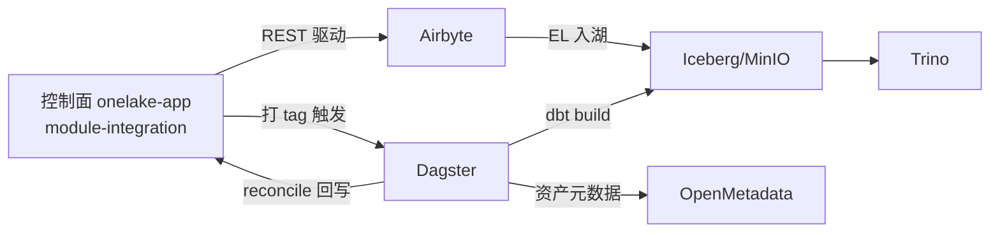

<aside>
🌊

本文回答「数据面的开发在哪里」。数据面 **不在 onelake-app（Java 控制面）里写逻辑**,它由三类产物组成:**开源组件（部署配置） + dbt（SQL 转换） + Dagster（Python 编排）**。控制面只通过 API/事件去驱动数据面运行。

</aside>

## 一、数据面开发边界与产物

| 环节 | 开发产物 | 代码/配置位置 | 语言/形式 |
| --- | --- | --- | --- |
| 部署编排 | MinIO/Iceberg/Trino/Airbyte/Dagster/OpenMetadata/Keycloak/Superset | deploy/docker-compose.yml（本地）、Helm（生产） | 声明式 YAML |
| 数据采集（EL） | Airbyte Source/Destination/Connection | 控制面 API 创建 或 octavia/（GitOps） | 配置,非编码 |
| 数据转换/建模 | dbt 模型、测试、宏 | dbt/（models/macros/tests） | SQL + Jinja |
| 调度编排 | Dagster assets/jobs/schedules/sensors | dagster/onelake_dp/ | Python |
| 查询/存储层 | Trino catalog、Iceberg namespace/表 | deploy/trino/catalog/、建表 SQL | properties / SQL |



## 二、第三方依赖（数据面侧）

数据面用 Python 工具链,与 Java 控制面隔离:

```
# dagster/requirements.txt
dagster==1.7.*
dagster-webserver==1.7.*
dagster-dbt==0.23.*
dagster-airbyte==0.23.*
dbt-core==1.8.*
dbt-trino==1.8.*
requests==2.32.*
octavia-cli==0.50.*   # Airbyte GitOps（可选）
```

## 三、部署编排（docker-compose 骨架）

数据面所有组件用一份 compose 拉起;控制面的 PostgreSQL 单库复用,数据面 catalog 元数据走 Iceberg REST Catalog。

```yaml
# deploy/docker-compose.dataplane.yml
services:
  minio:
    image: minio/minio:RELEASE.2024-06-13T22-53-53Z
    command: server /data --console-address ":9001"
    environment:
      MINIO_ROOT_USER: minio
      MINIO_ROOT_PASSWORD: minio12345
    ports: ["9000:9000", "9001:9001"]

  iceberg-rest:
    image: tabulario/iceberg-rest:1.6.0
    environment:
      CATALOG_WAREHOUSE: s3://onelake/
      CATALOG_IO__IMPL: org.apache.iceberg.aws.s3.S3FileIO
      CATALOG_S3_ENDPOINT: http://minio:9000
    ports: ["8181:8181"]
    depends_on: [minio]

  trino:
    image: trinodb/trino:451
    ports: ["8080:8080"]
    volumes: ["./trino/catalog:/etc/trino/catalog"]
    depends_on: [iceberg-rest]

  airbyte:
    image: airbyte/airbyte:0.63.0   # abctl/compose 部署的聚合入口
    ports: ["8000:8000"]

  dagster:
    build: ../dagster
    command: dagster dev -h 0.0.0.0 -p 3000
    ports: ["3000:3000"]
    volumes: ["../dagster:/opt/dagster/app", "../dbt:/opt/dagster/dbt"]
    depends_on: [trino, airbyte]

  openmetadata:
    image: openmetadata/server:1.4.1
    ports: ["8585:8585"]
```

<aside>
⚙️

统一用根 `Makefile` 编排:`make dp-up`（拉起数据面）、`make dp-down`、`make trino-init`（建 namespace）、`make dbt-build`、`make dagster-dev`。与技术初始化文档第五章本地开发流程衔接。

</aside>

## 四、Airbyte 连接器声明

两种方式,二选一:

1. **控制面 API（推荐,与 module-integration 一致）**:由 `AirbyteSyncDriver.ensureConnection()` 调 `/sources/create`、`/destinations/create`、`/connections/create` 动态创建,连接器配置随数据源元数据存于 `integration.datasource`。
2. **Octavia GitOps（声明式版本化）**:把连接器定义纳入仓库,适合固定管道。

```
octavia/
├── sources/
│   └── crm_mysql/configuration.yaml
├── destinations/
│   └── iceberg/configuration.yaml
└── connections/
    └── crm_to_ods.yaml
```

```yaml
# octavia/connections/crm_to_ods.yaml
definition_type: connection
resource_name: crm_to_ods
source_id: crm_mysql
destination_id: iceberg
configuration:
  namespace_definition: customformat
  namespace_format: ods
  schedule_type: manual          # 由 Dagster/控制面触发,不让 Airbyte 自调度
  sync_catalog:
    streams:
      - stream: { name: orders }
        config: { sync_mode: incremental, destination_sync_mode: append_dedup, cursor_field: [updated_at], primary_key: [[id]] }
```

## 五、dbt 项目（转换与建模）

分层对齐湖仓: **staging（贴源 ods） → intermediate（明细 dwd） → marts（汇总 dws/应用 ads）**。

```
dbt/
├── dbt_project.yml
├── profiles.yml
├── models/
│   ├── staging/
│   │   └── crm/
│   │       ├── _crm__sources.yml
│   │       ├── _crm__models.yml      # 列描述 + 测试
│   │       └── stg_crm__orders.sql
│   ├── intermediate/
│   │   └── int_orders_enriched.sql
│   └── marts/
│       └── sales/
│           └── fct_orders.sql
├── macros/
├── tests/
└── seeds/
```

<aside>
⚠️

**渲染约定**:因本页对双花括号有渲染限制,下方 dbt 代码中 Jinja 表达式 `{ {  } }` 用 `[[ ]]` 代替、语句块 `{ % % }` 用 `[% %]` 代替。**落地到真实 dbt 文件时,请把 `[[ ]]` 换回双花括号、`[% %]` 换回 `{ % % }`**。

</aside>

**dbt_project.yml**

```yaml
name: onelake
profile: onelake
version: "1.0.0"
models:
  onelake:
    staging:      { +materialized: view,        +schema: ods }
    intermediate: { +materialized: table,       +schema: dwd }
    marts:        { +materialized: incremental,  +schema: dws }
```

**profiles.yml（dbt-trino 适配器）**

```yaml
onelake:
  target: dev
  outputs:
    dev:
      type: trino
      method: none
      host: trino
      port: 8080
      user: "[[ env_var('TRINO_USER', 'admin') ]]"
      catalog: iceberg
      schema: dwd
      threads: 4
```

**贴源 staging 模型** `models/staging/crm/stg_crm__orders.sql`

```sql
[[ config(materialized='view') ]]
with source as (
    select * from [[ source('crm', 'orders') ]]
)
select
    id          as order_id,
    customer_id,
    amount,
    status,
    updated_at
from source
```

**增量事实表** `models/marts/sales/fct_orders.sql`

```sql
[[ config(materialized='incremental', unique_key='order_id', incremental_strategy='merge') ]]
with orders as (
    select * from [[ ref('stg_crm__orders') ]]
)
select
    order_id,
    customer_id,
    amount,
    status,
    updated_at
from orders
[% if is_incremental() %]
where updated_at > (select coalesce(max(updated_at), date '1970-01-01') from [[ this ]])
[% endif %]
```

**源定义与测试** `models/staging/crm/_crm__sources.yml`

```yaml
version: 2
sources:
  - name: crm
    schema: ods
    tables:
      - name: orders
        columns:
          - name: id
            tests: [unique, not_null]
```

开发循环命令:

```bash
dbt deps          # 安装 packages
dbt run -s staging.crm+   # 跑 crm 链路
dbt test          # 跑数据测试
dbt docs generate && dbt docs serve   # 血缘文档
```

## 六、Dagster 编排骨架

用 `dagster-dbt` 把 dbt 模型映射为资产、`dagster-airbyte` 把同步映射为资产,统一调度并回写控制面。

```
dagster/
├── requirements.txt
├── Dockerfile
└── onelake_dp/
    ├── __init__.py        # Definitions 聚合
    ├── assets.py          # dbt + airbyte 资产
    ├── jobs.py
    ├── schedules.py
    └── sensors.py         # 回写控制面
```

**assets.py**

```python
from pathlib import Path
from dagster import Definitions, ScheduleDefinition, define_asset_job
from dagster_dbt import DbtCliResource, dbt_assets
from dagster_airbyte import AirbyteResource, load_assets_from_airbyte_instance

DBT_DIR = Path("/opt/dagster/dbt")

@dbt_assets(manifest=DBT_DIR / "target" / "manifest.json")
def onelake_dbt_assets(context, dbt: DbtCliResource):
    yield from dbt.cli(["build"], context=context).stream()

airbyte = AirbyteResource(host="airbyte", port="8000")
airbyte_assets = load_assets_from_airbyte_instance(airbyte)

dbt_job = define_asset_job("dbt_job", selection="*")
daily = ScheduleDefinition(job=dbt_job, cron_schedule="0 3 * * *")

defs = Definitions(
    assets=[onelake_dbt_assets, *airbyte_assets],
    schedules=[daily],
    resources={"dbt": DbtCliResource(project_dir=str(DBT_DIR))},
)
```

**sensors.py（数据面 → 控制面回写,闭环关键）**

```python
import requests
from dagster import run_status_sensor, RunStatusSensorContext, DagsterRunStatus

CONTROL_PLANE = "http://onelake-app:8080/api/integration"

@run_status_sensor(run_status=DagsterRunStatus.SUCCESS)
def report_to_control_plane(context: RunStatusSensorContext):
    # 控制面触发时把 sync_run_id 作为 run tag 传入
    run_id = context.dagster_run.tags.get("onelake/sync_run_id")
    if run_id:
        requests.post(f"{CONTROL_PLANE}/sync-runs/{run_id}/reconcile", timeout=10)
```

启动:`dagster dev -h 0.0.0.0 -p 3000`,UI 在 3000 端口,可手动 Materialize 或观察 Sensor。

## 七、Trino catalog 与 Iceberg 表

**deploy/trino/catalog/iceberg.properties**

```
connector.name=iceberg
iceberg.catalog.type=rest
iceberg.rest-catalog.uri=http://iceberg-rest:8181
fs.native-s3.enabled=true
s3.endpoint=http://minio:9000
s3.path-style-access=true
s3.aws-access-key=minio
s3.aws-secret-key=minio12345
```

**初始化 namespace（make trino-init）**

```sql
CREATE SCHEMA IF NOT EXISTS iceberg.ods WITH (location = 's3://onelake/ods');
CREATE SCHEMA IF NOT EXISTS iceberg.dwd WITH (location = 's3://onelake/dwd');
CREATE SCHEMA IF NOT EXISTS iceberg.dws WITH (location = 's3://onelake/dws');
CREATE SCHEMA IF NOT EXISTS iceberg.ads WITH (location = 's3://onelake/ads');
```

Airbyte 落 `ods`,dbt 逐层加工到 `dwd/dws/ads`,Trino 统一查询,Superset/PostgREST 消费。

## 八、数据面与控制面衔接点

| 方向 | 触发点 | 机制 |
| --- | --- | --- |
| 控制面 → 数据面 | 触发同步 | module-integration 调 Airbyte API,并给 Dagster run 打 sync_run_id tag |
| 数据面 → 控制面 | 运行完成 | Dagster run_status_sensor 调 /sync-runs/{id}/reconcile 回写状态 |
| 数据面 → 控制面 | 新表落库 | reconcile 成功后控制面发 integration.table.loaded → catalog/quality |
| 数据面 → 目录 | 资产元数据 | Dagster/OpenMetadata 采集器登记表与血缘 |

## 九、本地开发与调试流程

1. `make dp-up` 拉起数据面 → `make trino-init` 建 namespace。
2. Airbyte UI（8000）配置或由控制面 API 创建 source/destination/connection。
3. dbt 开发循环:`dbt run -s <模型>` → `dbt test`,Trino UI（8080）验证结果。
4. `make dagster-dev`（3000）手动 Materialize 资产,观察 dbt/airbyte 资产状态。
5. 调试回写:给 Dagster run 打 `onelake/sync_run_id` tag,确认控制面 `sync_run` 状态被 reconcile 更新。
6. 端到端验证:控制面触发 → ods 有数据 → dbt 加工 → ads 可查 → catalog 出现资产。

## 十、落地清单（DoD）

- [ ]  deploy/docker-compose.dataplane.yml + Makefile 目标齐全
- [ ]  Trino iceberg catalog + 四层 namespace 初始化脚本
- [ ]  dbt 项目骨架（staging/intermediate/marts + sources + tests + profiles）
- [ ]  dbt-trino 连通 Iceberg,`dbt build` 通过
- [ ]  Dagster Definitions:dbt 资产 + airbyte 资产 + schedule
- [ ]  Dagster sensor 回写 /sync-runs/{id}/reconcile 打通闭环
- [ ]  Airbyte 连接声明（API 动态 或 octavia GitOps）二选一确定
- [ ]  端到端冒烟:源 → ods → dws/ads → Trino 可查 → catalog 登记