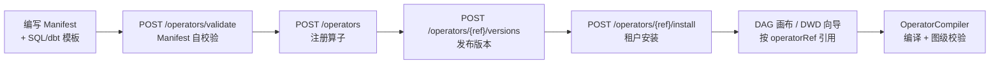
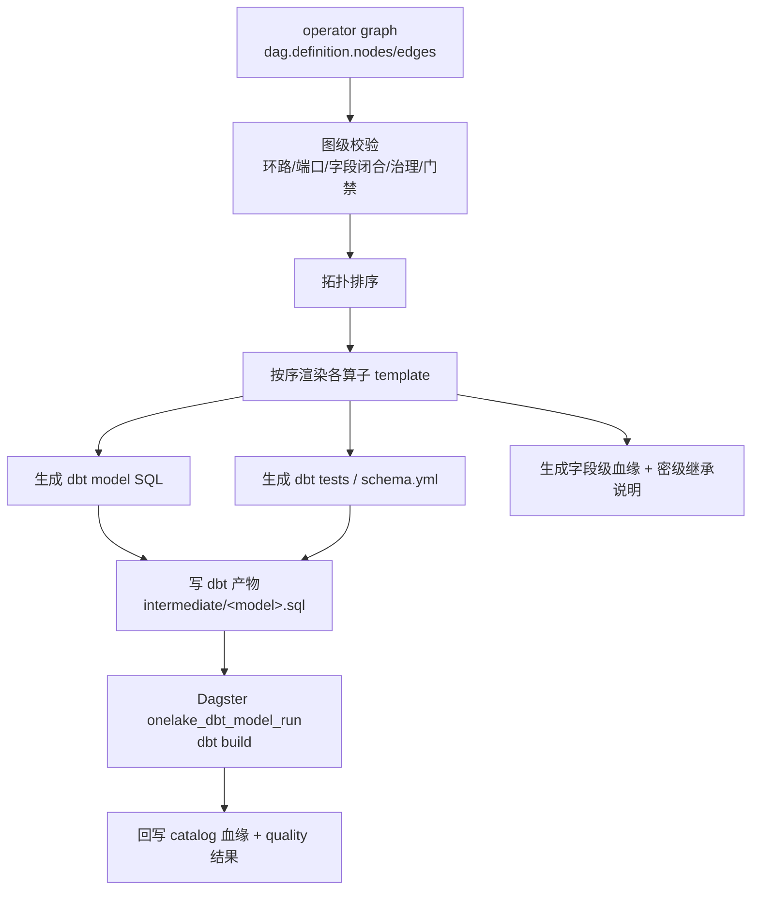

# 流水线与算子市场 · 统一算子开发标准设计方案

> 版本：v1.0（2026-06-22）
> 范围：本文件为**设计方案文档**，不改动任何代码。
> 定位：补齐 L4-4「处理编排」中「统一算子开发标准 + 内置算子库（≥50）+ 算子市场」的工程契约，作为后续迭代开发的权威依据。
> 关联设计：`docs/详细功能清单产品详细设计.md`（L4-4）、`docs/数据平台 · 原型设计与交互说明文档.md`（§4.4 / §8.4.6）、`docs/ODS到DWD标准闭环实施方案.md`（迭代 2.5 operator graph 契约）、`docs/技术初始化文档.md`（§6.5 / §7.3）。

---

## 0. 设计目标与约束

### 0.1 目标

1. 系统内置 **≥50 个常用算子**（本方案落地 **65 个**，预留扩展位）。
2. 建立**统一的算子开发标准**：所有内置算子与自定义算子遵循同一份「Manifest（声明）+ 编译模板（实现）」契约，做到可注册、可校验、可版本化、可市场化、可编排、可血缘。
3. 与既有 ODS→DWD 闭环（迭代 2.5 的 `operatorRef/operatorVersion` 节点契约、`DwdModelCompiler`）**无缝衔接**，不另起一套 DSL。

### 0.2 关键决策（已确认）

- **执行形态：SQL/dbt 优先**。第一批 65 个算子全部编译为 **Trino SQL / dbt 表达式或 dbt test**，统一一种执行形态，最快闭环；Spark/Python 算子作为后续扩展点预留接口（见 §2.5）。
- **本方案交付物**：本设计文档；不建表、不写后端、不改前端，仅给出可直接据以开发的契约与清单。

### 0.3 架构红线（沿用 `CLAUDE.md`）

- 算子注册/市场/编译落在 **`orchestration` schema**（L4-4 归属编排模块），不跨 schema 直读其它模块表。
- 算子对 `MaskingPolicy`/`quality.rule`/`dict_item` 等其它模块能力的复用，通过**在 Manifest 内固化 SQL 模板**实现，而非跨模块 DB 读取。
- 所有业务表带 `tenant_id`；敏感操作走 `AuditLogger`；跨模块协作走 Outbox 事件。

---

## 1. 现状评估

### 1.1 设计层（已较完整）

- `docs/详细功能清单产品详细设计.md` L4-4 已定义：
  - L4-4.1.1 DAG 拖拽编排（P0）：可视化拖拽算子连线，保存前自动校验环路（拓扑排序）与上下游 schema 类型匹配。
  - L4-4.1.2 算子市场（P1）：内置 + 自定义算子注册，声明输入/输出 schema 与参数，版本化发布，支持租户私有算子。
  - 技术选型：前端 DAG 画布生成 pipeline DSL，运行时编译为 Spark/Flink 作业，算子以 schema 声明接口插拔。
- `docs/数据平台 · 原型设计与交互说明文档.md` §8.4.6 已给出算子市场线框（分类/搜索/内置·自定义·租户私有/Schema/版本/安装）。
- `docs/ODS到DWD标准闭环实施方案.md` 迭代 2.5 已规划节点契约（本方案据此扩展为完整算子标准）：
  - `nodeType`：`INPUT/TRANSFORM/GOVERN/MASK/ENCRYPT/QUALITY_GATE/DBT_MODEL/OUTPUT`
  - `operatorRef/operatorVersion`、`config`、`inputRefs/outputRefs`、`resourceProfile`
  - `policy.actionOnViolation`：`WARN/DROP/FAIL/QUARANTINE`、`emitsLineage/emitsQualityResult`

### 1.2 后端层（实现基本为零）

- `module-orchestration` 仅有 `Dag`/`JobRun` 实体、`OrchestrationService`（create/get/list/triggerDag）、`DagsterClient.launch`。
- 表 `orchestration.dag`（含 `definition JSONB`）、`orchestration.job_run`（见 `bootstrap/.../db/migration/orchestration/V1__orchestration.sql`）。
- **无任何** operator 实体 / 表 / API / 注册 / 编译 / 市场逻辑。

### 1.3 前端层（仅 UI 原型）

- `web-console/src/pages/orchestration/OperatorMarket.tsx`：5 条硬编码 mock 卡片，安装/使用仅 `message.success`。
- `web-console/src/pages/orchestration/DagCanvas.tsx`：SVG 静态画布，左侧算子面板 `cursor: grab` 但无拖拽事件，保存按钮未绑定 API；`@antv/x6` 在 `package.json` 已声明但 src 零引用。
- `web-console/src/types/index.ts` 已有 `DagNode`（`type: 'INPUT'|'GOVERN'|'MASK'|'ENCRYPT'|'OUTPUT'|'QUALITY_GATE'|'SQL'|string`）与 `DagEdge`。

### 1.4 可直接复用的现有抽象

| 现有能力 | 路径 | 在算子体系中的角色 |
|----------|------|--------------------|
| `orchestration.dag.definition` + `DagNode` | `module-orchestration` / `types/index.ts` | 算子图节点容器（扩展 `operatorRef` 字段） |
| `MaskingPolicy.strategy`（MASK/HASH/NULLIFY/PARTIAL） | `module-security/.../MaskingPolicy.java` | 脱敏类算子的配置语义来源 |
| `quality.rule.ruleType`（NOT_NULL/UNIQUE/RANGE/REGEX/CUSTOM_SQL） + `severity`（BLOCK/WARN） | `module-quality/.../Rule.java` | 质量门禁类算子的规则与动作来源 |
| `modeling.DataStandard` + `common.dict_type/dict_item` | `module-modeling` / `module-common` | 标准化/码表映射算子的字典来源 |
| dbt macro（`mask_phone`/`mask_id_card`/`incremental_filter`） | `onelake-app/dbt/macros/onelake_macros.sql` | 算子编译模板的最小执行单元 |
| `DagsterClient.launch` | `module-orchestration/.../client/DagsterClient.java` | 编译产物的执行触发入口 |

**结论**：算子作为「一等公民」的注册、市场、版本、编译、执行链路尚未开始，但底层零件（节点容器、脱敏/质量规则、字典、dbt 宏）齐备，适合用统一标准把它们编织成算子库。

---

## 2. 统一算子开发标准（核心）

核心理念：**算子 = Manifest（声明式契约）+ Compile Template（SQL/dbt 实现）**。内置算子与自定义算子使用**完全相同**的结构，唯一区别是 `scope` 与是否随 Flyway 预置。

### 2.1 算子 Manifest 契约（OperatorManifest）

```jsonc
{
  "operatorRef": "mask.partial",          // 全局唯一标识，<category>.<name> 命名
  "version": "1.0.0",                      // 语义化版本 semver
  "category": "MASK",                      // 见 §2.2 算子分类（对齐 nodeType）
  "scope": "BUILTIN",                      // BUILTIN | CUSTOM | TENANT_PRIVATE
  "displayName": "部分掩码",
  "description": "对手机号/证件号等字段保留首尾、中间用 * 替换",
  "icon": "EyeInvisibleOutlined",
  "tags": ["脱敏", "PII", "合规"],

  // —— 端口契约 ——
  "inputPorts": [
    { "name": "in", "cardinality": "ONE", "accept": "TABLE" }
  ],
  "outputSchema": {
    "mode": "PASSTHROUGH_MODIFY",          // PASSTHROUGH | PASSTHROUGH_MODIFY | DERIVE | AGGREGATE | ASSERT
    "modifies": ["{{params.column}}"]      // 受影响列（用于输出 schema 推导）
  },

  // —— 参数契约（JSON Schema，驱动前端表单 + 后端校验）——
  "paramsSchema": {
    "type": "object",
    "required": ["column"],
    "properties": {
      "column":     { "type": "string", "title": "脱敏字段", "x-widget": "column-select" },
      "keepHead":   { "type": "integer", "title": "保留前 N 位", "default": 3 },
      "keepTail":   { "type": "integer", "title": "保留后 N 位", "default": 4 },
      "maskChar":   { "type": "string",  "title": "掩码字符", "default": "*" }
    }
  },

  // —— 编译契约 ——
  "compileTarget": "SQL_DBT",             // 第一批统一 SQL_DBT；预留 SPARK / PYTHON
  "template": {
    "kind": "COLUMN_EXPR",                // SELECT_EXPR | COLUMN_EXPR | FILTER | JOIN | AGG | DBT_TEST | RAW_SQL
    "sql": "regexp_replace({{ column }}, '^(.{{ '{' }}{{ keepHead }}{{ '}' }})(.*)(.{{ '{' }}{{ keepTail }}{{ '}' }})$', concat('$1', repeat('{{ maskChar }}', 4), '$3'))"
  },

  // —— 治理契约 ——
  "lineageRule": { "type": "ONE_TO_ONE", "from": "{{params.column}}", "to": "{{params.column}}" },
  "securityRule": {
    "effect": "DOWNGRADE_ALLOWED",         // INHERIT | DOWNGRADE_ALLOWED | KEEP
    "note": "部分掩码后可由 L3 降级至 L2，需记录转换说明"
  },
  "qualityEmit": false,
  "policy": { "actionOnViolation": null },  // 仅 QUALITY_GATE 类算子使用

  // —— 资源契约 ——
  "resourceHint": { "defaultResourceGroup": "rg-default", "engine": "TRINO_DBT" },

  "examples": [
    { "title": "手机号脱敏", "params": { "column": "phone", "keepHead": 3, "keepTail": 4 } }
  ]
}
```

### 2.2 算子分类（category，对齐 nodeType）

| category | 含义 | 对应 nodeType（dag.definition） | 编译产物 |
|----------|------|-------------------------------|----------|
| `INPUT` | 数据源读取 | INPUT | dbt `source()` / ref / SELECT |
| `TRANSFORM` | 结构/计算转换 | TRANSFORM | SELECT 表达式 |
| `GOVERN` | 清洗与治理 | GOVERN | WHERE / 去重 / 表达式 |
| `STANDARD` | 标准化（字典/格式） | GOVERN | CASE/映射表达式 |
| `MASK` | 脱敏 | MASK | 列表达式 |
| `ENCRYPT` | 加密/哈希/令牌 | ENCRYPT | 列表达式 |
| `AGG` | 聚合/窗口/透视 | TRANSFORM | GROUP BY / 窗口 SQL |
| `JOIN` | 关联/合并 | TRANSFORM | JOIN / UNION |
| `QUALITY_GATE` | 质量门禁 | QUALITY_GATE | dbt test / 断言 SQL |
| `OUTPUT` | 落库/物化 | OUTPUT | dbt config(materialized) |

### 2.3 输出 schema 推导规则（outputSchema.mode）

- `PASSTHROUGH`：输出列 = 输入列（如 filter、行过滤、质量门禁）。
- `PASSTHROUGH_MODIFY`：保留列结构，仅改动 `modifies` 指定列的值/类型（如脱敏、类型转换、trim）。
- `DERIVE`：在输入列基础上新增/删除列（如派生列、字段拆分、列选择）。
- `AGGREGATE`：输出列由 `groupBy + aggregations` 决定（如分组聚合、透视）。
- `ASSERT`：不改变数据，仅产出质量结果（质量门禁）。

编译器据此做**上下游字段闭合校验**：下游算子引用的列必须存在于上游推导出的 schema 中。

### 2.4 校验契约（validate）

注册或保存算子图时必须通过：

1. **Manifest 自校验**：`operatorRef` 命名规范、`paramsSchema` 合法 JSON Schema、`template` 可解析。
2. **图级校验**（算子图）：拓扑排序无环；每条边端口基数匹配；上下游字段闭合（§2.3）。
3. **治理校验**：敏感字段（来自 ODS `classification/piiType`）若被透传到 DWD 而未经 MASK/ENCRYPT，须有显式说明，否则报错（沿用 ODS→DWD 方案约束）。
4. **门禁校验**：`QUALITY_GATE` 算子必须声明 `policy.actionOnViolation`（WARN/DROP/FAIL/QUARANTINE）。
5. **资源校验**：`resourceGroup` 存在且支持当前 `engine`。

### 2.5 扩展点（后续，不在本批落地）

- `compileTarget = SPARK`：Manifest 增加 `template.kind = SPARK_SQL / PYSPARK`，编译为 Dagster Spark op。
- `compileTarget = PYTHON`：Manifest 声明 Python 入口与 requirements，编译为 Dagster Python op（用于 ML/复杂去重/MDM）。
- 编译器以 `compileTarget` 多态分发，Manifest 结构保持不变 —— 这是"统一标准"的关键收益。

### 2.6 自定义算子开发流程（标准化）



内置算子走相同结构，但由 Flyway seed 在 `scope=BUILTIN` 预置，全租户可见无需 install。

---

## 3. 内置算子目录（65 个，9 大类）

> 全部 `compileTarget = SQL_DBT`，`engine = TRINO_DBT`。下表给出 ref / 关键参数 / 输入→输出 / 编译要点 / 治理规则。复用来源：M=MaskingPolicy、Q=quality.rule、D=dict_item/DataStandard、X=dbt macro。

### A. 输入 / 输出（6）

| # | operatorRef | 参数 | 输入→输出 | 编译要点 |
|---|-------------|------|-----------|----------|
| 1 | `input.ods_table` | `sourceFqn` | -→表 | `{{ source('ods', '<t>') }}` |
| 2 | `input.dwd_table` | `modelRef` | -→表 | `{{ ref('<model>') }}` |
| 3 | `input.sql_query` | `sql` | -→表 | 直接子查询（单 SELECT 校验） |
| 4 | `output.iceberg_table` | `targetFqn`,`partitionBy` | 表→落库 | `config(materialized='table', file_format='iceberg')` |
| 5 | `output.view` | `targetFqn` | 表→视图 | `config(materialized='view')` |
| 6 | `output.incremental_merge` | `uniqueKey`,`incrementalColumn`,`strategy` | 表→增量 | `config(materialized='incremental')` + `incremental_filter`（X） |

### B. 结构转换 TRANSFORM（10）

| # | operatorRef | 参数 | 输出模式 | 编译要点 |
|---|-------------|------|----------|----------|
| 7 | `transform.select_columns` | `columns[]` | DERIVE | `SELECT col_a, col_b` |
| 8 | `transform.rename_columns` | `mapping{}` | DERIVE | `old AS new` |
| 9 | `transform.cast_type` | `column`,`targetType` | PASSTHROUGH_MODIFY | `CAST(col AS <t>)` |
| 10 | `transform.derive_column` | `name`,`expr` | DERIVE | `<expr> AS name`（表达式白名单校验） |
| 11 | `transform.constant_column` | `name`,`value`,`type` | DERIVE | `CAST('<v>' AS <t>) AS name` |
| 12 | `transform.concat_columns` | `columns[]`,`sep`,`as` | DERIVE | `concat_ws(sep, ...)` |
| 13 | `transform.split_column` | `column`,`delimiter`,`outputs[]` | DERIVE | `split_part(col, d, i)` |
| 14 | `transform.case_when` | `cases[]`,`else`,`as` | DERIVE | `CASE WHEN ... END` |
| 15 | `transform.rename_by_standard` | `standardId` | DERIVE | 按 DataStandard 命名映射（D） |
| 16 | `transform.reorder_columns` | `order[]` | DERIVE | SELECT 顺序 |

### C. 清洗 GOVERN（10）

| # | operatorRef | 参数 | 输出模式 | 编译要点 |
|---|-------------|------|----------|----------|
| 17 | `govern.trim_whitespace` | `columns[]` | PASSTHROUGH_MODIFY | `trim(col)` |
| 18 | `govern.fillna` | `column`,`fillValue` | PASSTHROUGH_MODIFY | `coalesce(col, v)` |
| 19 | `govern.drop_null` | `columns[]` | PASSTHROUGH | `WHERE col IS NOT NULL` |
| 20 | `govern.dedup` | `keys[]`,`orderBy` | PASSTHROUGH | `row_number() ... = 1` |
| 21 | `govern.filter_rows` | `predicate` | PASSTHROUGH | `WHERE <predicate>` |
| 22 | `govern.drop_required_missing` | `requiredColumns[]` | PASSTHROUGH | 多列非空过滤 |
| 23 | `govern.normalize_case` | `column`,`mode` | PASSTHROUGH_MODIFY | `upper/lower(col)` |
| 24 | `govern.standardize_enum` | `column`,`dictType` | PASSTHROUGH_MODIFY | 码表映射（D） |
| 25 | `govern.outlier_filter` | `column`,`min`,`max`/`method` | PASSTHROUGH | 范围/IQR 过滤 |
| 26 | `govern.regex_replace` | `column`,`pattern`,`replacement` | PASSTHROUGH_MODIFY | `regexp_replace` |

### D. 标准化 STANDARD（6）

| # | operatorRef | 参数 | 输出模式 | 复用 |
|---|-------------|------|----------|------|
| 27 | `standard.codebook_mapping` | `column`,`dictType` | PASSTHROUGH_MODIFY | D（dict_item） |
| 28 | `standard.unit_normalize` | `column`,`fromUnit`,`toUnit`,`factor` | PASSTHROUGH_MODIFY | 量纲换算 |
| 29 | `standard.date_format` | `column`,`inputFmt`,`outputType` | PASSTHROUGH_MODIFY | `date_parse/format` |
| 30 | `standard.phone_normalize` | `column` | PASSTHROUGH_MODIFY | 去分隔符/区号规整 |
| 31 | `standard.id_card_normalize` | `column` | PASSTHROUGH_MODIFY | 大写 X/校验位 |
| 32 | `standard.address_normalize` | `column`,`dictType` | PASSTHROUGH_MODIFY | 省市区标准化（D） |

### E. 脱敏 MASK（8，复用 M）

| # | operatorRef | 参数 | securityRule | 编译要点 |
|---|-------------|------|--------------|----------|
| 33 | `mask.partial` | `column`,`keepHead`,`keepTail` | DOWNGRADE_ALLOWED | `regexp_replace` |
| 34 | `mask.full` | `column` | DOWNGRADE_ALLOWED | 全 `*` |
| 35 | `mask.name` | `column` | DOWNGRADE_ALLOWED | 姓名保留姓氏 |
| 36 | `mask.id_card` | `column` | DOWNGRADE_ALLOWED | `mask_id_card`（X） |
| 37 | `mask.email` | `column` | DOWNGRADE_ALLOWED | 用户名部分掩码 |
| 38 | `mask.bankcard` | `column` | DOWNGRADE_ALLOWED | 保留后 4 位 |
| 39 | `mask.nullify` | `column` | DOWNGRADE_ALLOWED | `NULL`（M: NULLIFY） |
| 40 | `mask.generalize` | `column`,`buckets[]` | DOWNGRADE_ALLOWED | 年龄→年龄段等分桶 |

### F. 加密 ENCRYPT（5）

| # | operatorRef | 参数 | 可逆 | 编译要点 |
|---|-------------|------|------|----------|
| 41 | `encrypt.sha256` | `column`,`salt` | 否 | `to_hex(sha256(...))` |
| 42 | `encrypt.md5` | `column` | 否 | `md5(col)` |
| 43 | `encrypt.aes` | `column`,`keyRef` | 是 | UDF/密钥引用（不落明文密钥） |
| 44 | `encrypt.fpe` | `column`,`keyRef` | 是 | 保格加密 UDF |
| 45 | `encrypt.tokenize` | `column`,`tokenTable` | 是（查表） | 令牌化映射 |

> 加密类 `keyRef` 仅保存对 `security.secret` 的引用句柄，编译时不内联明文，密钥获取在执行层完成。

### G. 聚合 / 计算 AGG（6）

| # | operatorRef | 参数 | 输出模式 | 编译要点 |
|---|-------------|------|----------|----------|
| 46 | `agg.group_aggregate` | `groupBy[]`,`aggregations[]` | AGGREGATE | `GROUP BY` |
| 47 | `agg.window_function` | `partitionBy[]`,`orderBy`,`fn` | DERIVE | `over(partition by ...)` |
| 48 | `agg.pivot` | `key`,`value`,`columns[]` | AGGREGATE | 条件聚合行转列 |
| 49 | `agg.unpivot` | `columns[]`,`keyName`,`valueName` | DERIVE | `UNNEST` 列转行 |
| 50 | `agg.distinct_count` | `groupBy[]`,`column` | AGGREGATE | `count(distinct)` |
| 51 | `agg.running_total` | `partitionBy[]`,`orderBy`,`column` | DERIVE | `sum() over(... rows ...)` |

### H. 关联 / 合并 JOIN（5）

| # | operatorRef | 参数 | 端口 | 编译要点 |
|---|-------------|------|------|----------|
| 52 | `join.inner` | `on`,`select[]` | 2 入 | `INNER JOIN` |
| 53 | `join.left` | `on`,`select[]` | 2 入 | `LEFT JOIN` |
| 54 | `join.union_all` | `mode` | N 入 | `UNION [ALL]` |
| 55 | `join.lookup_enrich` | `dimRef`,`on`,`enrichColumns[]` | 1 入+维表 | 维表 LEFT JOIN 补全 |
| 56 | `join.dedup_merge` | `keys[]`,`orderBy`,`strategy` | N 入 | SCD-lite / MDM 金标合并 |

### I. 质量门禁 QUALITY_GATE（9，复用 Q）

| # | operatorRef | 参数 | actionOnViolation | 编译产物 |
|---|-------------|------|-------------------|----------|
| 57 | `gate.not_null` | `columns[]` | FAIL/WARN | dbt test `not_null` |
| 58 | `gate.unique` | `columns[]` | FAIL/WARN | dbt test `unique` |
| 59 | `gate.range` | `column`,`min`,`max` | FAIL/WARN/DROP | 断言 SQL |
| 60 | `gate.regex` | `column`,`pattern` | FAIL/WARN/QUARANTINE | 断言 SQL |
| 61 | `gate.enum` | `column`,`values[]`/`dictType` | FAIL/WARN | `accepted_values` |
| 62 | `gate.freshness` | `column`,`maxDelay` | WARN/FAIL | dbt source freshness |
| 63 | `gate.row_count` | `min`,`max` | FAIL/WARN | 空表/行数断言 |
| 64 | `gate.referential` | `column`,`refModel`,`refColumn` | FAIL/WARN | `relationships` test |
| 65 | `gate.custom_sql` | `assertionSql` | FAIL/WARN/QUARANTINE | 自定义断言（Q: CUSTOM_SQL） |

**合计 65 个**，满足"≥50"目标，并在每类预留扩展位（Spark/Python/ML 算子后续以同一 Manifest 接入）。

---

## 4. 数据模型与市场 API

### 4.1 新增表（落 `orchestration` schema）

> 仅设计，落地时新增 `bootstrap/.../db/migration/orchestration/V2__operator.sql`（**不可改 V1**）。

```sql
-- 算子注册表
CREATE TABLE orchestration.operator (
  id            UUID PRIMARY KEY DEFAULT gen_random_uuid(),
  tenant_id     UUID,                       -- BUILTIN 为 NULL（全局）；CUSTOM/TENANT_PRIVATE 必填
  operator_ref  VARCHAR(128) NOT NULL,      -- 全局唯一标识 <category>.<name>
  category      VARCHAR(24)  NOT NULL,      -- INPUT/TRANSFORM/GOVERN/STANDARD/MASK/ENCRYPT/AGG/JOIN/QUALITY_GATE/OUTPUT
  scope         VARCHAR(16)  NOT NULL,      -- BUILTIN/CUSTOM/TENANT_PRIVATE
  display_name  VARCHAR(128) NOT NULL,
  description   TEXT,
  latest_version VARCHAR(24) NOT NULL,
  status        VARCHAR(16)  NOT NULL DEFAULT 'ACTIVE',  -- ACTIVE/DEPRECATED
  created_at    TIMESTAMPTZ  NOT NULL DEFAULT now(),
  UNIQUE (operator_ref, scope, tenant_id)
);

-- 算子版本（manifest 快照）
CREATE TABLE orchestration.operator_version (
  id            UUID PRIMARY KEY DEFAULT gen_random_uuid(),
  operator_id   UUID NOT NULL REFERENCES orchestration.operator(id),
  version       VARCHAR(24) NOT NULL,       -- semver
  manifest      JSONB NOT NULL,             -- 完整 OperatorManifest（含 template）
  changelog     TEXT,
  created_by    UUID,
  created_at    TIMESTAMPTZ NOT NULL DEFAULT now(),
  UNIQUE (operator_id, version)
);

-- 租户安装/可见性（BUILTIN 默认全可见，无需登记）
CREATE TABLE orchestration.operator_install (
  id            UUID PRIMARY KEY DEFAULT gen_random_uuid(),
  tenant_id     UUID NOT NULL,
  operator_id   UUID NOT NULL REFERENCES orchestration.operator(id),
  pinned_version VARCHAR(24),               -- NULL=跟随 latest
  installed_at  TIMESTAMPTZ NOT NULL DEFAULT now(),
  UNIQUE (tenant_id, operator_id)
);
```

内置 65 个算子由 `V3__operator_seed.sql`（或 service 启动 seeder）以 `scope=BUILTIN, tenant_id=NULL` 写入 `operator` + `operator_version`。

### 4.2 市场 API（`/api/v1/orchestration/operators`）

| 方法 | 路径 | 权限 | 说明 |
|------|------|------|------|
| GET | `/operators` | 认证 | 列表，过滤 `category`/`scope`/`keyword`；返回当前租户可见（BUILTIN + 本租户 CUSTOM/已安装 TENANT_PRIVATE） |
| GET | `/operators/{ref}` | 认证 | 详情 + 版本列表 + manifest |
| POST | `/operators/validate` | DE | 校验 Manifest（不落库），返回错误清单 |
| POST | `/operators` | DE | 注册自定义算子（scope=CUSTOM/TENANT_PRIVATE） |
| POST | `/operators/{ref}/versions` | DE | 发布新版本（manifest 快照） |
| PUT | `/operators/{ref}` | DE | 更新元信息 / 弃用（status=DEPRECATED） |
| POST | `/operators/{ref}/install` | DE | 租户安装/锁定版本 |

- 返回统一 `ApiResponse<T>`；敏感操作（注册/发布/安装）写 `AuditLogger`。
- 节点引用：`orchestration.dag.definition.nodes[]` 增加 `operatorRef/operatorVersion/config`，与 ODS→DWD 迭代 2.5 契约字段完全一致（`nodeType/operatorRef/operatorVersion/config/inputRefs/outputRefs/policy/emitsLineage/emitsQualityResult`）。

### 4.3 模块分层（沿用 module-orchestration 标准结构）

```
com.onelake.orchestration/
├── api/OperatorController.java
├── service/OperatorService.java + impl/
├── service/compile/OperatorCompiler.java        (见 §5)
├── domain/entity/{Operator, OperatorVersion, OperatorInstall}.java
├── domain/enums/{OperatorCategory, OperatorScope, CompileTarget}.java
├── dto/{OperatorManifest, OperatorPort, OperatorDTO}.java
├── repository/{OperatorRepository, OperatorVersionRepository, OperatorInstallRepository}.java
└── config/OperatorSeeder.java                    (内置 65 算子预置)
```

---

## 5. 编译与执行链路

### 5.1 OperatorCompiler（与迭代 2.5 的 DwdModelCompiler 合并）



- **编译输入**：`orchestration.dag.definition` 的算子图（节点含 `operatorRef/version/config`）。
- **编译步骤**：图级校验（§2.4）→ 拓扑排序 → 逐节点用 Manifest `template` + node `config` 渲染 SQL 片段 → 按 SELECT/WHERE/JOIN/AGG 组装为单个 dbt model SELECT → 质量门禁算子额外产出 dbt tests/schema.yml → 输出算子决定 `materialized`。
- **编译产物**：
  - `onelake-app/dbt/models/intermediate/<model>.sql`（DWD）
  - `onelake-app/dbt/models/intermediate/schema.yml`（tests）
  - `orchestration.dag.definition` 回写节点/边
  - 字段级血缘映射 + 密级继承/降级说明（供 catalog 回写）

### 5.2 执行（不新增引擎）

- 经 `DagsterClient.launch` 触发统一 job `onelake_dbt_model_run`（与 ODS→DWD 后续迭代一致）执行 `dbt build --select <model>`。
- 第一批**不做拖拽编译**：DWD 向导默认生成算子链「`input.ods_table` → `govern.*` 清洗 → `standard.*` 标准化 → `mask.*`（按 ODS 字段 `classification/piiType` 自动建议）→ `gate.*` 质量门禁 → `output.*`」，与 ODS→DWD 迭代 2.5「DWD 向导默认生成清洗/标准化/质量门禁/输出节点」完全吻合。

### 5.3 与 Dagster 现状的差距（执行前置条件）

- 当前 `onelake-app/dagster/definitions.py` 仅有 `onelake_sync_task_schedule_reconcile`。执行链路落地依赖 ODS→DWD 路线引入 `dagster-dbt` 与 `onelake_dbt_model_run`，本方案的编译产物已对齐该 job 名，无需额外约定。

---

## 6. 前端改造设计（仅设计）

### 6.1 类型（`web-console/src/types/index.ts`）

新增：

```ts
export interface OperatorPort { name: string; cardinality: 'ONE' | 'MANY'; accept: 'TABLE' | 'COLUMN'; }
export interface OperatorManifest {
  operatorRef: string; version: string; category: string; scope: 'BUILTIN'|'CUSTOM'|'TENANT_PRIVATE';
  displayName: string; description?: string; icon?: string; tags?: string[];
  inputPorts: OperatorPort[]; outputSchema: { mode: string; modifies?: string[] };
  paramsSchema: Record<string, unknown>;
  compileTarget: 'SQL_DBT'|'SPARK'|'PYTHON';
  examples?: { title: string; params: Record<string, unknown> }[];
}
export interface Operator {
  id: string; operatorRef: string; category: string; scope: string;
  displayName: string; description?: string; latestVersion: string; status: string;
}
```

`DagNode` 扩展（向后兼容）：增加可选 `operatorRef?: string; operatorVersion?: string; config?: Record<string, unknown>;`。

### 6.2 API（`web-console/src/api/index.ts`）

新增 `OperatorAPI`：`listOperators(filter)`、`getOperator(ref)`、`validateOperator(manifest)`、`registerOperator(manifest)`、`publishVersion(ref, payload)`、`installOperator(ref, payload)`。

### 6.3 算子市场页（`OperatorMarket.tsx`）

- 用 `OperatorAPI.listOperators` 替换硬编码 `OPERATORS`。
- 过滤维度：9 大分类 Tab + 范围（内置/自定义/租户私有）+ 关键词搜索。
- 卡片：分类色（沿用 `IntentBadge`/`tokens.ts` 分类色，不内联颜色）、版本、输入→输出端口、scope chip。
- 详情 Modal：展示 `paramsSchema` 字段、输入输出、`examples` 编译示例；「安装」调用 `installOperator`。

### 6.4 画布（`DagCanvas.tsx`）

- 读取真实 `orchestration.dag.definition` 的 `operatorRef` 节点渲染（替换 `INITIAL_NODES` mock）。
- 算子面板从 `OperatorAPI.listOperators` 取分类列表。
- X6 真实拖拽、连线校验、属性面板（由 `paramsSchema` 动态生成表单）列为**后续增强**，非本批硬性要求。

---

## 7. 分阶段落地路线与验证

### 7.1 路线

| 阶段 | 内容 | 产出 |
|------|------|------|
| 阶段一（本文档） | 统一算子标准 + Manifest schema + 65 算子目录定稿 | 本设计方案 |
| 阶段二 | `operator/operator_version/operator_install` 表 + 市场后端 API + 65 内置算子 seed + 前端市场接真实 API | 可浏览/搜索/安装的算子市场 |
| 阶段三 | `OperatorCompiler` 接入 DWD 向导：生成算子链 → dbt 产物 → `onelake_dbt_model_run` 运行 → 血缘/质量回写 | ODS→DWD 经算子链可运行闭环 |
| 阶段四 | 自定义/租户私有算子注册发布、画布 X6 拖拽、Spark/Python 算子扩展 | 完整算子工程化 |

### 7.2 依赖关系

- 阶段三依赖 ODS→DWD 路线的 `dagster-dbt` + `onelake_dbt_model_run`（见 `docs/ODS到DWD标准闭环实施方案.md` 迭代 3）。
- 阶段二可独立交付（市场浏览不依赖执行）。

### 7.3 验证清单（设计自检）

- [x] 65 个算子全部可编译为 Trino SQL / dbt 表达式 / dbt test，无需新引擎。
- [x] 节点契约字段与 `docs/ODS到DWD标准闭环实施方案.md`（§3「必须补充的契约」与迭代 2.5）一致：`nodeType/operatorRef/operatorVersion/config/inputRefs/outputRefs/policy.actionOnViolation/emitsLineage/emitsQualityResult`。
- [x] 新增表落 `orchestration` schema，不跨 schema 直读其它模块；对 MaskingPolicy/quality.rule/dict 的复用通过 Manifest 模板固化，符合 `CLAUDE.md` 架构红线。
- [x] 所有表带 `tenant_id`（BUILTIN 全局除外）；敏感 API 走 AuditLogger。
- [x] 内置算子数量 ≥50（实际 65），且每类预留扩展位。
- [x] 前端改造向后兼容（`DagNode` 扩展为可选字段，不破坏现有 mock 渲染）。

### 7.4 与现有文档的关系

- 本文档是 L4-4「算子市场 + DAG 编排」的**算子标准细化**，是 `docs/ODS到DWD标准闭环实施方案.md` 迭代 2.5 的**算子契约展开版**；两者节点契约共用同一份定义，避免 DSL 漂移。
